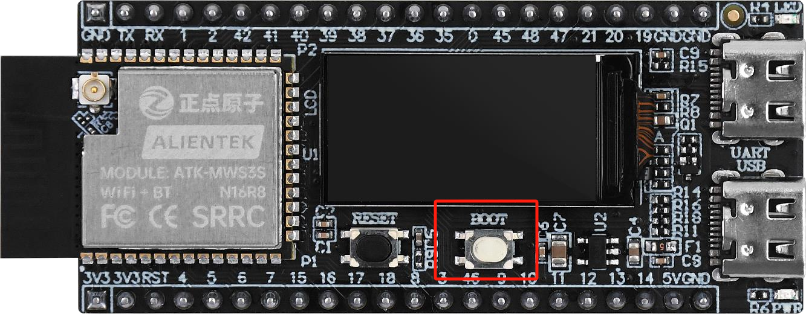
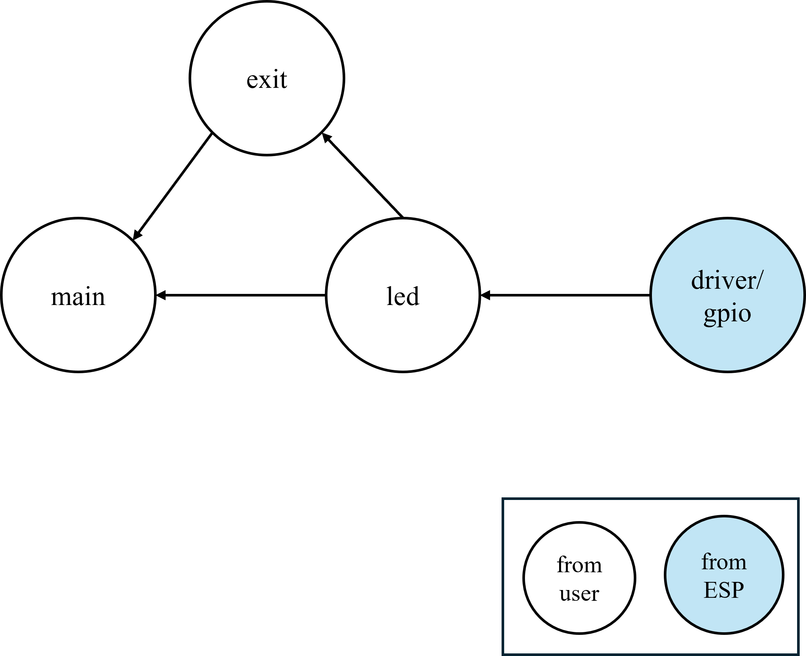

# 按键（中断方式）笔记

## 介绍

!!! note
    在本节中，我们将讨论desp32s3m开发板上的板载按键，为了方便起见，该按键不使用阻塞模式，而是用于中断模式。我们使用外部中断来检测按键按下。实际上我们本章讨论的是中断，但是载体是按键。

## 按键

{ width=800px }

## 板载电路

{ width=800px }

## 依赖关系

## 关键函数

| 函数原型 | 说明 | 示例 |
| --- | --- | --- |
|static void IRAM_ATTR exit_gpio_isr_handler(void *arg) | 外部中断服务例程，将您希望在检测到事件后执行的操作放在这里 | 在这里放置您的操作 |
|esp_err_t gpio_install_isr_service(int intr_alloc_flags) | 安装驱动程序的GPIO ISR服务，允许您为GPIO引脚注册ISR处理程序 | gpio_install_isr_service(0); |
|esp_err_t gpio_isr_handler_add(gpio_num_t gpio_num, gpio_isr_t isr_handler, void *args) | 为GPIO引脚添加处理程序 | gpio_isr_handler_add(BOOT_INT_GPIO_PIN, exit_gpio_isr_handler, (void*) BOOT_INT_GPIO_PIN); |
| esp_err_t gpio_intr_enable(gpio_num_t gpio_num) | 启用GPIO中断 | gpio_intr_enable(BOOT_INT_GPIO_PIN); |

!!! tip
    一旦你设置好了处理函数，你就不需要在主循环中调用该函数，因为一旦检测到事件，中断将自动触发。