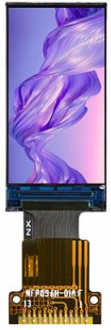
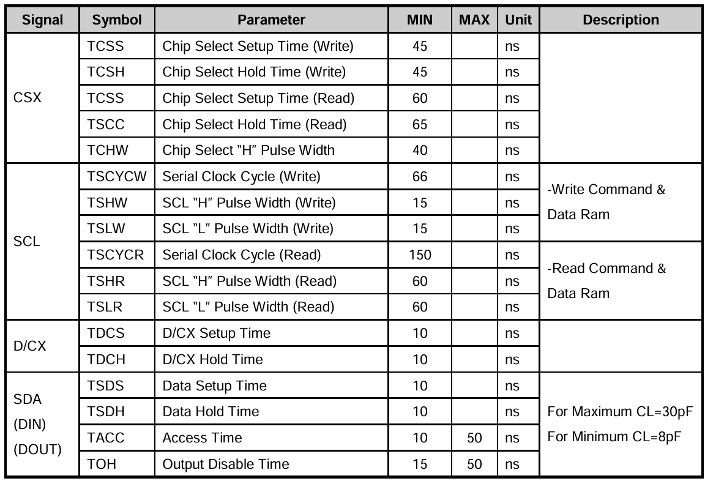

# LCD

### ESP32S3 Minimal System Board with 0.96-Inch HD IPS LCD Display

The onboard 0.96-inch HD IPS LCD display has a resolution of 160x80 and supports 16-bit true color display. The display uses the ST7735S driver chip with built-in RAM, eliminating the need for external drivers or memory. The ESP32S3 chip can drive this display via the SPI interface. In 4-wire SPI communication mode, the 0.96-inch LCD screen requires only four signal lines (CS, SCL, SDA, RS (DC)).

  

The screen connects to the PCB circuit via 13 pins. The pin details are as follows:

| No. | Name  | Description                                                                 |
|-----|-------|-----------------------------------------------------------------------------|
| 1   | TP0   | NC                                                                          |
| 2   | TP1   | NC                                                                          |
| 3   | SDA   | SPI communication MOSI signal line                                          |
| 4   | SCL   | SPI communication SCK signal line                                           |
| 5   | RS    | Command/Data signal line (Low: Command; High: Data)                         |
| 6   | RES   | Hardware reset pin (active low)                                             |
| 7   | CS    | SPI communication chip select signal (active low)                           |
| 8   | GND   | Ground                                                                      |
| 9   | NC    | NC                                                                          |
| 10  | VCC   | 3.3V power supply                                                           |
| 11  | LEDK  | LCD backlight control pin (cathode)                                         |
| 12  | LEDA  | LCD backlight control pin (anode)                                           |
| 13  | GND   | Ground                                                                      |

  

From the above diagrams, it is evident that the write cycle of the 0.96-inch LCD module in 4-wire SPI mode is very fast (TSCYCW = 66ns), whereas the read cycle is relatively slower (TSCYCR = 150ns).

The ST7735S LCD driver stores display data directly in its onboard RAM, which has a capacity of 132x162x18 bits. The ST7735S chip automatically displays data from its RAM to the LCD without an external clock, minimizing power consumption.

#### Hardware Reset Requirements

Before initializing the display module, the RST pin must be used to perform a hardware reset. The RST pin should be pulled low for at least 10 microseconds. After pulling RST high to end the reset, a delay of 120 milliseconds is required before data can be transmitted to the display module.

#### Backlight Control

The LEDK pin controls the LCD backlight of the display module. This pin has a built-in pull-down resistor. The backlight is off when the LEDK pin is high or floating and turns on when the LEDK pin is pulled low.

#### Color Depth

The ST7735S supports a maximum color depth of 18 bits (262K colors), but 16-bit color depth (65K colors) is generally used for maximum speed. In 16-bit mode, the RGB565 format is used to transmit and store color data, as shown below:

- High 5 bits represent red.
- Middle 6 bits represent green.
- Low 5 bits represent blue.
- Larger values correspond to darker colors.

#### Continuous RAM Read/Write and Scan Direction Configuration

The ST7735S allows continuous read/write operations in its RAM for color data on the LCD. The scan direction (RAM auto-increment direction) can be configured using command `0x36`, as shown below:

Command `0x36` configures six parameters, but only `MY`, `MX`, and `MV` are relevant for setting the LCD scan direction:

| MY | MX | MV | LCD Scan Direction (RAM Auto-Increment Direction)      |
|----|----|----|--------------------------------------------------------|
| 0  | 0  | 0  | Left to right, top to bottom                           |
| 1  | 0  | 0  | Left to right, bottom to top                           |
| 0  | 1  | 0  | Right to left, top to bottom                           |
| 1  | 1  | 0  | Right to left, bottom to top                           |
| 0  | 0  | 1  | Top to bottom, left to right                           |
| 1  | 0  | 1  | Bottom to top, left to right                           |
| 0  | 1  | 1  | Top to bottom, right to left                           |
| 1  | 1  | 1  | Bottom to top, right to left                           |

This flexibility allows efficient content rendering, such as displaying BMP images that decode data starting from the bottom-left corner. By setting the LCD scan direction appropriately, data can be filled into the LCD without repeatedly setting coordinates, improving display speed.

#### Setting Address for Color Data

Before writing color data to the ST7735S, the address must be set to specify which pixel on the LCD will receive the color data. Commands `0x2A` and `0x2B` are used to set the column and row addresses, respectively:

- Command `0x2A`:  
  

- Command `0x2B`:  
  

With the default LCD scan direction (left to right, top to bottom), the `XS` and `XE` parameters of command `0x2A` and the `YS` and `YE` parameters of command `0x2B` define a region on the LCD. During continuous read/write operations, the ST7735S reads/writes color data in this region following the configured scan direction.

## Dependencies

## Key Functions