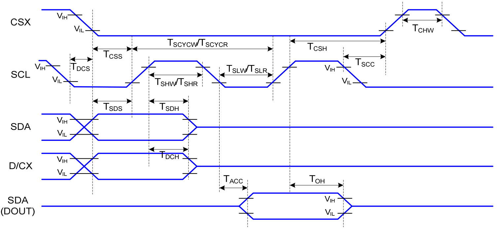

# 液晶显示屏

ESP32S3 最小系统板板载 0.96 英寸高清 IPS LCD 显示屏，其分辨率为 160x80，支持 16 位真彩色显示。该显示屏采用 ST7735S 作为驱动芯片，其内置 RAM 无需外部驱动器或存储器。ESP32S3 芯片仅需通过 SPI 接口即可轻松驱动此显示屏。0.96 寸 LCD 屏在四线 SPI 通讯模式下，仅需四根信号线（CS、SCL、SDA、RS（DC））就能够驱动。

该屏幕通过 13 个引脚与 PCB 电路连接。引脚详细描述，如下表所示。

| 序号 | 名称  | 说明                                   |
|------|-------|----------------------------------------|
| 1    | TP0   | NC                                     |
| 2    | TP1   | NC                                     |
| 3    | SDA   | SPI 通讯 MOSI 信号线                  |
| 4    | SCL   | SPI 通讯 SCK 信号线                   |
| 5    | RS    | 写命令/数据信号线（低电平：写命令；高电平：写数据） |
| 6    | RES   | 硬件复位引脚（低电平有效）            |
| 7    | CS    | SPI 通讯片选信号（低电平有效）        |
| 8    | GND   | 电源地                                 |
| 9    | NC    | NC                                     |
| 10   | VCC   | 3.3V 电源供电                          |
| 11   | LEDK  | LCD 背光控制引脚（阴极）              |
| 12   | LEDA  | LCD 背光控制引脚（阳极）              |
| 13   | GND   | 电源地                                 |

从上图中可以看出，0.96 寸 LCD 模块四线 SPI 的写周期是非常快的（TSCYCW = 66ns），而读周期就相对慢了很多（TSCYCR = 150ns）。

0.96 寸 LCD 屏采用 ST7735S 作为 LCD 驱动器，LCD 的显存可直接存放在 ST7735S 的片上RAM中，ST7735S的片上RAM有132*162*18-bits，并且ST7735S会在没有外部时钟的情况下，自动将其片上 RAM 的数据显示至 LCD 上，以最小化功耗。

在每次初始化显示模块之前，必须先通过 RST 引脚对显示模块进行硬件复位，硬件复位要求 RST 至少被拉低 10 微秒，拉高 RST 结束硬件复位后，须延时 120 毫秒等待复位完成后，才能够往显示模块传输数据。

LEDK 引脚用于控制显示模块的 LCD 背光，该引脚自带下拉电阻，当 LEDK 引脚被拉高或悬空时，0.96 寸 LCD 模块的 LCD 背光都处于关闭状态，当 LEDK 引脚被拉低时，显示模块的LCD 背光才会点亮。

ST7735S 最高支持 18 位色深（262K 色），不过一般使用 16 位颜色深度（65K 色），RGB565格式，这样可以在 16 位色深下达到最快的速度。在 16 位色深模式下，ST7789V 采用 RGB565格式传输、存储颜色数据，如下图所示。

上图是一个传输像素数据的时序过程，D/CX 线需要拉高，表示传输的是数据。一个像素的颜色数据需要使用 16比特来传输，这 16 比特数据中，高 5 比特用于表示红色，低 5 比特用于表示蓝色，中间的 6 比特用于表示绿色。数据的数值越大，对应表示的颜色就越深。

ST7735S支持连续读写RAM中存放的LCD上颜色对应的数据，并且连续读写的方向（LCD的扫描方向）是可以通过命令 0x36 进行配置的，如下图所示。

从上图中可以看出，命令 0x36 可以配置 6 个参数，但对于配置 LCD 的扫描方向，仅需关心 MY、MX 和 MV 这三个参数，如下表所示。

| MY | MX | MY | LCD 扫描方向（RAM 自增方向）        |
|----|----|----|------------------------------------|
| 0  | 0  | 0  | 从左到右，从上到下                |
| 1  | 0  | 0  | 从左到右，从下到上                |
| 0  | 1  | 0  | 从右到左，从上到下                |
| 1  | 1  | 0  | 从右到左，从下到上                |
| 0  | 0  | 1  | 从上到下，从左到右                |
| 1  | 0  | 1  | 从下到上，从左到右                |
| 0  | 1  | 1  | 从上到下，从右到左                |
| 1  | 1  | 1  | 从下到上，从右到左                |

这样，我们在使用 ST7735S 显示内容的时候，就有很大灵活性了，比如显示 BMP 图片，BMP解码数据，就是从图片的左下角开始，慢慢显示到右上角，如果设置LCD扫描方向为从左到右，从下到上，那么我们只需要设置一次坐标，然后就不停的往 LCD 填充颜色数据即可，这
样可以大大提高显示速度。

在往 ST7735S 写入颜色数据前，还需要设置地址，以确定随后写入的颜色数据对应 LCD 上的哪一个像素，通过命令 0x2A 和命令 0x2B 可以分别设置 ST7735S 显示颜色数据的列地址和行地址，命令 0x2A 的描述，如下图所示。

命令 0x2B 的描述，如下图所示。

以默认的 LCD 扫描方式（从左到右，从上到下）为例，命令 0x2A 的参数 XS 和 XE 和命令0x2B 的参数 YS 和 YE 就在 LCD 上确定了一个区域，在连读读写颜色数据时，ST7735S 就会按照从左到右，从上到下的扫描方式读写设个区域的颜色数据

## 依赖关系

## 关键函数

