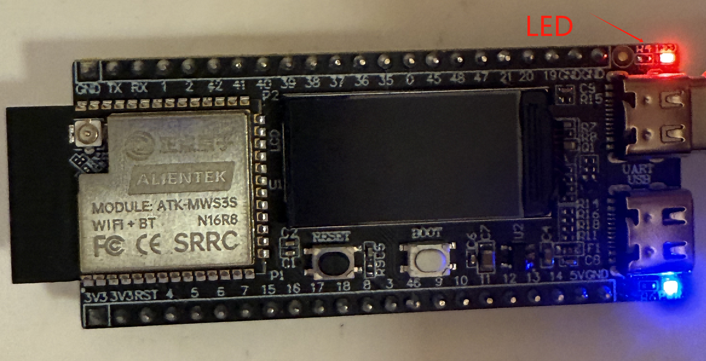

# LED NOTES

## Introduction

!!! note
    In this section, we will talk about the onboard LED light on the DNESP32S3M development board. By modify the GPIO pin, the code can be used for other boards as well.

## The LED

{ width=800px }

## The Circuit Onboard

{ width=800px }

As can be seen, the GPIO to control the LED is IO1.

## The Effect

{ width=800px }

## Dependencies

## Key Functions

| Function Prototype | Explanation | Example |
| --- | --- | --- |
| `void led_init(void)` | Initialize the LED | `led_init();` |
| `void led(int x)` | Control the LED | `led(1);` |
| `void led_toggle(void)` | Toggle the LED | `led_toggle();` |