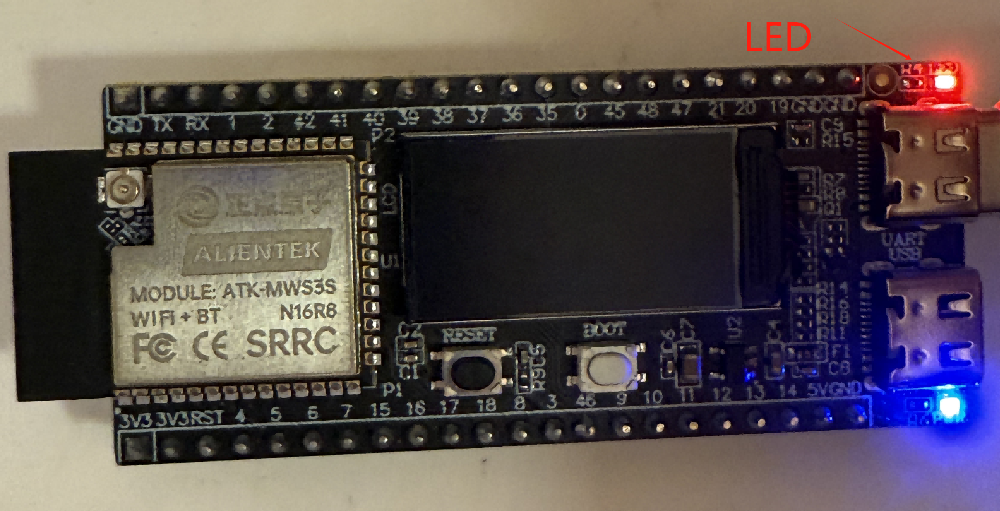
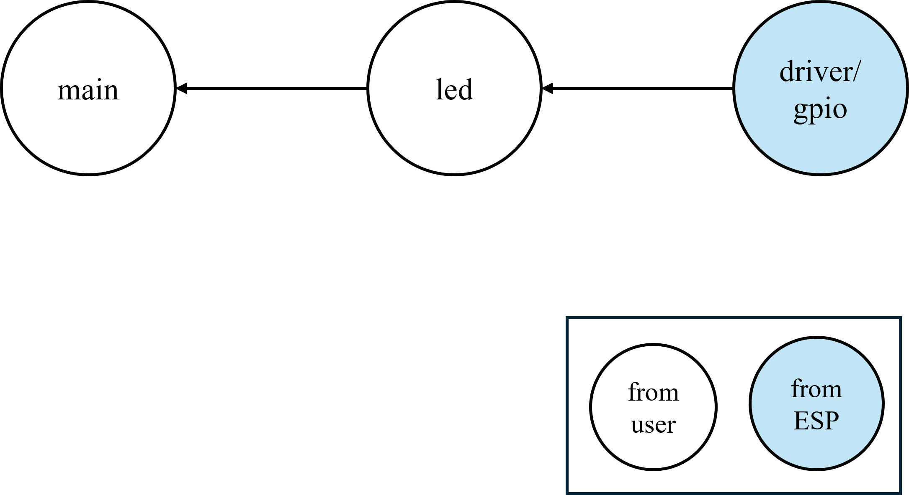

# LED 笔记

## 介绍

!!! note
    本章我们讲解DNESP32S3M开发板上的板载LED灯的驱动和控制。通过修改GPIO引脚，代码也可以用于其他开发板。

## LED灯

{ width=800px }

## 电路示意图

{ width=800px }

如图所示，控制LED的GPIO是IO1。

## 效果图

{ width=800px }

## 依赖关系

!!! tip
    "[ ]" 代表该依赖来自于ESP-IDF内置的库

## 关键函数

| 函数原型 | 说明 | 示例 |
| --- | --- | --- |
| `void led_init(void)` | 初始化LED | `led_init();` |
| `void led(int x)` | 控制LED | `led(1);` |
| `void led_toggle(void)` | 切换LED | `led_toggle();` |
