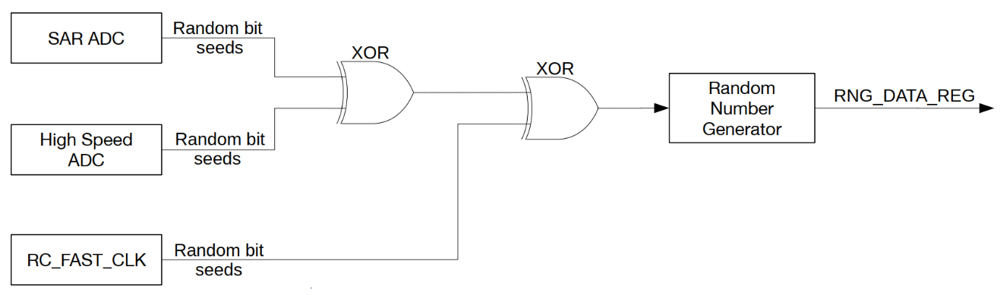
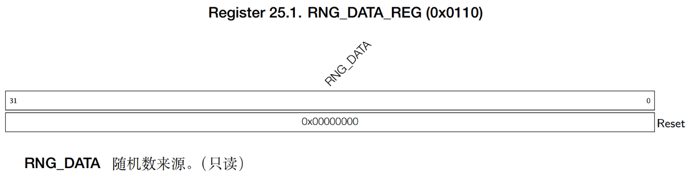

# RNG (Random Number Generator)

!!! info
    ESP32-S3 features a true random number generator (RNG) that generates 32-bit random numbers, which can serve as a basis for operations such as encryption. Unlike algorithm-based generators, the ESP32-S3 RNG produces true random numbers through physical processes, ensuring an equal probability of occurrence for all numbers within a specific range.

## RNG Features

To better understand the RNG, let's first examine its noise sources. Familiarizing yourself with the noise sources provides a solid foundation for programming and offers a clearer perspective on its workings. The noise sources of the ESP32-S3 RNG are illustrated below:

The ESP32 RNG generates 32-bit true random numbers via the **RNG_DATA_REG** register. Its noise sources mainly include thermal noise and asynchronous clocks:
- Thermal noise originates from the SAR ADC or high-speed ADC. When these modules are active, they generate bitstreams that are processed through an XOR operation to serve as random seeds for the RNG.
- When the RC_FAST_CLK (20MHz) is enabled for the digital core, the RNG samples the clock, leveraging its metastable characteristics to increase entropy.

For maximum entropy, it is recommended to enable at least one ADC (SAR ADC or high-speed ADC) as a random seed source in conjunction with the RC_FAST_CLK.

## RNG Random Number Register

**RNG_DATA_REG** Random Number Data 0x0110 Read-only

## Example

This example demonstrates how to use the ESP32-S3 built-in hardware random number generator (RNG) to obtain random numbers, for a given period, and print them.

## Dependencies

This section does not have any dependencies.

## Key Functions

| Function Prototype | Explanation | Example |
| --- | --- | --- |
| uint32_t rng_get_random_num(void) | Get a random number | rng_get_random_num() |
| int rng_get_random_range(int min, int max) | Get a random number within a specific range | rng_get_random_range(0, 9) |

