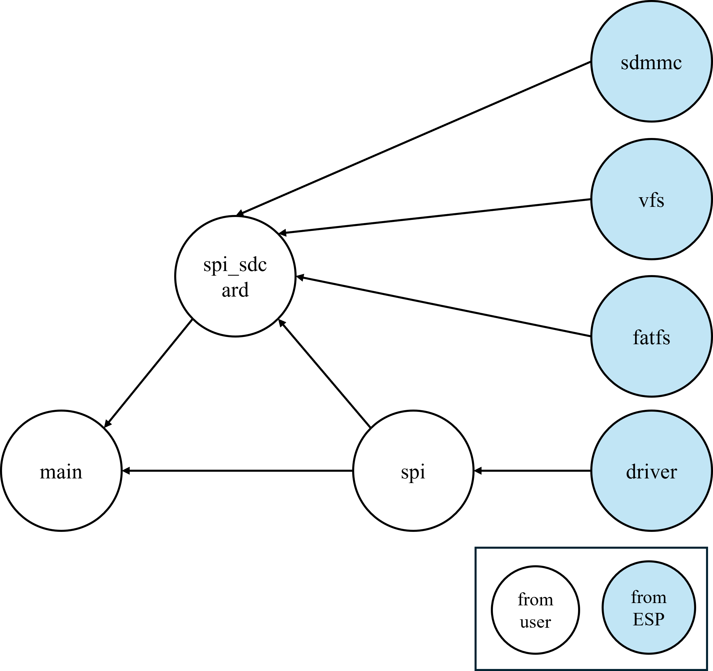

# TF卡（SD卡）操作 - SPI方式

## 介绍

!!! info "SD卡介绍"
    本很多单片机系统都需要大容量存储设备，以存储数据。目前常用的有U盘，FLASH芯片，SD卡等。他们各有优点，综合比较，最适合单片机系统的莫过于SD卡了，它不仅容量可以做到很大（32GB以上），支持SPI/SDIO驱动，而且有多种体积的尺寸可供选择（标准的SD卡尺寸及Micro SD卡尺寸等），能满足不同应用的要求。
    
    只需要少数几个IO口即可外扩一个高达32GB或以上的外部存储器，容量从几十M到几十G选择范围很大，更换也很方便，编程也简单，是单片机大容量外部存储器的首选。

    正点原子ESP32-S3最小系统板使用的接口是Micro SD卡接口，卡座带自锁功能，SD SPI主机驱动程序基于SPI Master Driver实现。借助SPI主控驱动程序，SD卡及其他SPI设备可以共享同一SPI总线。SPI主机驱动程序将处理来自不同任务的独占访问。

!!! info
    一个完整的 SD卡操作过程是：主机(单片机等)发起“命令”，SD卡根据命令的内容决定是否发送响应信息及数据等，如果是数据读/写操作，主机还需要发送停止读/写数据的命令来结束本次操作，这意味着主机发起命令指令后，SD 卡可以没有响应、数据等过程，这取决于命令的含义。

!!! info "卡模式"
    SD卡有两种有效操作模式：“卡识别模式”和“数据传输模式”。根据操作方式不同，分为SD模式和SPI模式。正点原子ESP32-S3最小系统板使用的是SPI模式。

## 关键步骤
1. SD卡初始化 （SPI模式/SDIO模式）
2. SD卡读写数据

!!! warning
    ESP32的SDIO驱动模式和SPI驱动模式不兼容，只能选择一种驱动模式。

## 用例

本章实验功能简介：经过一系列初始化之后，通过一个 while 循环以 SD 卡初始化为条件，以检测 SD 卡是否初始化成功，若初始化 SD 卡成功，则会通过串口或者 VSCode 终端输出 SD卡的相关参数，并在 LCD 上显示 SD 卡的总容量以及剩余容量。此时 LED 闪烁，表示程序正在运行。

## 涉及资源

1. LED 灯
LED -IO0
2. 0.96 寸 LCD
3. SD
CS-IO2
SCK-IO12
MOSI-IO11
MISO-IO13

## 接线图

本章实验使用 SPI 接口与 SD 卡进行连接，DNESP32S3M 最小系统板板载了一个 Micro SD卡座用于连接 SD 卡，SD 卡与 ESP32-S3 的连接原理图，如下图所示。

## 关键函数

## 依赖关系

