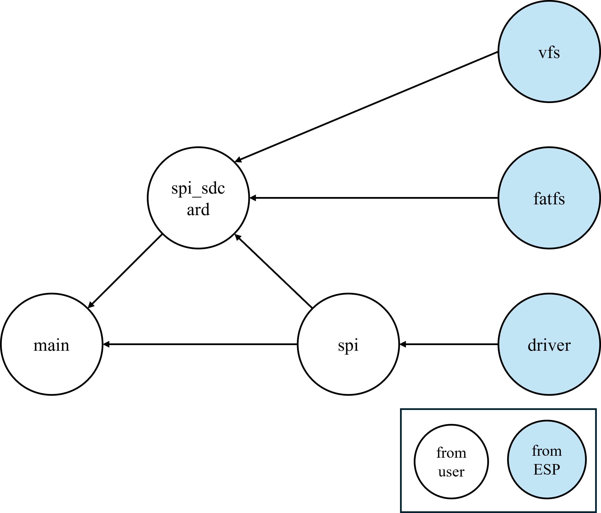

# TF CARD (SD CARD) Operation - SPI Mode

## Introduction

!!! info "SD Card Overview"
    Many microcontroller systems require high-capacity storage devices to store data. Common options include USB drives, FLASH chips, and SD cards. Each has its advantages, but overall, SD cards are the most suitable for microcontroller systems. They offer large capacities (over 32GB), support SPI/SDIO interfaces, and come in various sizes (standard SD card and Micro SD card sizes), meeting the requirements of different applications.

    With just a few IO pins, you can extend storage capacity to 32GB or more, with a wide range of choices from tens of megabytes to tens of gigabytes. They are easy to replace, simple to program, and are the preferred choice for large-capacity external storage in microcontroller systems.

    The ZD Atom ESP32-S3 minimal system board uses a Micro SD card interface with a self-locking card slot. The SD SPI host driver is implemented based on the SPI Master Driver. With the SPI host driver, the SD card and other SPI devices can share the same SPI bus. The SPI host driver handles exclusive access from different tasks.

!!! info
    A complete SD card operation process involves the host (e.g., a microcontroller) initiating a "command." The SD card determines whether to send a response or data based on the command's content. For read/write operations, the host must also send a command to stop reading/writing data to end the operation. This means that after the host sends a command, the SD card may not respond or provide data, depending on the command's meaning.

!!! info "Card Modes"
    SD cards have two effective operation modes: "Card Identification Mode" and "Data Transfer Mode." Based on the operation method, there are SD mode and SPI mode. The ZD Atom ESP32-S3 minimal system board uses SPI mode.

## Key Steps

1. SD card initialization (SPI mode/SDIO mode)
2. SD card read/write operations

!!! warning
    The ESP32's SDIO driver mode and SPI driver mode are not compatible. You can only choose one driver mode.

## Use Case

This experiment introduces the following functionality: After a series of initializations, an SD card initialization condition is used within a `while` loop to check whether the SD card is successfully initialized. If initialization succeeds, SD card parameters will be output to the serial terminal or VSCode terminal, and the total capacity and remaining capacity will be displayed on the LCD. The LED blinks to indicate the program is running.

## Resources Used

1. **LED**
   - LED: IO0
2. **0.96-inch LCD**
3. **SD Card**
   - CS: IO2
   - SCK: IO12
   - MOSI: IO11
   - MISO: IO13

## Connection Diagram

This experiment connects the SD card to the ESP32-S3 using the SPI interface. The DNESP32S3M minimal system board has an onboard Micro SD card slot for connecting the SD card. The schematic for connecting the SD card to the ESP32-S3 is shown below.


## ESP-IDF API

To use SD card-related functionality, you must first import the required files.

```c
#include "driver/sdspi_host.h"
#include "driver/spi_common.h"
#include "sdmmc_cmd.h"
#include "driver/sdmmc_host.h"
#include "spi.h"
```

## Key Functions

### Mount SD Card

```c
esp_err_t esp_vfs_fat_sdspi_mount(const char* base_path,
                                  const sdmmc_host_t* host_config_input,
                                  const sdspi_device_config_t* slot_config,
                                  const esp_vfs_fat_mount_config_t*mount_config,
                                  sdmmc_card_t** out_card);
```


| Parameter         | Description                                                                                                             |
| :---------------- | :---------------------------------------------------------------------------------------------------------------------- |
| `base_path`       | Mount point, the path where the partition should be registered (e.g., "/sdcard").                                       |
| `host_config_input` | SDMMC host configuration, a pointer to a structure describing the SDMMC host. This structure can be initialized using the `SDSPI_HOST_DEFAULT` macro. |
| `slot_config`     | SD card configuration, a pointer to a structure with slot configuration. For SPI peripherals, pass a pointer to an `sdspi_device_config_t` structure initialized using `sdspi_device_config_DEFAULT`. |
| `mount_config`    | Mount configuration, a pointer to an `esp_vfs_fat_mount_config_t` structure to configure the FAT file system mount options. |
| `out_card`        | If not `NULL`, a pointer to the card information structure will be returned through this parameter.                      |


| Return Value               | Description                                                                                                   |
| :------------------------- | :----------------------------------------------------------------------------------------------------------- |
| `ESP_OK`                   | Operation succeeded.                                                                                         |
| `ESP_ERR_INVALID_STATE`    | Invalid state, if `esp_vfs_fat_sdmmc_mount` has already been called.                                         |
| `ESP_ERR_NO_MEM`           | Memory allocation failure.                                                                                   |
| `ESP_FAIL`                 | If the partition cannot be mounted, other error codes from the SDMMC or SPI driver, SDMMC protocol, or FATFS driver. |

### Unmount SD Card

```c
esp_err_t esp_vfs_fat_sdspi_unmount(const char* base_path, sdmmc_card_t* card);
```

## Parameter Description

| Parameter   | Description                                                   |
| :---------- | :------------------------------------------------------------ |
| `base_path` | Mount point, the path where the partition should be registered (e.g., "/sdcard"). |
| `card`      | SD/MMC card structure.                                        |

## Return Value Description

| Return Value           | Description                                                  |
| :--------------------- | :----------------------------------------------------------- |
| `ESP_OK`               | Operation succeeded.                                         |
| `ESP_ERR_INVALID_ARG`  | If the `card` parameter is not registered.                   |
| `ESP_ERR_INVALID_STATE`| If `esp_vfs_fat_sdmmc_mount` has not been called yet.        |

## Dependencies

