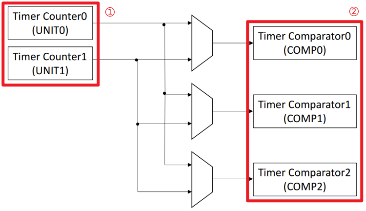
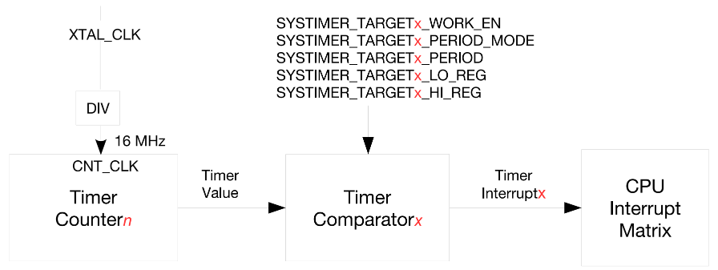
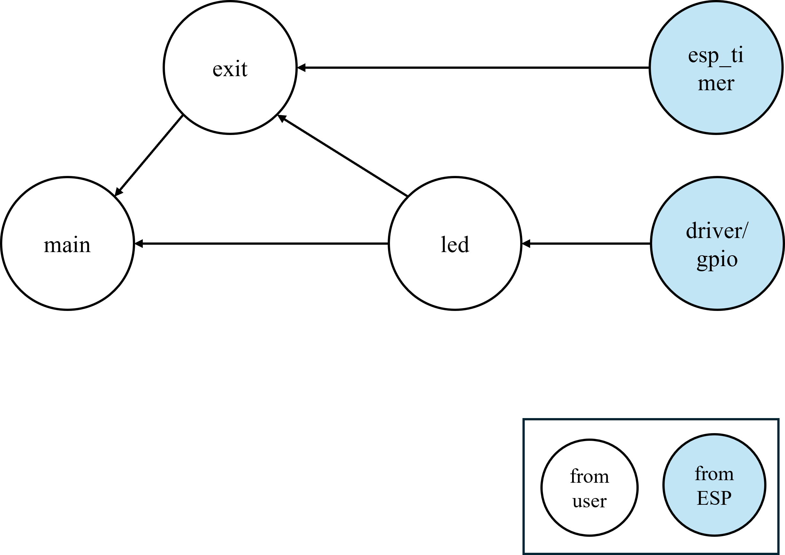

# 定时器

## 介绍

本章介绍 ESP32 定时器的使用。

!!! info "定时器"
    定时器是单片机内部集成的功能，它能够通过编程进行灵活控制。单片机的定时功能依赖于内部的计数器实现，每当单片机经历一个机器周期并产生一个脉冲时，计数器就会递增。定时器的主要作用在于计时，当设定的时间到达后，它会触发中断，从而通知系统计时完成。在中断服务函数中，我们可以编写特定的程序以实现所需的功能。

!!! info "定时器能做什么"

    - 执行定时任务：定时器常用于周期性执行特定任务。例如，若需要每 500 毫秒执行某项任务，定时器能够精准地满足这一需求。

    - 时间测量：定时器能够精确测量时间，无论是代码段的执行时间还是事件发生的间隔时间，都能通过定时器进行准确的计量。

    - 精确延时：对于需要微秒级精度的延时场景，定时器能够提供可靠的解决方案，确保延时的精确性。

    - PWN信号生成：通过定时器的精确控制，我们可以生成PWM（脉宽调制）信号，这对于驱动电机、调节 LED 亮度等应用至关重要。

    - 事件触发与监控：定时器不仅用于触发中断，实现事件驱动的逻辑，还可用于实现看门狗功能，监控系统状态，并在必要时进行复位操作，确保系统的稳定运行。

!!! info "定时器类型"
    定时器既可通过硬件实现，也可基于软件进行设计，二者各具特色，适用于不同场景：
    硬件定时器，依托微控制器的内置硬件机制，通过专门的计时/计数器电路达成定时功能。其显著优势在于高精度与高可靠性，这是因为硬件定时器的工作独立于软件任务和操作系统调度，故而不受它们的影响。在追求极高定时精确度的场合，如生成 PWM 信号或进行精确时间测量时，硬件定时器无疑是最佳选择。其工作原理确保即便主 CPU 忙于其他任务，定时器也能在预设时间准确触发相应操作。
    而软件定时器，则是通过操作系统或软件库模拟实现的定时功能。这类定时器的性能受系统当前负载和任务调度策略制约，因此在精度上较硬件定时器稍逊一筹。然而，软件定时器在灵活性方面更胜一筹，允许创建大量定时器，适用于对时间控制要求不那么严格的场景。值得注意的是，软件定时器在某些情况下可能面临定时精度问题，特别是在系统负载较重或存在众多高优先级任务时。不过，对于简单的非高精度延时需求，软件定时器通常已经足够应对。

## ESP32-S3 定时器整体框架

系统定时器内置两个计数器 UNIT0 和 UNIT1(如图所示)以及三个比较器 COMP0、COMP1、COMP2(如图所示)。比较器用于监控计数器的计数值是否达到报警值。

(1) 计数器

UNIT0、UNIT1 均为 ESP32-S3 系统定时器内置的 52 位计数器。计数器使用 XTAL_CLK 作为时钟源(40MHz)。XTAL_CLK 经分频后，在一个计数周期生成频率为 fXTAL_CLK/3 的时钟信号，然后在另一个计数周期生成频率为 fXTAL_CLK/2 的时钟信号。因此，计数器使用的时钟CNT_CLK，其实际平均频率为 fXTAL_CLK/2.5，即 16MHz，见图 14.1.2。每个 CNT_CLK 时钟周期，计数递增 1/16µs，即 16 个周期递增 1µs。用户可以通过配置寄存器 SYSTIMER_CONF_REG 中下面三个位来控制计数器 UNITn，这三个位分别是：
①：SYSTIMER_TIMER_UNITn_WORK_EN
②：SYSTIMER_TIMER_UNITn_CORE0_STALL_EN
③：SYSTIMER_TIMER_UNITn_CORE1_STALL_EN
关于这三位的配置请参考《esp32-s3_technical_reference_manual_cn》

(2) 比较器

COMP0、COMP1、COMP2 均为 ESP32-S3 系统定时器内置的 52 位比较器。比较器同样使用 XTAL_CLK 作为时钟源(40MHz)。

上图展示了系统定时器生成报警的过程。在上述过程中用到一个计数器(Timer Countern)和一个比较器(Timer Comparatorx)，比较器将根据比较结果，生成报警中断。

## 用例

我们来设计一个程序，程序运行后配置高分辨率定时器，并开启中断，在中断回调函数中翻转LED 的状态。由于使用的都是板上资源，没有连线。

## 依赖关系

## 关键函数

| 函数原型 | 说明 | 示例 |
| --- | --- | --- |
| void esptim_int_init(uint64_t tps); | 初始化高精度定时器(ESP_TIMER) | exit_init(); |
| void esptim_callback(void *arg); | 定时器回调函数 | exit_callback(); |
| esp_err_t esp_timer_create(const esp_timer_create_args_t* args, esp_timer_handle_t* out_handle) | 创建新定时器 | esp_timer_create(&tim_periodic_arg, &esp_tim_handle); |
| esp_err_t IRAM_ATTR esp_timer_start_periodic(esp_timer_handle_t timer, uint64_t period_us) | 启动周期性定时器 | esp_timer_start_periodic(esp_tim_handle, tps); |

## 总结

!!! note
    本章介绍了 ESP32 定时器的使用，通过设计一个程序，实现了高分辨率定时器的配置，并开启中断，在中断回调函数中翻转 LED 的状态。比较关键的几个点：

    - 如何将定时器文件添加到项目中，源文件，头文件，路径依赖等。

    - 如何构造定时器的初始化函数。

    - 如何构造定时器的回调函数。

    - 如何在应用层调用定时器初始化函数。