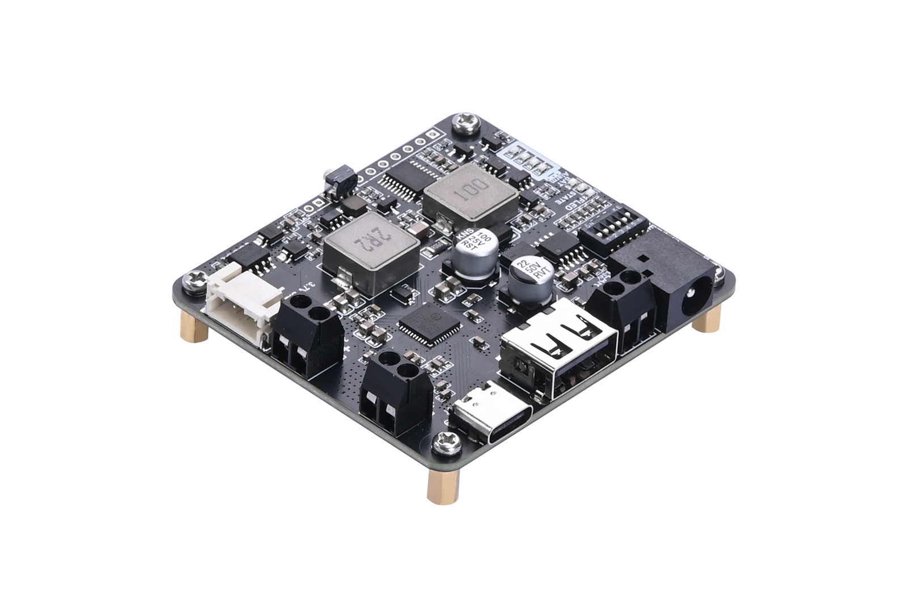
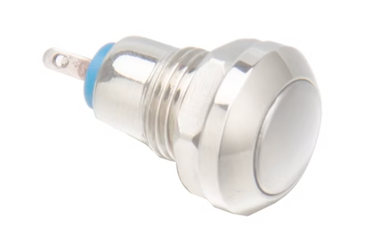
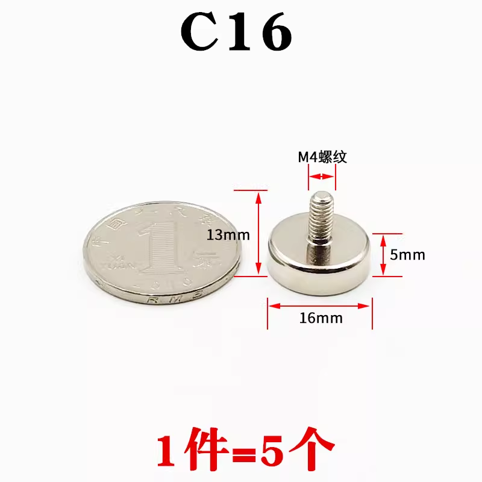
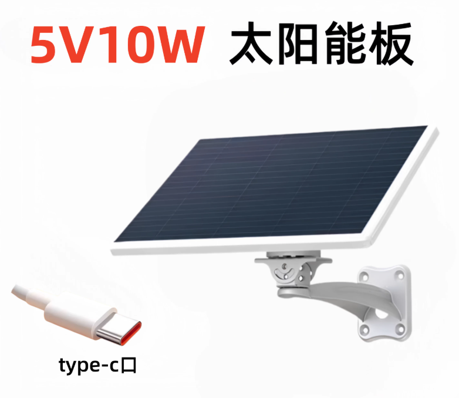
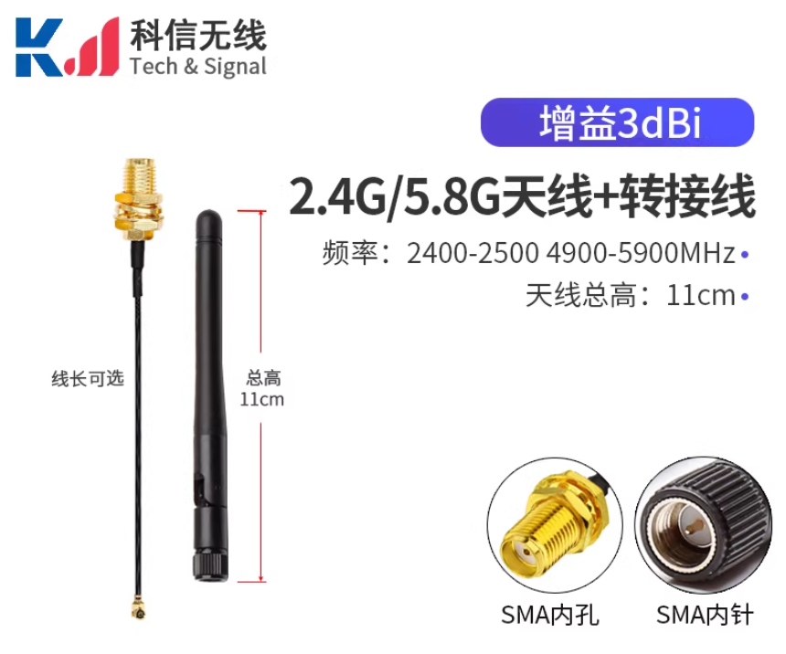

# BILL OF MATERIALS AND PURCHASE LINKS

## PCB

PCB design is done using EasyEDA, and the PCB is manufactured by JLCPCB.

-   :material-file:{ .lg .middle } __EASYEDA Design Files__

    ---

    [:octicons-arrow-right-24: <a href="https://github.com/Shuaiwen-Cui/NexNode/tree/main/DOC/docs/HARDWARE-ESP/EASYEDA" target="_blank"> Download Link </a>](#)

-   :material-cart:{ .lg .middle } __JLCPCB__

    ---

    [:octicons-arrow-right-24: <a href="https://www.jlcpcb.com/" target="_blank"> Purchase Link </a>](#)

## POWER MANAGEMENT

{width=50%}

-   :material-cart:{ .lg .middle } __Power Management Module__

    ---

    [:octicons-arrow-right-24: <a href="https://detail.tmall.com/item.htm?id=988132848239&mi_id=0000SVj08HZjiNkmavqSQMtDDYaUVLwCHSz_Qg98ru8IRB4&spm=tbpc.boughtlist.suborder_itemtitle.1.7b3a2e8dcZTmLu&skuId=5962683741075" target="_blank"> Purchase Link </a>](#)

## BATTERY

{width=50%}

-   :material-cart:{ .lg .middle } __Battery__

    ---

    [:octicons-arrow-right-24: <a href="https://sg.shp.ee/wmPS3m94" target="_blank"> Purchase Link </a>](#)

!!! note "Note"
    Since batteries are sensitive items, the purchase links may become invalid. Please search for suitable alternatives in your local market based on the battery model (18650 lithium-ion battery).

## SWITCH

{width=50%}

-   :material-cart:{ .lg .middle } __Switch__

    ---

    [:octicons-arrow-right-24: <a href="https://www.amazon.com/dp/B07Q6Z1Z9P" target="_blank"> Purchase Link </a>](#)

## ENCLOSURE

-   :material-file:{ .lg .middle } __3D Design Files__

    ---
    
    The following links contain the complete design files, including the main body, lid, BMS mounting frame, and battery mounting板 that need to be 3D printed. Users can download the corresponding design files as needed for 3D printing.

    [:octicons-arrow-right-24: <a href="https://github.com/Shuaiwen-Cui/NexNode/tree/main/DOC/docs/HARDWARE-ESP/FUSION" target="_blank"> Download Link </a>](#)

-   :material-cart:{ .lg .middle } __JLCPCB__

    ---

    [:octicons-arrow-right-24: <a href="https://www.jlcpcb.com/" target="_blank"> Purchase Link </a>](#)

## MAGNET

{width=50%}

-   :material-cart:{ .lg .middle } __Magnet__

    ---

    [:octicons-arrow-right-24: <a href="https://detail.tmall.com/item.htm?id=707591802629&mi_id=00008Q-hb_YP5SVe4UxzaUFui_I_my3L1tQGXtayquIftyA&spm=tbpc.boughtlist.suborder_itemtitle.1.7b3a2e8dcZTmLu&skuId=4972509253171" target="_blank"> Purchase Link </a>](#)

## SOLAR PANEL

{width=50%}

-   :material-cart:{ .lg .middle } __Solar Panel__

    ---

    [:octicons-arrow-right-24: <a href="https://item.taobao.com/item.htm?id=998201969204&mi_id=0000GsGfqNgvIzI0lE5mX-MkQTFFzUpoO7BDBMmhHGY-SYk&skuId=5981195585333&spm=tbpc.boughtlist.suborder_itemtitle.1.7b3a2e8dcZTmLu" target="_blank"> Purchase Link </a>](#)

## ANTENNA

{width=50%}

-   :material-cart:{ .lg .middle } __Antenna__

    ---

    [:octicons-arrow-right-24: <a href="https://item.taobao.com/item.htm?id=724910083205&mi_id=00003sj7SO6nrP9-K40H89QceyoGgs_nH_1PsrnipaShxwI&sku_properties=1627207%3A25488122317%3B-1%3A-1&spm=tbpc.boughtlist.suborder_itemtitle.1.7b3a2e8dcZTmLu" target="_blank"> Purchase Link </a>](#)

## SCREWS AND NUTS

Screw specification: M2.5x5, meaning the screw diameter is 2.5 mm and the length is 5 mm.
Nut specification: M2.5*4*4, meaning the nut inner diameter is 2.5 mm, outer diameter is 4 mm, and height is 4 mm.

Each node can be equipped with about 100 screws and 100 nuts. The exact quantity can be adjusted according to the actual installation requirements.

## HEADER PINS / FEMALE HEADERS / JUMPER CAPS / CONNECTING WIRES

Each node in this project also requires some header pins, female headers, jumper caps, and connecting wires to connect the PCB and other components. Because these parts are relatively easy to buy, only the specifications are listed below, and readers can purchase them locally. Note that the pin spacing of the header pins and female headers is 2.54 mm:

- For the core board, you need 4 2x5p header pins, 1 1x2p straight header pin to form the voltage measurement circuit, 1 1x2p right-angle header pin to control the power indicator LED, and one jumper cap to work with the power indicator LED on/off control.
- For the expansion board, you need 4 2x5p female headers.

## OTHER TOOLS

You will also need some other tools, such as screwdrivers, soldering irons, hot air guns, soldering stations, hot glue guns, and some common electronic and test tools such as multimeters and oscilloscopes. The purchase links for these tools may vary by region and brand, so readers can choose suitable tools locally according to their needs and budget.