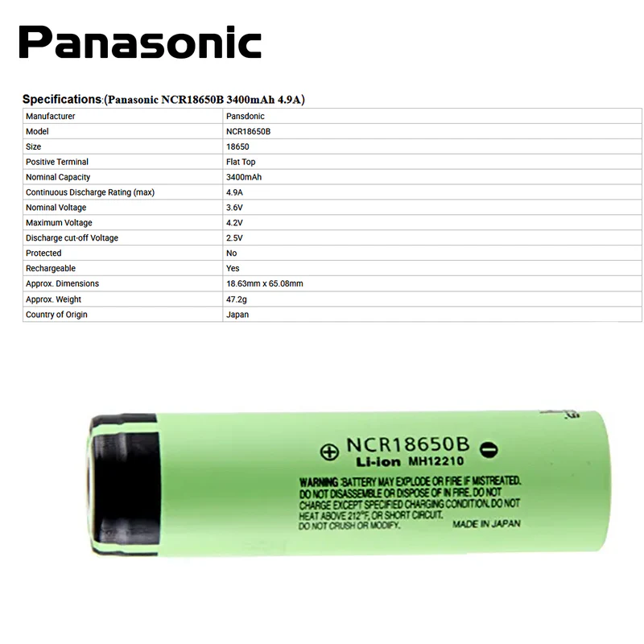
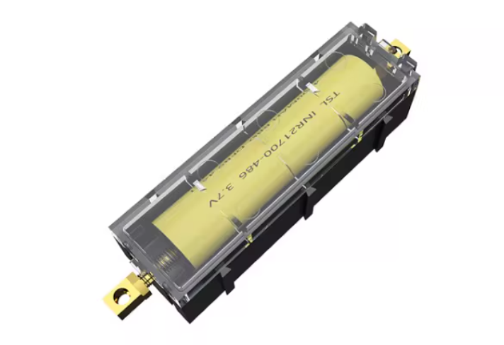
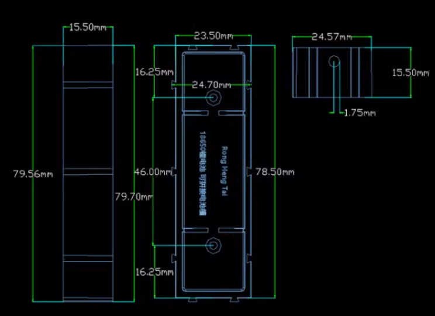
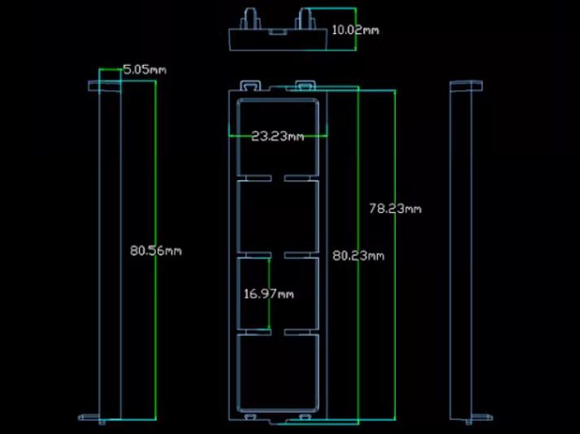

# BATTERY

The battery is an essential component for the SHM node. It provides power to the node, allowing it to operate without an external power source. Choosing the right battery is crucial for ensuring the reliability and performance of the node. For batteries, we need to consider trade-offs in terms of capacity, discharge rate, size, and safety.

## Battery Model

Currently, we have selected the 18650 lithium-ion battery as the power source for the SHM node. This type of battery has a high energy density and a long lifespan, making it suitable for our application needs.

{width=100%}

## Battery Holder

For design considerations, we have chosen a freely splicable battery holder for design assembly. The design of the battery holder allows us to increase or decrease the number of batteries as needed to meet different capacity requirements. At the same time, the battery holder also provides good protection to ensure that the batteries are safe and reliable during use.

{width=100%}

*Battery Holder Appearance*

{width=100%}

*Battery Holder Dimensions*

{width=100%}

*Battery Holder Lid Dimensions*