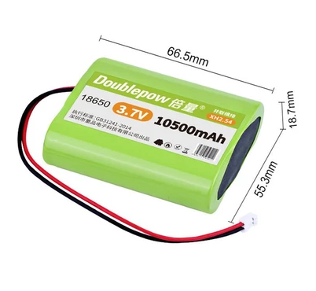

# BATTERY

The battery is an essential component for the SHM node. It provides power to the node, allowing it to operate without an external power source. Choosing the right battery is crucial for ensuring the reliability and performance of the node. For batteries, we need to consider trade-offs in terms of capacity, discharge rate, size, and safety.

!!! tip "Tip"
    It is best for the battery to have overcharge and over-discharge protection features to ensure the safe operation of the node. Additionally, selecting an appropriate battery capacity can extend the working time of the node and reduce maintenance frequency.

## Battery Model

Currently, we have selected lithium-ion batteries as the power source for the SHM node. These batteries have a high energy density and a long lifespan, making them suitable for our application needs. The selected model takes into account the size, capacity, and safety of the battery to meet the operational requirements of the node.

{width=100%}

