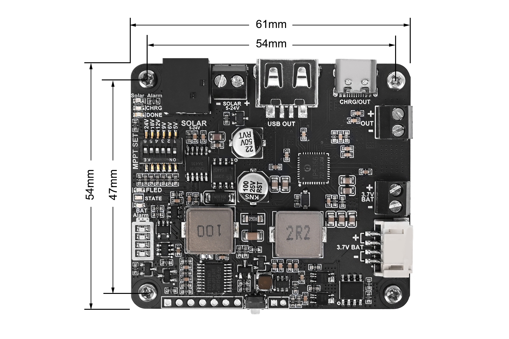

# SOLAR/BATTERY MANAGEMENT SYSTEM

The Solar Energy Manager A is a solar power management module supporting charging 3.7V 18650 lithium batteries via solar panels and USB interface. Features MPPT (Maximum Power Point Tracking) and charge-discharge protection with 5V/3.1A regulated output.

<model-viewer
    src="../../../static/models/bms.glb"
    alt="BMS 3D model"
    camera-controls
    auto-rotate
    auto-rotate-delay="3000"
    rotation-per-second="1deg"
    interaction-prompt="none"
    shadow-intensity="0.6"
    exposure="0.5"
    environment-image="legacy"
    orientation="0deg 0deg 30deg"
    ar
    ar-modes="webxr scene-viewer quick-look"
    style="display: block; width: 100%; height: 600px;">
</model-viewer>

*3D Model*

*Appearance*

*Dimensions*

## Key Specifications

| Parameter | Value |
|-----------|-------|
| Solar Input | 5-24V |
| USB Output | 5V/3.1A |
| Battery | 3.7V 18650 Lithium |
| Charge Protection | 4.2V ±1% |
| Discharge Protection | 3.0V ±1% |
| Dimensions | 61mm × 54mm |
| Weight | 28g |

## Resources

-   :material-file:{ .lg .middle } __Product Information__

    ---

    [:octicons-arrow-right-24: <a href="https://seengreat.com/wiki/161/" target="_blank"> View </a>](#)

