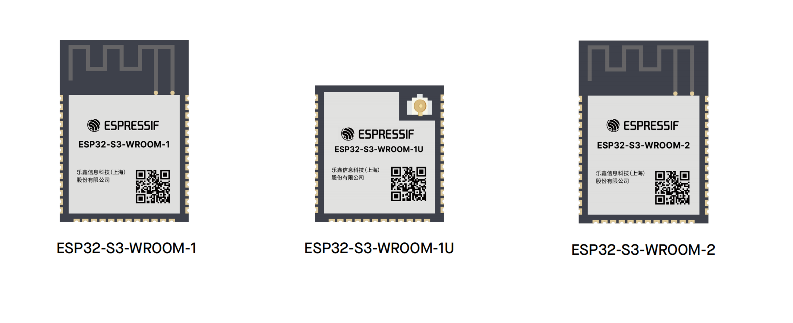
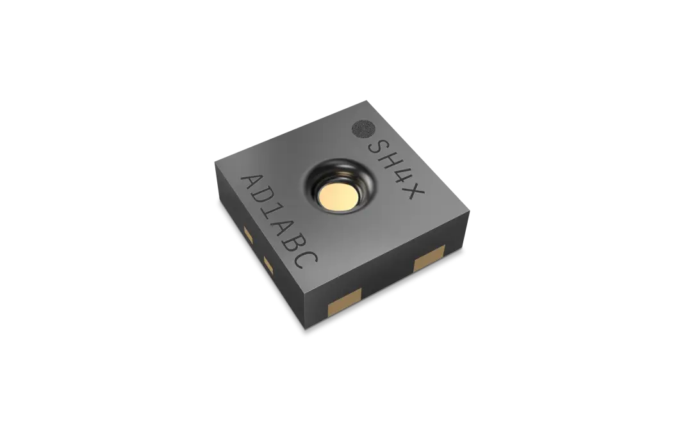
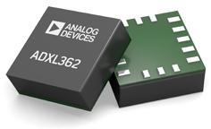
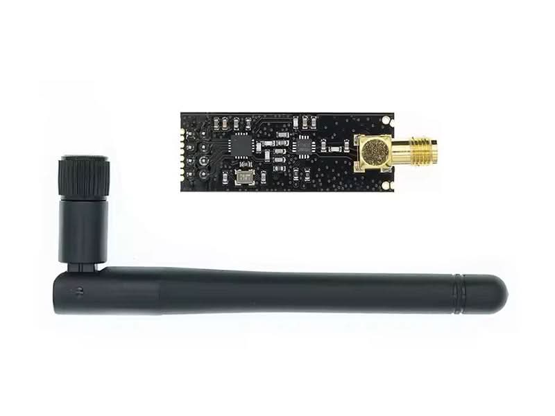
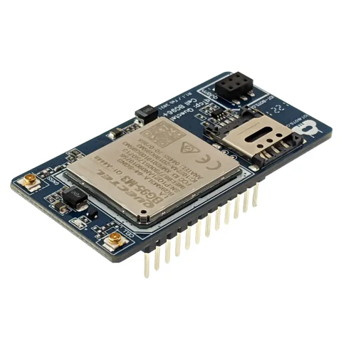

# COMPONENTS SELECTION

## MAIN CONTROLLER SYSTEM

| Module | Antenna Type | FLASH Size | PSRAM Size |
| ---------------- | ---------------- | --------- | ------- |
| ESP32S3-WROOM-1/1U | PCB Antenna / IPEX Antenna | 16MB | 8MB |
| ESP32S3-WROOM-2 | PCB Antenna | 32MB | 16MB |

!!! tip
    The above two models are preliminarily determined to be pin-compatible, but further verification is required.

-   :fontawesome-brands-bilibili:{ .lg .middle } __ESP32S3__

    ---

    [:octicons-arrow-right-24: <a href="https://documentation.espressif.com/esp32-s3_datasheet_en.html" target="_blank"> Data Sheet </a>](#)

    [:octicons-arrow-right-24: <a href="https://documentation.espressif.com/esp32-s3_technical_reference_manual_en.pdf" target="_blank"> Technical Reference Manual </a>](#)

-   :fontawesome-brands-bilibili:{ .lg .middle } __ESP32S3-WROOM-1/1U__

    ---

    [:octicons-arrow-right-24: <a href="https://documentation.espressif.com/esp32-s3-wroom-1_wroom-1u_datasheet_en.html" target="_blank"> Data Sheet </a>](#)

    [:octicons-arrow-right-24: <a href="https://documentation.espressif.com/ESP32-S3-WROOM-1U_V1.4_Reference_Design_0.zip" target="_blank"> Technical Reference Manual </a>](#)

-   :fontawesome-brands-bilibili:{ .lg .middle } __ESP32S3-WROOM-2__

    ---

    [:octicons-arrow-right-24: <a href="https://documentation.espressif.com/esp32-s3-wroom-2_datasheet_en.html" target="_blank"> Data Sheet </a>](#)

    [:octicons-arrow-right-24: <a href="https://documentation.espressif.com/ESP32-S3-WROOM-2_Reference_Design.zip" target="_blank"> Technical Reference Manual </a>](#)

## SENSING SYSTEM

### SHT45 — Digital Temperature & Humidity Sensor

| Item | Details |
|------|------|
| **Manufacturer** | Sensirion |
| **Type** | Digital temperature and humidity sensor |
| **Interface** | I²C (up to 1 MHz) |
| **Measurement Range** | Temperature: −40°C to +125°C; Humidity: 0%RH to 100%RH |
| **Accuracy** | Temperature ±0.1°C (typical), Humidity ±1.0%RH (typical) |
| **Resolution** | Temperature 0.01°C, Humidity 0.01%RH |
| **Response Time** | Humidity ~8 s (τ63%) |
| **Supply Voltage** | 1.08V ~ 3.6V |
| **Power Consumption** | Typical < 0.4 µA (low-power mode) |
| **Package Size** | 1.5 × 1.5 × 0.5 mm |
| **Features** | Integrated heater, factory-calibrated, high accuracy, high stability, suitable for long-term environmental monitoring |

### ADXL362 — Ultra-Low Power 3-Axis Accelerometer

| Item | Details |
|------|------|
| **Manufacturer** | Analog Devices (ADI) |
| **Type** | MEMS 3-axis accelerometer |
| **Interface** | SPI |
| **Measurement Range** | ±2g, ±4g, ±8g selectable |
| **Resolution** | 12-bit (typical) |
| **Noise Density** | 175 µg/√Hz (typical) |
| **Output Data Rate** | 12.5 Hz ~ 400 Hz |
| **Supply Voltage** | 1.6V ~ 3.5V |
| **Power Consumption** | 1.8 µA (wake-up mode), 270 nA (standby mode) |
| **Package Size** | 3 × 3 × 1.06 mm (LGA) |
| **Features** | Ultra-low power, built-in FIFO, integrated wake-up/motion detection, ideal for battery-powered nodes for event triggering or sleep monitoring |

### ADXL355 — Low Noise, High Precision 3-Axis Accelerometer

| Item | Details |
|------|------|
| **Manufacturer** | Analog Devices (ADI) |
| **Type** | MEMS 3-axis accelerometer |
| **Interface** | SPI / I²C |
| **Measurement Range** | ±2g, ±4g, ±8g |
| **Resolution** | 20-bit (effective ~19-bit) |
| **Noise Density** | 25 µg/√Hz (typical) |
| **Output Data Rate** | 4 Hz ~ 4 kHz |
| **Supply Voltage** | 2.25V ~ 3.6V |
| **Power Consumption** | 200 µA (operation), 21 µA (standby) |
| **Package Size** | 3 × 3 × 1.25 mm (LGA) |
| **Features** | Ultra-low noise, high resolution, high stability, integrated temperature sensor and self-calibration, ideal for vibration and seismic monitoring applications |

## Communication System

| Communication Type | Model | Remarks |
| ---------------- | ---------------- | ------------------------ |
| Wi-Fi | Integrated in main MCU | - |
| Bluetooth | Integrated in main MCU | Low power |
| ESP-NOW | Integrated in main MCU | - |
| Cellular Network | Quectel BG95 | LTE Cat.M1 / NB-IoT, UART interface |

<!-- ## Actuation System

| Device Type | Model | Remarks |
| ---------------- | ---------------- | ------------------------ |
| LED | - | - |
| RGB LED | WS2812B | - |
| Buzzer | - | - |
| Display | - | - |

## Power System

| Device Type | Model | Remarks |
| ---------------- | ---------------- | ------------------------ |
| Charging IC | - | - |
| Power Switch | - | - |
| Battery | - | - |

!!! warning "Note"
    All the above selections are preliminary and subject to change based on actual requirements.  
    A potential issue is that there are too many I²C and SPI devices, which may require the use of a multiplexer. -->
