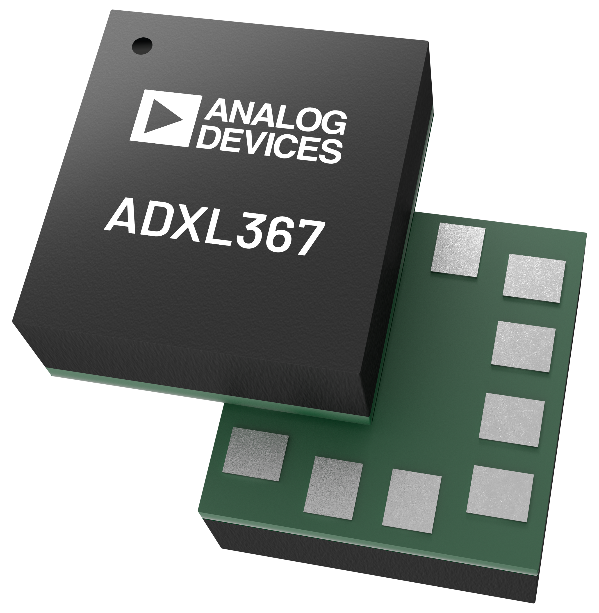
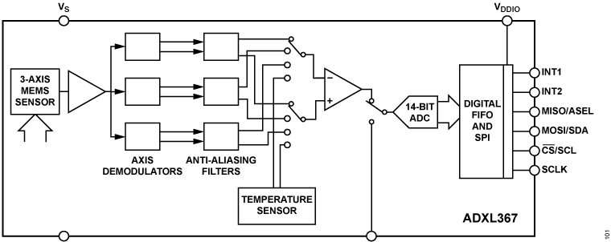
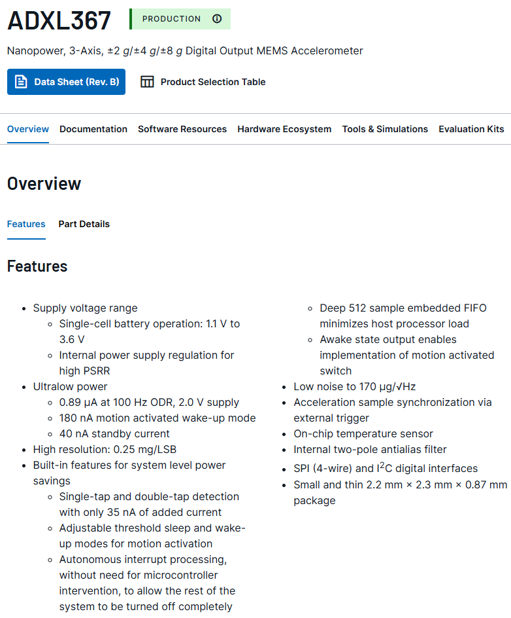
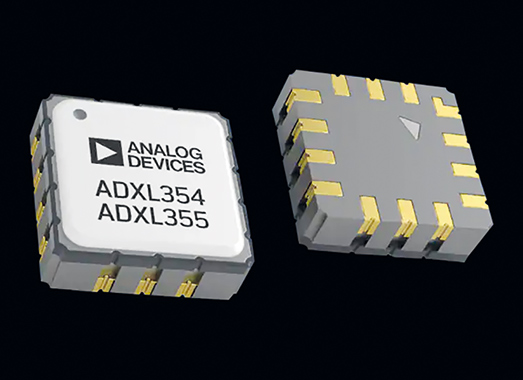
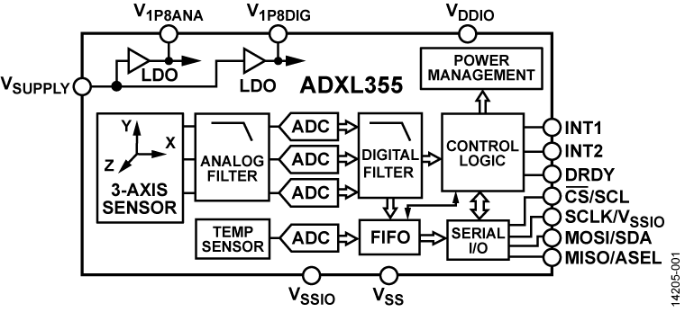
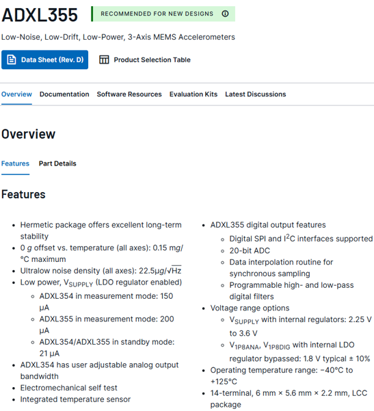

# SENSOR

## Accelerometer - ADXL367

{width="400px"}

*Figure 1. ADXL367 device appearance*

{width="800px"}

*Figure 2. ADXL367 functional block diagram*

{width="800px"}

*Figure 3. ADXL367 package and pin information*

## Accelerometer - ADXL355

{width="400px"}

*Figure 4. ADXL355 device appearance*

{width="800px"}

*Figure 5. ADXL355 functional block diagram*

{width="800px"}

*Figure 6. ADXL355 package and pin information*

## ADXL367 / ADXL355 Key Parameter Comparison

| Parameter | ADXL367 | ADXL355 |
|------|---------|---------|
| Manufacturer | Analog Devices (ADI) | Analog Devices (ADI) |
| Type | Ultralow-power digital 3-axis MEMS accelerometer | Low-noise, high-precision digital 3-axis MEMS accelerometer |
| Interface | SPI (4-wire) / I²C | SPI / I²C |
| Measurement Range | ±2g, ±4g, ±8g | ±2g, ±4g, ±8g |
| Resolution | 14-bit (with 12-bit / 8-bit output formats for compatibility) | 20-bit ADC (effective resolution ~19-bit) |
| Noise Density (typ.) | As low as 170 µg/√Hz | 22.5~25 µg/√Hz |
| Output Data Rate (ODR) | Configurable (commonly up to 400 Hz) | 4 Hz ~ 4 kHz |
| Supply Voltage | 1.1 V ~ 3.6 V | 2.25 V ~ 3.6 V |
| Power Consumption (typ.) | 0.89 µA @ 100 Hz; 180 nA (motion wake-up); 40 nA (standby) | 200 µA (measurement); 21 µA (standby) |
| FIFO Depth | 512 samples | 96 samples |
| Temperature Sensor | Integrated | Integrated |
| Typical Applications | Always-on battery sensing, wake-up trigger, wearables | Structural vibration monitoring, tilt/IMU, high-precision condition monitoring |

> Note: This table is a design-oriented summary. Always use the latest datasheet as the final reference.

## Collaborative Use in SHM

- This node uses a **combined ADXL367 + ADXL355 architecture**.
- **ADXL367**: handles long-term low-power always-on monitoring (event wake-up, low-power edge detection).
- **ADXL355**: handles high-precision capture and structural evaluation during critical events (vibration analysis, SHM diagnostics).
- Combined value: low-power front-end screening + high-precision back-end analysis, balancing energy budget and measurement quality for SHM workflows.
