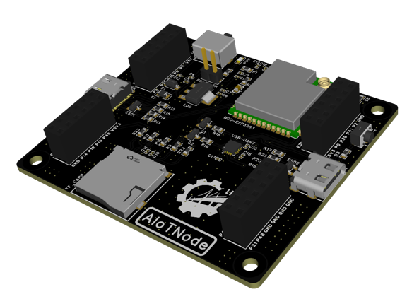
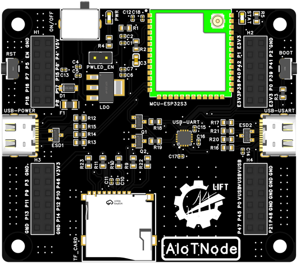
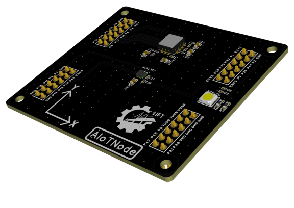
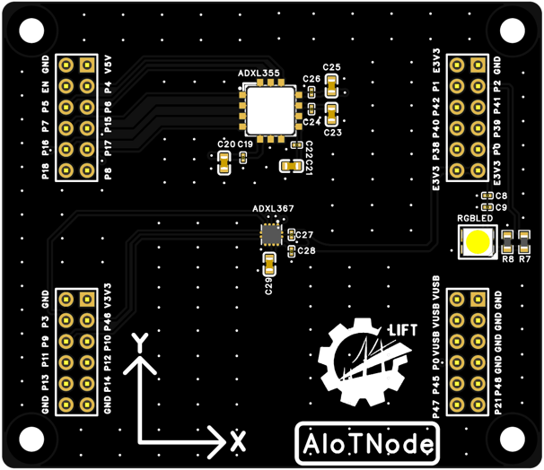

# PCB LAYOUT

!!! INFO 
    This section is still under design and adjustment. The following images are preliminary versions of the PCB layout diagrams, which will be updated and improved as the design progresses.

## Base Board

{width="800px"}
*Figure 1. Base Board 3D View*

{width="800px"}
*Figure 2. Base Board Top Layout*

## Extension Board

{width="800px"}
*Figure 3. Extension Board 3D View*

{width="800px"}
*Figure 4. Extension Board Top Layout*