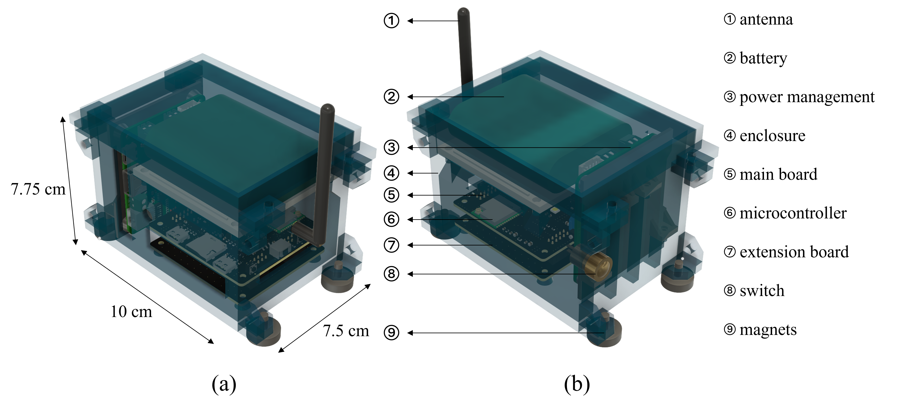
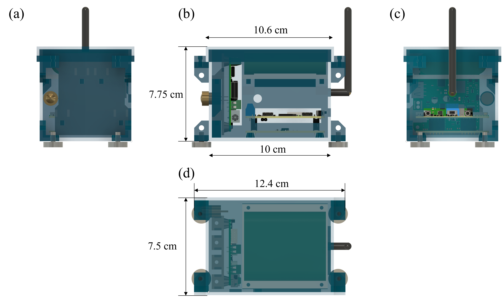
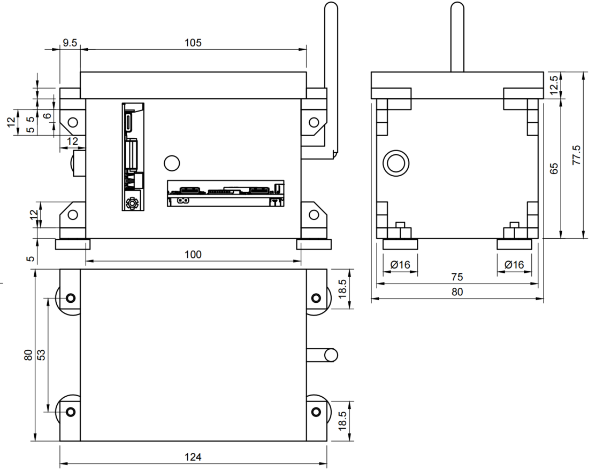

# 机械设计

机械设计很大程度决定了节点在布置和安装时的灵活性和适用性。本项目中，节点机械设计兼顾了功能性和美观性，在支持长时间部署的同时，又尽可能的做到紧凑小巧。

{width=100%}

*机械设计概览*

上图展示了节点的整体机械设计。我们采用了坚固耐用的外壳来保护内部组件，同时在设计中预留了足够的空间来容纳各种接口和功能模块。外壳采用模块化设计，方便用户进行维护和升级。上图也展示了节点的尺寸和关键组件的位置。我们在设计中充分考虑了空间利用率，确保各个组件之间有足够的空间进行散热和维护。同时，节点的尺寸也经过优化，以适应不同的安装环境和应用场景。

{width=100%}

*正交视图*

上图展示了节点的正交视图，从不同角度展示了节点的结构和组件布局。通过正交视图，用户可以更清晰地了解节点的内部结构和组件位置，有助于安装、维护和升级。正交视图还展示了节点的接口布局，包括电源接口、通信接口和其他功能接口，方便用户进行连接和使用。

{width=100%}

*三视图*

上图展示了节点的三视图，包括前视图、侧视图和俯视图。三视图提供了节点的详细尺寸和组件位置，帮助用户更好地理解节点的结构和设计。通过三视图，用户可以清晰地看到节点的外形、接口布局和内部组件的位置，有助于安装、维护和升级。

## 外壳

### 设计

外壳分为主体和盖子两个部分，设计时考虑到了户外部署的需求，支持使用磁铁进行安装，支持在底部和侧部安装。同时在盒子外侧进行开口处理，方便用户插接线和操作按钮。开口考虑使用橡胶塞进行密封，保证防水性能。而我们设计了许多螺丝孔，方便用户进行安装和维护，配套需要使用热熔螺母进行安装。

### 制作

外壳采用3D打印技术制作，使用8228树脂材料，具有良好的强度和耐候性。3D打印技术使得外壳的设计和制作更加灵活，可以根据需要进行快速迭代和定制。使用8228树脂材料可以确保外壳在户外环境中具有良好的耐久性和防护性能，保护内部组件免受损坏。

### 相关零件

- 盒子
- 盖子
- 热熔螺母 + 加热枪
- 螺丝
- 磁铁，螺母
- 橡胶塞

## 挂载系统

### BMS 挂载框

为了方便固定和挂载BMS开发板，我们设计了一个专用的挂载框，采用与外壳相同的材料和制作工艺。挂载框具有多个安装孔和固定点，可以牢固地固定BMS开发板，并且与外壳的设计兼容，方便用户进行安装和维护。挂载框的设计考虑了散热和空间利用，确保BMS开发板在运行过程中能够保持良好的散热性能，同时提供足够的空间来容纳其他组件和接口。

### 电池 挂载板

为了把电池挂载到外壳上面，我们设计了一个挂载板，采用与外壳相同的材料和制作工艺。挂载板与外壳的连接采用螺丝螺母固定，但是挂载板和电池之间采用胶固定，预计使用502/热熔胶进行固定。挂载板的设计考虑了电池的尺寸和重量，确保电池能够牢固地固定在外壳上，同时提供足够的空间来容纳其他组件和接口。挂载板还考虑了散热和安全性，确保电池在运行过程中能够保持良好的散热性能，并且提供必要的保护措施来防止电池损坏或发生安全事故。

### 相关零件

- BMS 挂载框
- 电池挂载板
- 开关
- 电线

## 天线

天线是配合ESP32-S3-WROOM-1U模块，对应IPEX接口的外置天线。我们在外壳上开了一个圆形孔，用来安装天线。

### 相关零件

- 天线