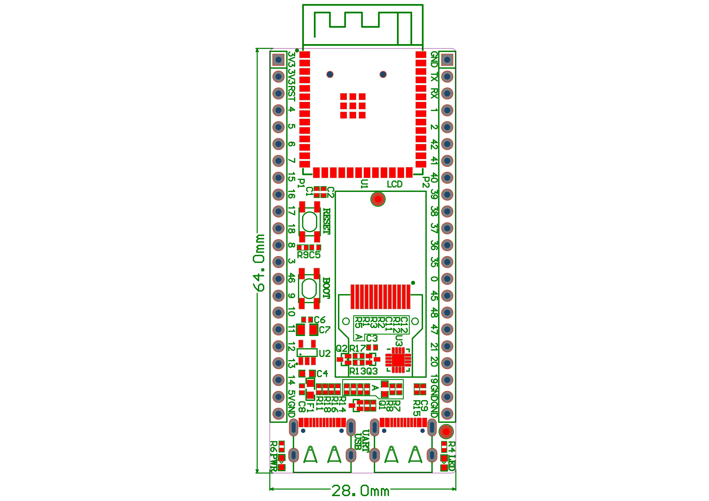
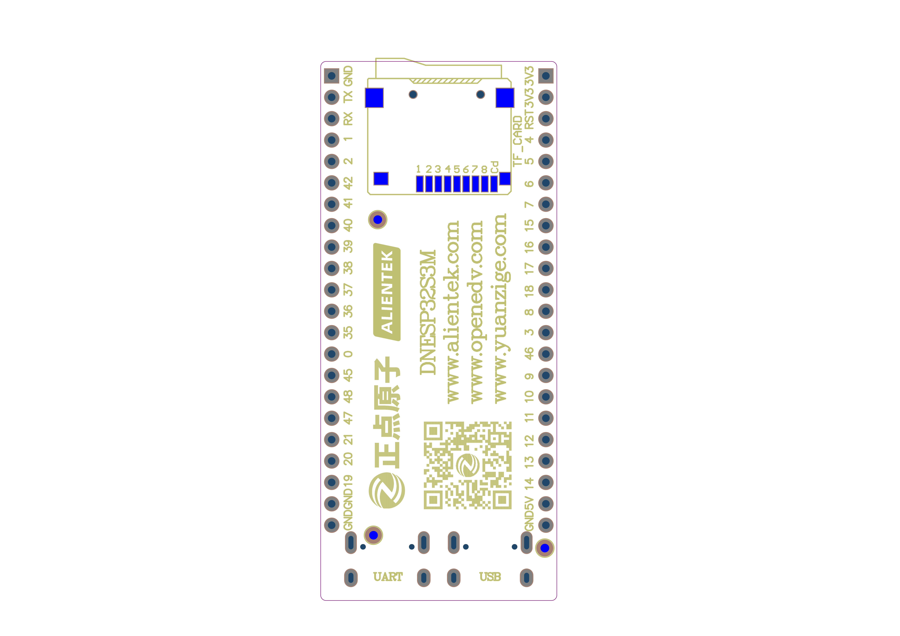
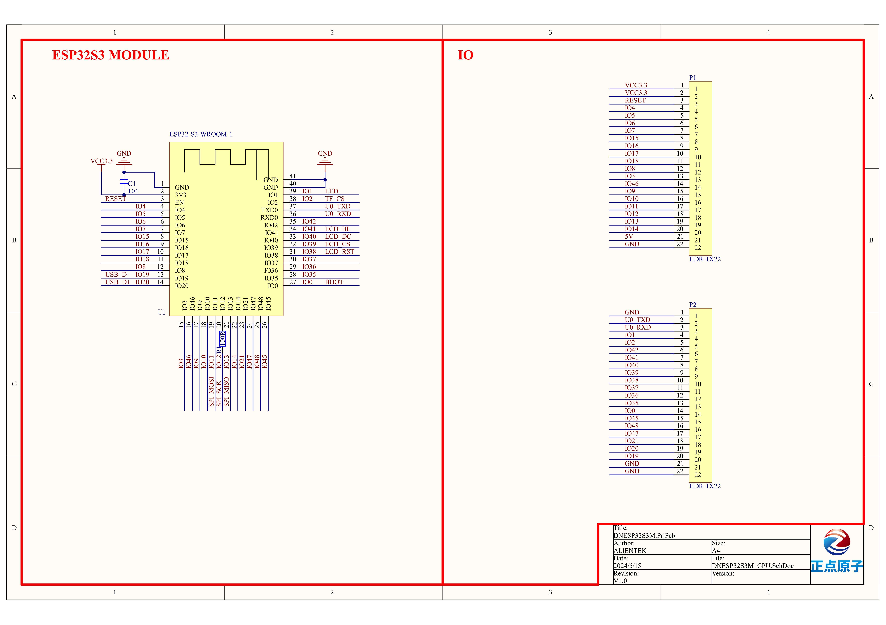
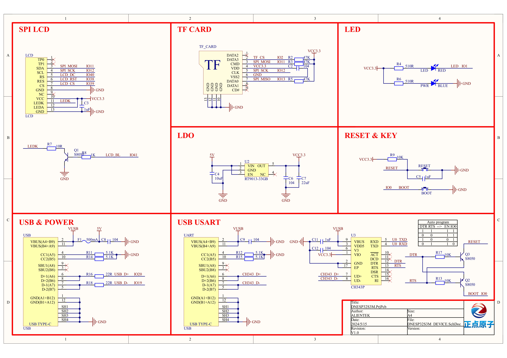

# SCHEMATIC

Official Reference

-   :fontawesome-brands-bilibili:{ .lg .middle } __ESP32S3__

    ---

    [:octicons-arrow-right-24: <a href="https://docs.espressif.com/projects/esp-hardware-design-guidelines/en/latest/esp32s3/index.html" target="_blank">  Hardware Design Guidelines </a>](#)

## CORE BOARD ATK DNESP32S3M

{width=100%}
{width=100%}

{width=100%}
{width=100%}