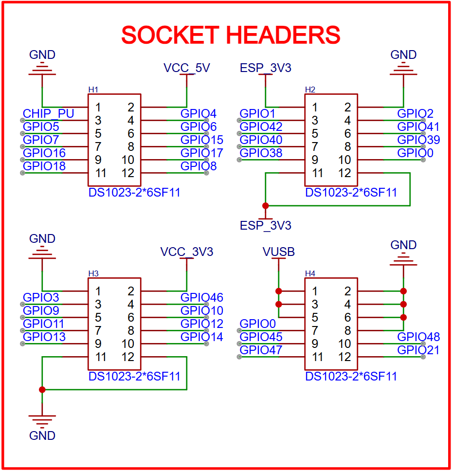
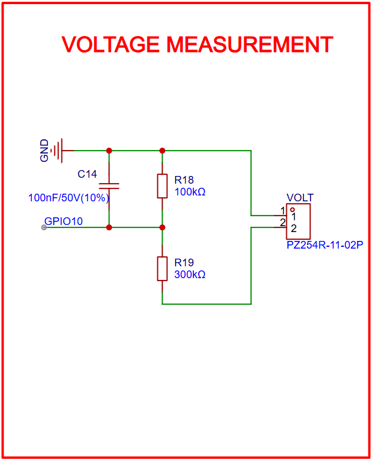
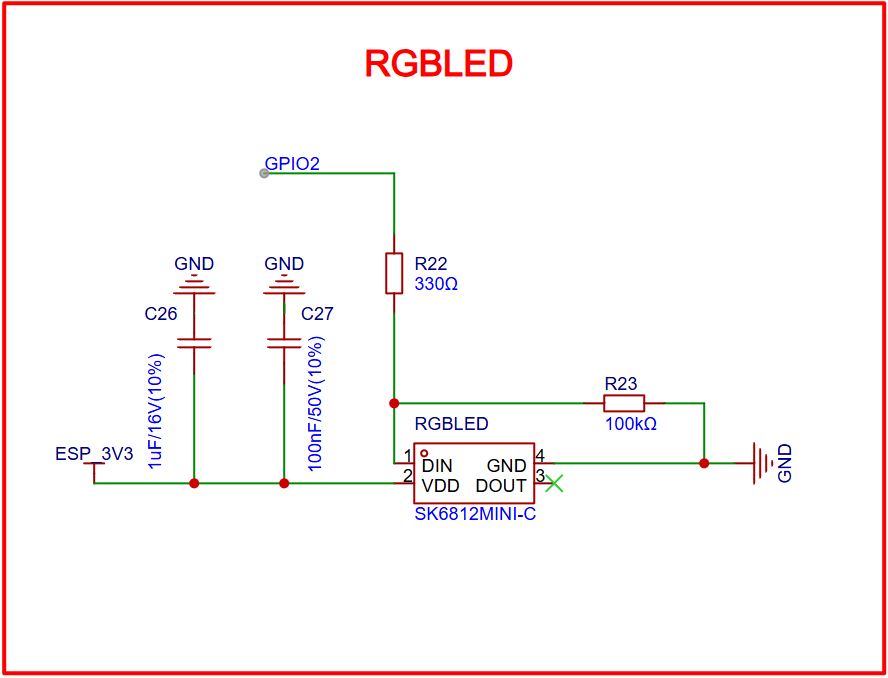

# SCHEMATIC

Official Reference

-   :fontawesome-brands-bilibili:{ .lg .middle } __ESP32S3__

    ---

    [:octicons-arrow-right-24: <a href="https://docs.espressif.com/projects/esp-hardware-design-guidelines/en/latest/esp32s3/index.html" target="_blank">  Hardware Design Guidelines </a>](#)

## BASE BOARD

### Main Controller

{width=100%}

### Connector

{width=100%}

### Linear Regulator

{width=100%}

### LED Indicator

{width=100%}

### TF Card Slot

{width=100%}

### Button

{width=100%}

### USB Type-C Interface - Power

{width=100%}

### USB Type-C Interface - UART

{width=100%}

### Voltage Measurement Circuit

{width=100%}

### Auto Download Circuit

{width=100%}

## EXTENSION BOARD

### Connector

{width=100%}

### Sentinel Sensor

{width=100%}

### Primary Sensor

{width=100%}

### RGB LED Indicator

{width=100%}