# SCHEMATIC

Official Reference

-   :fontawesome-brands-bilibili:{ .lg .middle } __ESP32S3__

    ---

    [:octicons-arrow-right-24: <a href="https://docs.espressif.com/projects/esp-hardware-design-guidelines/en/latest/esp32s3/index.html" target="_blank">  Hardware Design Guidelines </a>](#)

## BASE BOARD

### Main Controller

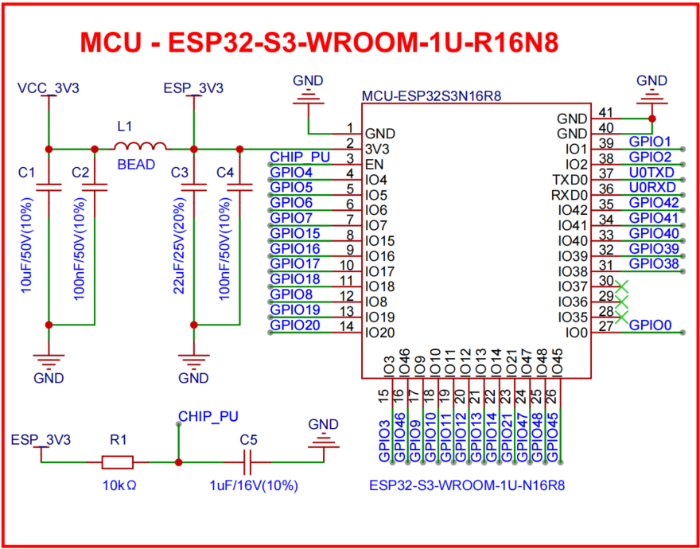{width=100%}

*Microcontroller*

### Connector

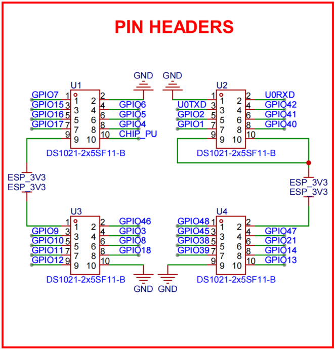{width=100%}

*Main board connector*

In this design, the main controller board is mounted on the upper side, so we use pin headers as connectors for easy assembly and disassembly. Considering mechanical stress and component placement, we selected four 2x5 headers to provide 10 connection points. This meets the signal transmission requirements between the main board and the extension board while also serving as structural support points to ensure stable and reliable connections.

### Linear Regulator (LDO)

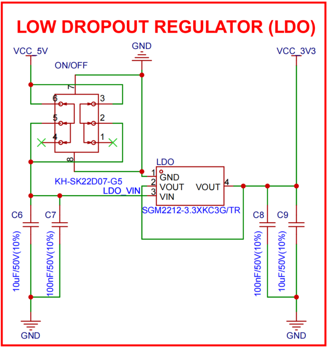{width=100%}

*Linear regulator*

As shown in the figure, we use a linear regulator (LDO) to provide a stable output voltage for the system. The LDO converts the input voltage into the required regulated output to ensure normal system operation. When selecting the LDO, we considered output current capability, efficiency, and thermal performance to satisfy system power consumption and heat dissipation requirements. In addition, a power switch is included so users can turn the power on or off as needed to save energy.

### LED & RGB LED

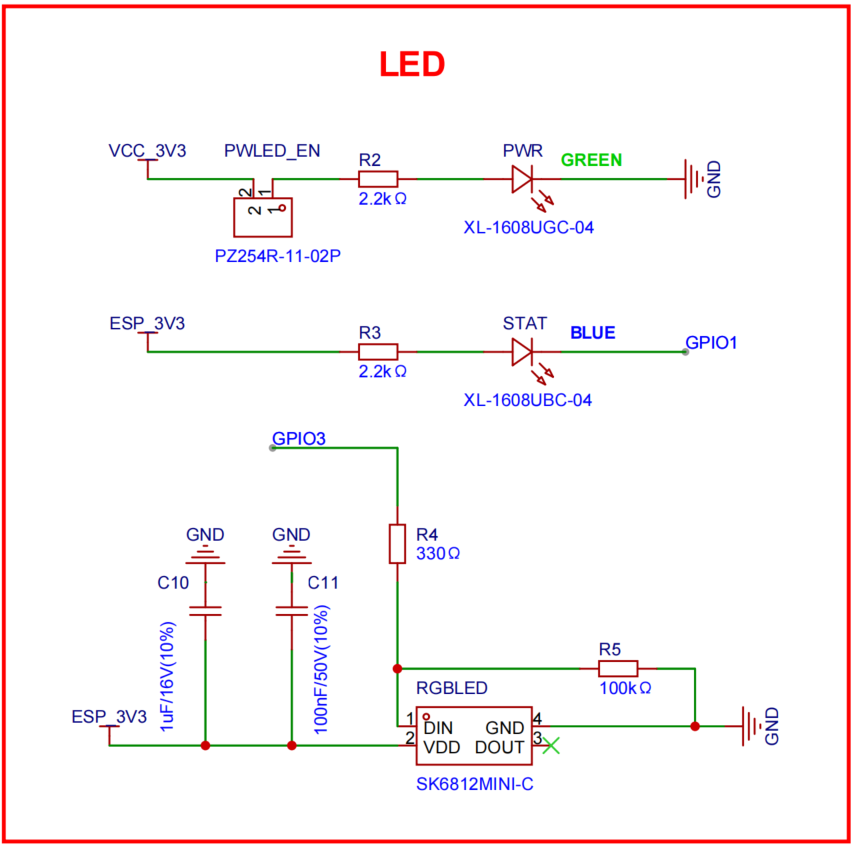{width=100%}

*LED and RGB LED*

As shown in the figure, this project uses three LEDs in total: two standard LEDs and one RGB LED. The standard LEDs are used for system status indication, such as power and operation indicators, while the RGB LED provides richer status information or visual effects through different color combinations. LEDs improve user experience and make system status easier to understand at a glance. For power saving, the power indicator path includes a jumper-cap-controlled on/off option. For long-duration deployments, the path can be disconnected to reduce power consumption; for indoor use, it is recommended to keep it connected for continuous status visibility.

### TF Card Slot

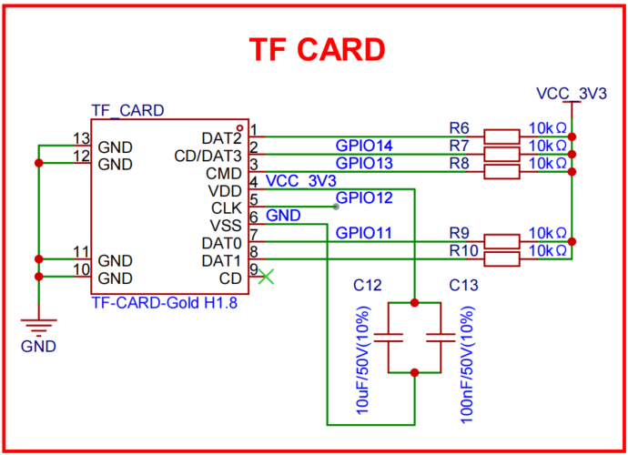{width=100%}

*TF card slot*

As shown in the figure, we integrated a TF card slot into the design to provide external storage expansion. The TF card slot allows users to insert a TF card to store additional data, logs, or other files. This is very useful for applications that require large-capacity storage, such as data logging and media storage. With a TF card, users can easily expand system storage capacity to meet the needs of different application scenarios.

### Buttons

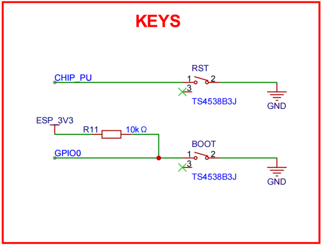{width=100%}

*Buttons*

As shown in the figure, two buttons are provided in this project: RST and BOOT. The RST button is used to reset the system for quick reboot when needed, while the BOOT button is used to enter specific modes, such as download mode or recovery mode. These buttons make device operation and management more convenient, improving usability and overall user experience.

### TYPE-C Interface (USB-POWER)

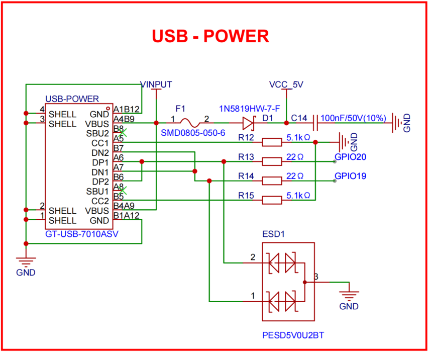{width=100%}

*TYPE-C interface (USB-POWER)*

As shown in the figure, a TYPE-C interface is integrated in the design mainly for power input. The TYPE-C interface supports reversible insertion, higher power delivery capability, and faster data transfer. Through this interface, users can conveniently power the device and also perform data transfer and debugging. This design improves compatibility and enhances user experience. The interface supports native USB functionality, allowing direct connection to a computer for data transfer and debugging without extra adapters, greatly improving convenience and efficiency.

### TYPE-C Interface (USB-USART)

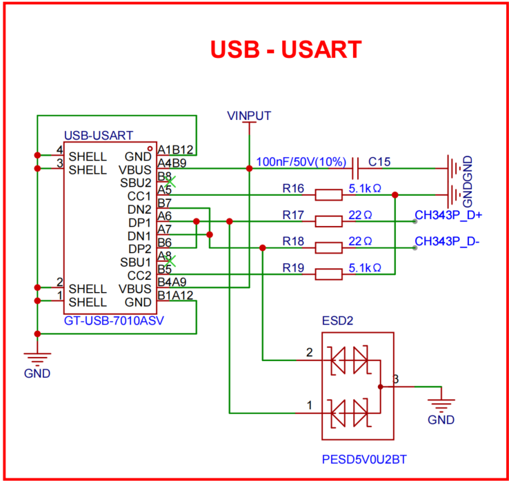{width=100%}

*TYPE-C interface (USB-USART)*

As shown in the figure, another TYPE-C interface is also integrated, mainly for USB-to-UART (USB-USART) functionality. This interface allows users to connect the device to a computer for serial communication and debugging. Through the USB-USART interface, users can conveniently perform data transfer, debugging, and firmware updates without additional serial adapters. This design improves compatibility and user experience, making development and debugging more efficient and convenient. Note that this interface requires a dedicated USB-to-UART bridge chip to ensure compatibility and stable communication performance.

### USB-UART Bridge Chip

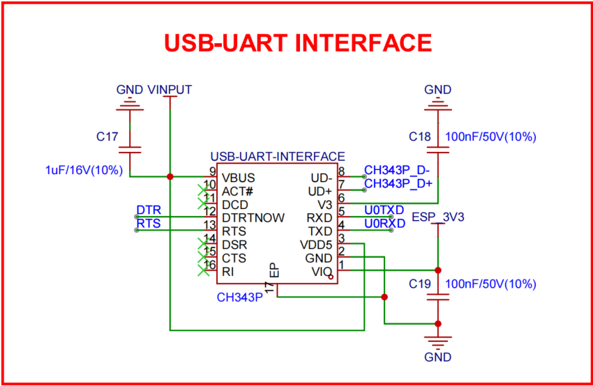{width=100%}

*USB-UART bridge chip*

As shown in the figure, we integrated a USB-UART bridge chip (CH343P) to implement USB-to-UART functionality. This chip converts USB signals to UART signals, allowing users to perform serial communication and debugging through a USB interface. With this bridge chip, users can easily connect the device to a computer for data transfer, debugging, and firmware updates without additional serial adapters. This design improves compatibility and user experience, making development and debugging more efficient and convenient. Please note that users may need to install the corresponding driver to ensure proper communication performance.

### Auto-Download Circuit

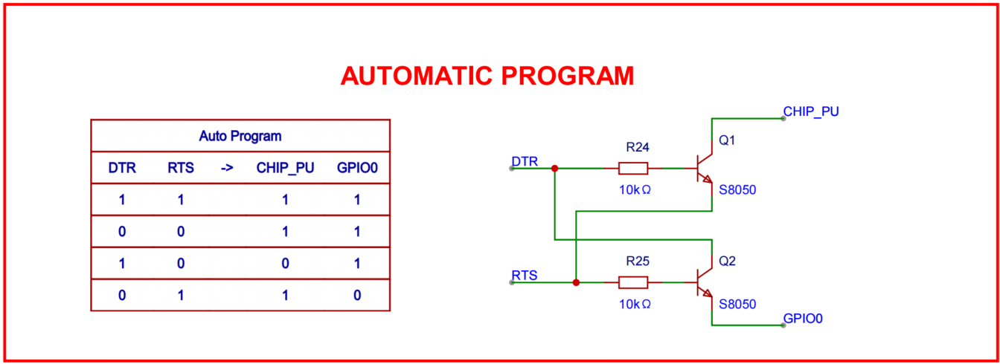{width=100%}

*Auto-download circuit*

As shown in the figure, an auto-download circuit is integrated to enable automatic programming of the device. By controlling the BOOT and RST states, this circuit can automatically enter download mode when the user initiates programming, making firmware updates and debugging more convenient. With this auto-download circuit, users can upload new firmware with minimal manual button operations and fewer complex steps. This design improves ease of use and user experience, making firmware update and debugging workflows more efficient.

### POWER INPUT CIRCUIT

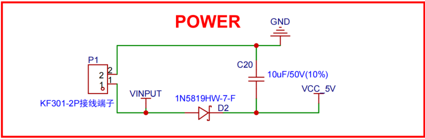{width=100%}

*Power input circuit*

As shown in the figure, we designed a power input terminal and its supporting circuitry with reverse-polarity protection and decoupling capacitors. The input terminal provides a safe and reliable interface for connecting external power to the device. Reverse-polarity protection ensures that the device will not be damaged even if the power polarity is accidentally reversed. Decoupling capacitors help stabilize power delivery, reducing voltage fluctuations and noise to ensure normal device operation.

### Voltage Measurement Circuit

{width=100%}

*Voltage measurement circuit*

As shown in the figure, a voltage measurement circuit is integrated to monitor system voltage status. The circuit uses a voltage divider and ADC (analog-to-digital converter) to measure voltage, enabling real-time monitoring and helping keep operation within a safe range. To reduce power consumption, a PMOS transistor is used as a switch for the voltage measurement path, so users can enable or disable measurement as needed. In addition, a 1x2-pin header is provided as an output interface for voltage measurement data, making system monitoring and debugging easier. In general, the two pins of this header should be connected to the positive and negative battery terminals to measure the voltage before the BMS input stage, helping users understand battery condition and remaining capacity.

## EXTENSION BOARD

### Connector

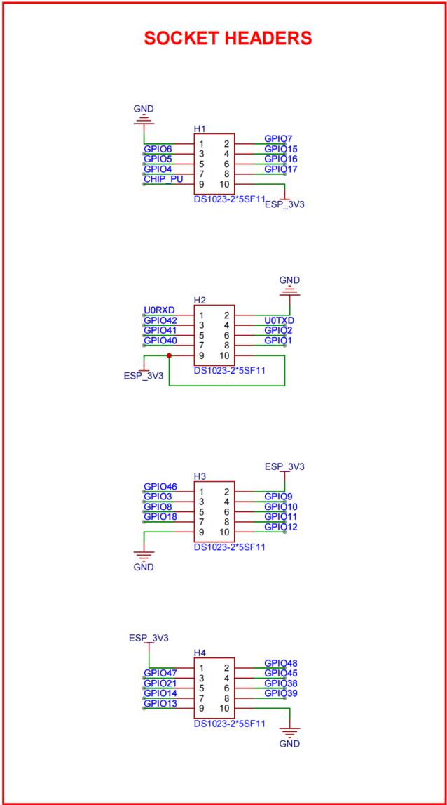{width=100%}

*Extension board connector*

As shown in the figure, because the extension board is located below the main controller board, we use female headers on the extension board for convenient connection and removal. Considering mechanical stress and component placement, we selected four 2x5 female headers to provide 10 connection points. This satisfies signal transmission requirements between the main board and extension board while also acting as structural support to ensure stable and reliable connections.

### Ultra-Low-Power Sensor - ADXL367

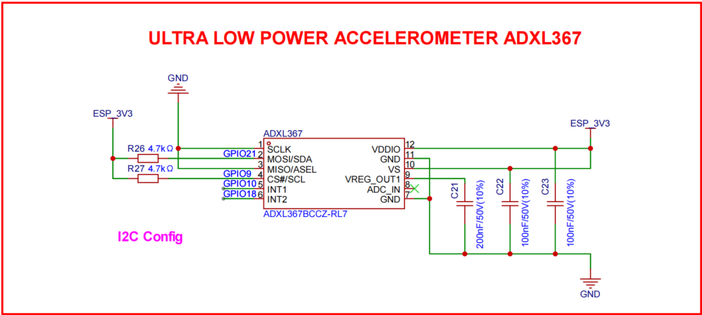{width=100%}

*Ultra-low-power sensor - ADXL367*

In this project, two accelerometers are integrated on the extension board. One of them is the ADXL367, an ultra-low-power three-axis accelerometer. The ADXL367 features high precision and very low power consumption, making it suitable for motion detection, posture recognition, and activity monitoring. By integrating ADXL367, users can monitor motion status and environmental changes in real time to support various intelligent applications. We mainly use this sensor for low-power monitoring during most of the operating time. Once a specific motion pattern or event is detected, the system can switch to a higher-performance operating mode to improve intelligence and user experience.

### High-Performance Sensor - ADXL355

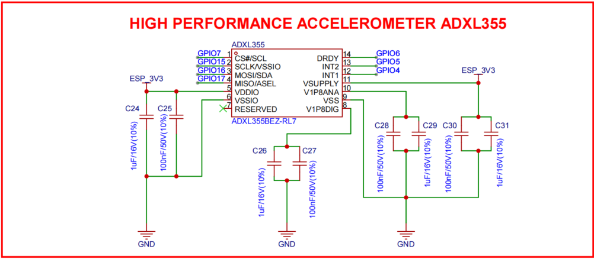{width=100%}

*High-performance sensor - ADXL355*

In this project, the other accelerometer is the ADXL355, a high-performance three-axis accelerometer. The ADXL355 provides high resolution and low noise, making it suitable for precise motion detection, posture recognition, and activity monitoring. By integrating ADXL355, users can obtain higher-accuracy motion data for more reliable support in intelligent applications. We mainly use this sensor for high-precision monitoring of specific events. For example, when a specific motion pattern or event is detected, the system can switch to ADXL355 for more detailed data acquisition and analysis, allowing the node to balance energy efficiency and performance.