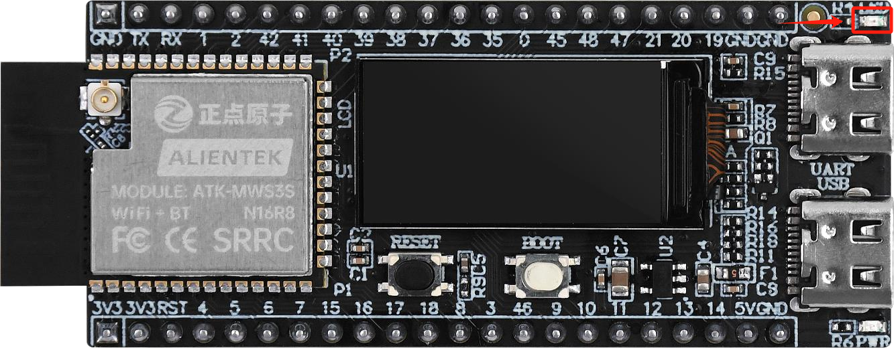
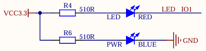
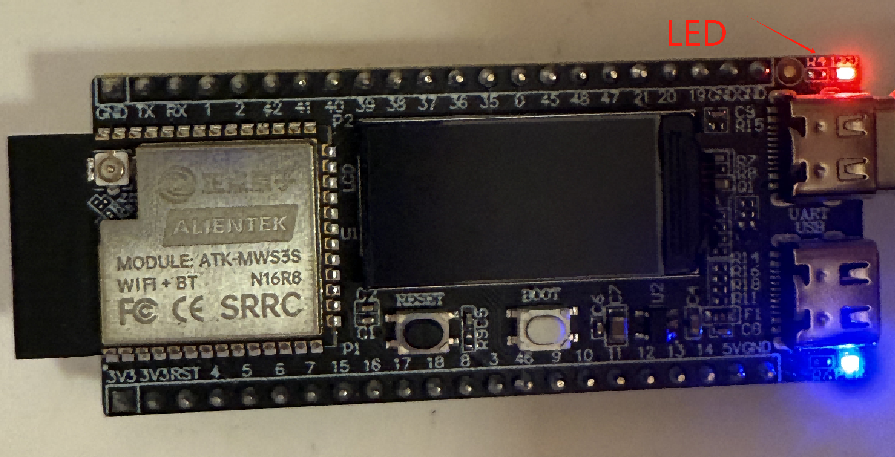

# LED NOTES

## Introduction

!!! note
    In this section, we explain the driving and control of the onboard LED on the development board. By modifying the GPIO pin, the code can also be used for other development boards.

## The LED

{ width=800px }

## The Circuit Onboard

{ width=800px }

As can be seen, the GPIO to control the LED is IO1.

## The Effect

{ width=800px }

## Dependencies

LED related functions depend on the driver/gpio component in the ESP-IDF framework, no additional installation is required, but it needs to be declared in the project's CMakeLists.txt.

## Key Functions

| Function Prototype | Explanation | Example |
| --- | --- | --- |
| `void led_init(void)` | Initialize the LED | `led_init();` |
| `void led(int x)` | Control the LED | `led(1);` |
| `void led_toggle(void)` | Toggle the LED | `led_toggle();` |