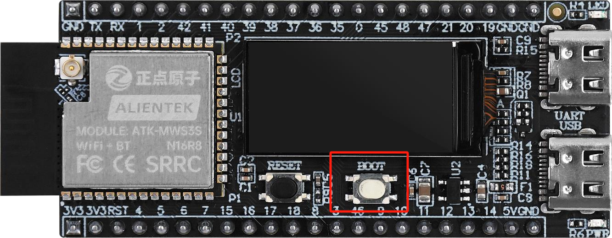

# EXTERNAL INTERRUPT (KEY AS AN EXAMPLE) NOTE
## Introduction

!!! note
    In this section, we will discuss the onboard key on the development board. For convenience, the key is used in interrupt mode instead of blocking mode. We use external interrupts to detect key presses. In fact, what we are discussing in this chapter is interrupts, but the carrier is the key.

## The KEY

{ width=800px }

## The Circuit Onboard

{ width=800px }

## Dependencies

This component needs to declare a dependency on the LED component because it uses the key to control the LED.

## Key Functions

| Function Prototype | Explanation | Example |
| --- | --- | --- |
|static void IRAM_ATTR exit_gpio_isr_handler(void *arg) | External interrupt service routine, put the action you want to conduct once an event is detected here | put your actions here |
|esp_err_t gpio_install_isr_service(int intr_alloc_flags) | Install the driver's GPIO ISR service, which allows you to register the ISR handler for the GPIO pin | gpio_install_isr_service(0); |
|esp_err_t gpio_isr_handler_add(gpio_num_t gpio_num, gpio_isr_t isr_handler, void *args) | Add the handler for the GPIO pin | gpio_isr_handler_add(BOOT_INT_GPIO_PIN, exit_gpio_isr_handler, (void*) BOOT_INT_GPIO_PIN); |
| esp_err_t gpio_intr_enable(gpio_num_t gpio_num) | Enable the GPIO interrupt | gpio_intr_enable(BOOT_INT_GPIO_PIN); |

!!! tip
    Once you setup the handler function, you do not need to call the funciton in your main loop, as the interrupt will be triggered automatically once the event is detected.