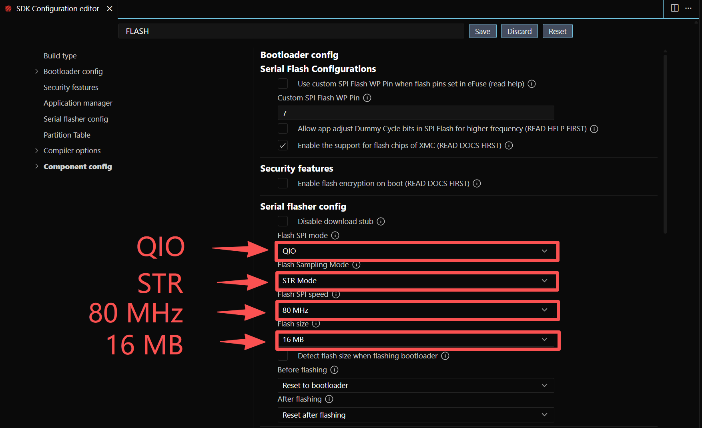
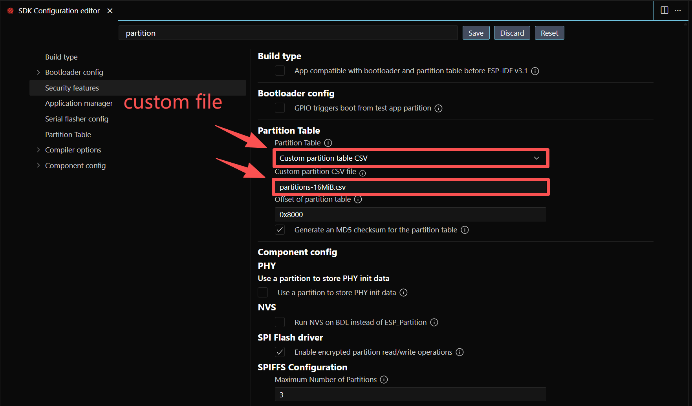
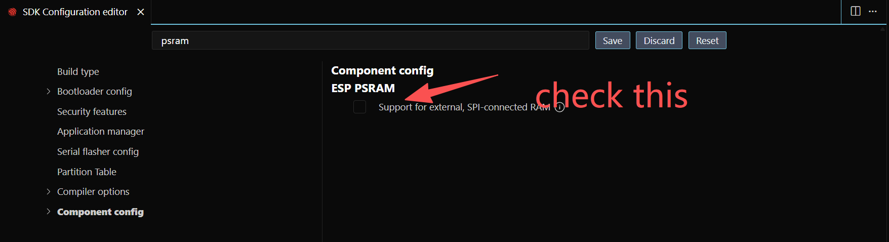
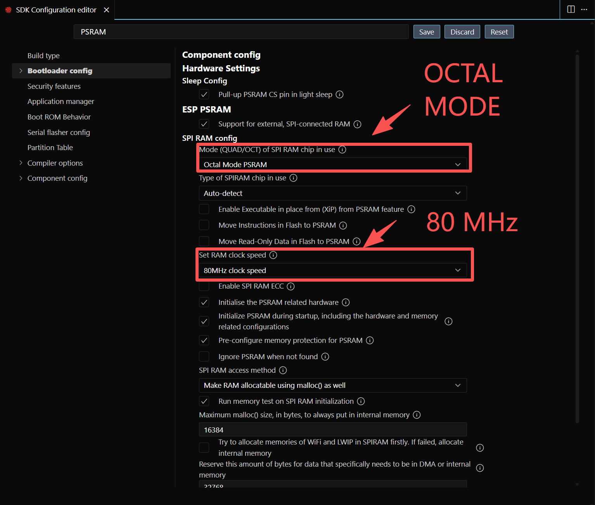
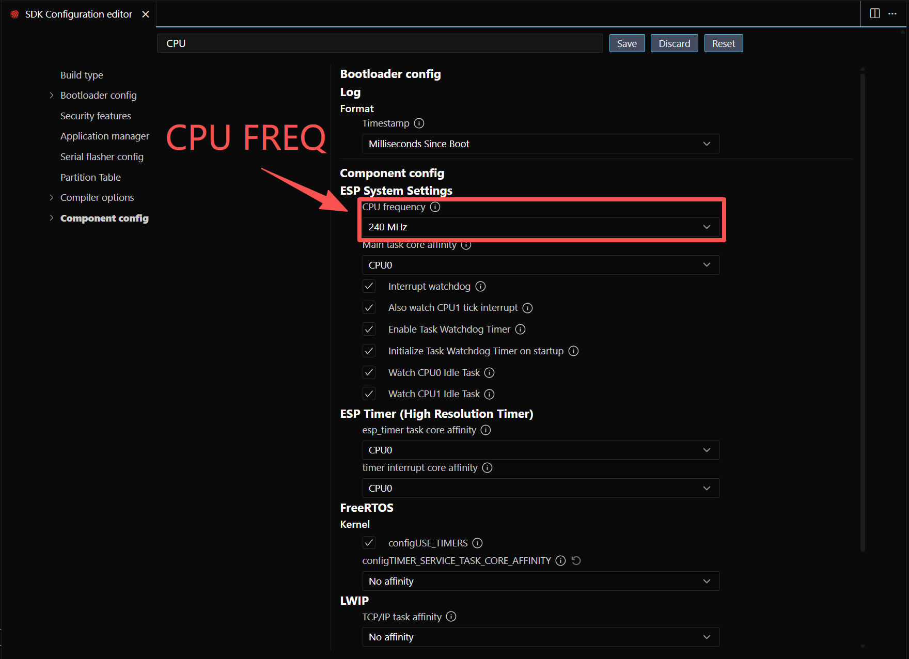
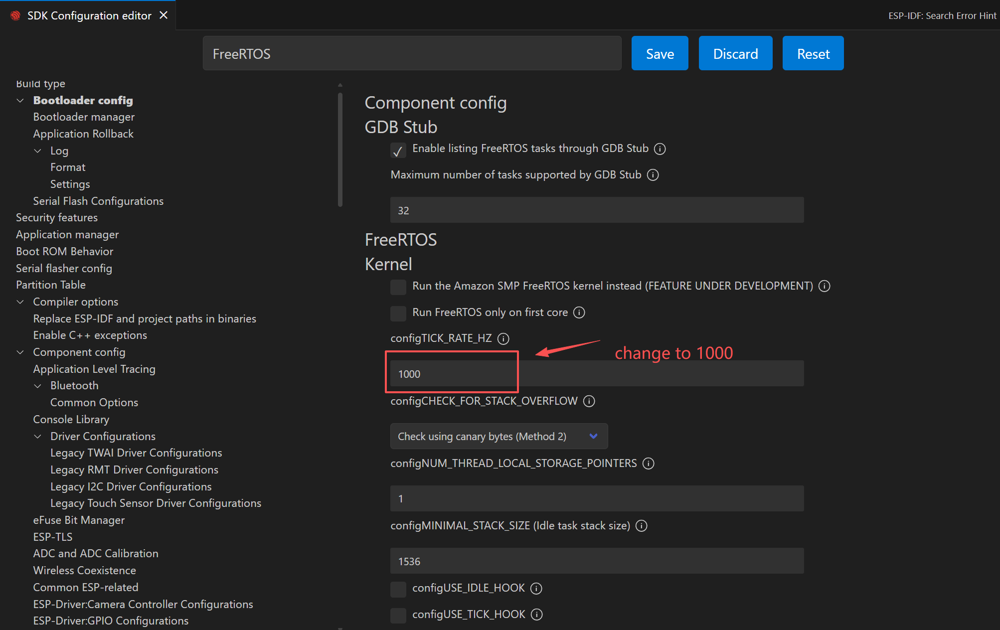
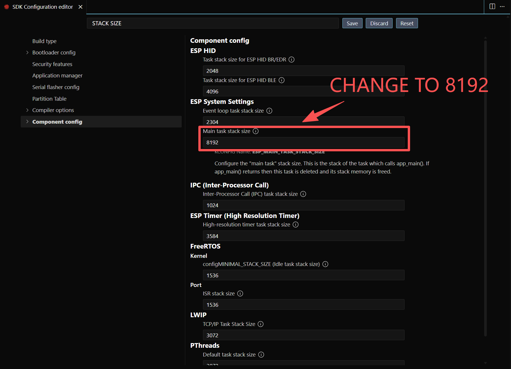
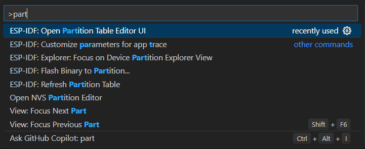
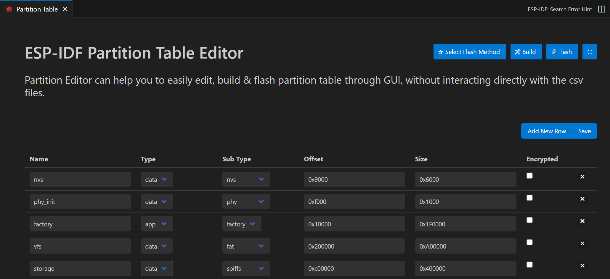

# 项目初始化

## 创建项目

创建项目可以使用UI界面，也可以使用命令行工具`idf.py`。由于使用UI界面创建的项目自动生成内容比较多，不太方便理解项目结构，建议使用命令行工具创建项目。想要使用命令行中的`idf.py`工具，首先需要安装ESP-IDF开发环境，具体安装步骤请参考[ESP-IDF官方文档](https://docs.espressif.com/projects/esp-idf/en/latest/esp32/get-started/)。具体创建项目的步骤如下：

1. 创建好想要存储项目的文件夹，例如`CODE`文件夹。
2. 打开终端，进入到刚刚创建的文件夹，例如`CODE`文件夹。
3. 激活ESP-IDF开发环境，可以参考官方说明。此处假设您可以使用`get_idf`命令来激活ESP-IDF开发环境。在目标文件夹中打开终端后，输入以下命令来激活ESP-IDF开发环境：

   ```bash
   get_idf
   ```
4. 使用`idf.py create-project <project_name>`命令来创建项目，例如我们使用AIoTNode来作为项目名称：

   ```bash
   idf.py create-project AIoTNode
   ```
5. 打开创建好的项目文件夹，可以看到项目的基本结构如下：

   ```
   AIoTNode/
   ├── CMakeLists.txt
   ├── main/
   │   ├── CMakeLists.txt
   │   └── AIoTNode.c
   └── sdkconfig
   ```
!!! warning "注意"
    从IDF v6.0开始，默认生成的主程序所在文件名与项目名一致，如果想要对其进行修改，可以直接修改`main`文件夹下的源文件名，并相应地修改`main/CMakeLists.txt`中的文件名。

## 配置项目

!!! tip "配置项目"
    配置项目是为了让其工作在最佳状态下，以最大化硬件的性能，即使用特定于目标的配置而不是默认配置。

!!! note "配置项目的方法"
    配置项目有两种主要方法：

    - 使用`idf.py menuconfig`通过命令行界面进行配置。

    - 使用VS Code的ESP-IDF扩展中的图形界面进行配置。此处推荐使用VS Code的ESP-IDF扩展中的图形界面进行配置，因为它更直观易用。

### 进入项目配置界面

通过按 `Ctrl+Shift+P`（Windows/Linux）或 `Cmd+Shift+P`（macOS）并输入 `ESP-IDF: Configure Project` 进入项目配置 UI。或者，可以点击 VSCode 窗口底部菜单的齿轮图标。

### FLASH 配置

`FLASH` 配置。在搜索栏中输入 `flash` 并按 Enter。

{width="800"}

### 分区表配置

`Partition Table` 配置。在搜索栏中输入 `partition` 并按 Enter。

{width="800"}

详细信息稍后提供。

### PSRAM 配置

`PSRAM` 配置。在搜索栏中输入 `psram` 并按 Enter。

{width="800"}

{width="800"}

### CPU频率配置

更改 CPU 频率。在搜索栏中输入 cpu 并按 Enter。将 CPU 频率修改为 240 MHz。

{width="800"}

### FREERTOS 配置

修改 FreeRTOS tick 时钟频率。在搜索栏中输入 tick 并按 Enter。将频率修改为 1000。

{width="800"}

### 主任务栈大小配置

修改主任务栈大小。在搜索栏中输入 main task stack 并按 Enter。将栈大小修改为 8192。

{width="800"}

### 分区表修改

分区表修改可以通过两种方式完成：

1. 通过UI界面选择预定义的分区表方案。
2. 创建自定义分区表CSV文件并修改其内容。

第一种方式请参考下图：

修改分区表。在命令面板中输入 ESP-IDF: Open Partition Table Editor UI。

{width="800"}

{width="800"}

第二种方式是直接打开分区表的csv文件进行修改。分区表csv文件位于项目目录下的`partitions`文件夹中，文件名通常为`partitions.csv`。打开该文件后，可以根据需要修改各个分区的大小和类型。例如：

```
# ESP-IDF Partition Table
# Name, Type, SubType, Offset, Size, Flags
nvs,data,nvs,0x9000,0x6000,,
phy_init,data,phy,0xf000,0x1000,,
factory,app,factory,0x10000,0x1F0000,,
vfs,data,fat,0x200000,0xA00000,,
storage,data,spiffs,0xc00000,0x400000,,
```


## 模板程序 - C

现在，让我们创建一个简单的程序来测试板子。

转到 main.c 文件, 默认内容是：

```c
#include <stdio.h>

void app_main(void)
{

}
```
用以下代码替换：

```c
#include "freertos/FreeRTOS.h"
#include "freertos/task.h"
#include "nvs_flash.h"
#include "esp_system.h"
#include "esp_chip_info.h"
#include "esp_psram.h"
#include "esp_flash.h"

/**
 * @brief Entry point of the program
 * @param None
 * @retval None
 */
void app_main(void)
{
    esp_err_t ret;
    uint32_t flash_size;
    esp_chip_info_t chip_info;

    // Initialize NVS
    ret = nvs_flash_init();
    if (ret == ESP_ERR_NVS_NO_FREE_PAGES || ret == ESP_ERR_NVS_NEW_VERSION_FOUND)
    {
        ESP_ERROR_CHECK(nvs_flash_erase()); // Erase if needed
        ret = nvs_flash_init();
    }

    // Get FLASH size
    esp_flash_get_size(NULL, &flash_size);
    esp_chip_info(&chip_info);

    // Display CPU core count
    printf("CPU Cores: %d\n", chip_info.cores);

    // Display FLASH size
    printf("Flash size: %ld MB flash\n", flash_size / (1024 * 1024));

    // Display PSRAM size
    printf("PSRAM size: %d bytes\n", esp_psram_get_size());

    while (1)
    {
        printf("Hello-ESP32\r\n");
        vTaskDelay(1000);
    }
}
```

然后，确保串口正确，板子设置正确，然后编译并烧录程序。然后，你应该会看到串口输出显示开发板信息和 `Hello-ESP32` 消息。

<!-- !!! note "AIoTNode-C-ZERO"
    这个版本我们命名为AIoTNode-C-ZERO，是因为它是一个非常基础的模板程序，适合初学者入门和理解ESP32的基本功能。 -->

## 模板程序 - C++

如果你想使用C++来编写程序，可以按照以下步骤进行操作：

1. 将 `main.c` 文件重命名为 `main.cpp`。
2. 将`main/CMakeLists.txt`文件中的源文件名从`main.c`修改为`main.cpp`。
3. 使用以下代码替换 `main.cpp` 文件中的内容：

```c++
// Use C++ headers where appropriate and keep ESP-IDF C APIs
#include <cstdio>
#include <cinttypes>

#include "freertos/FreeRTOS.h"
#include "freertos/task.h"
#include "nvs_flash.h"
#include "esp_system.h"
#include "esp_chip_info.h"
#include "esp_psram.h"
#include "esp_flash.h"
#include "esp_log.h"

static const char *TAG = "main";

/**
 * Entry point for ESP-IDF applications when using C++.
 * app_main must use C linkage so the runtime can find it.
 */
extern "C" void app_main(void)
{
    esp_err_t ret = nvs_flash_init();
    if (ret == ESP_ERR_NVS_NO_FREE_PAGES || ret == ESP_ERR_NVS_NEW_VERSION_FOUND)
    {
        ESP_ERROR_CHECK(nvs_flash_erase());
        ret = nvs_flash_init();
    }
    ESP_ERROR_CHECK(ret);

    uint32_t flash_size = 0;
    esp_chip_info_t chip_info{}; // value-initialize

    // Get FLASH size and chip info
    ESP_ERROR_CHECK(esp_flash_get_size(nullptr, &flash_size));
    esp_chip_info(&chip_info);

    // Log system info
    ESP_LOGI(TAG, "CPU Cores: %d", chip_info.cores);
    ESP_LOGI(TAG, "Flash size: %u MB", flash_size / (1024 * 1024));
    ESP_LOGI(TAG, "PSRAM size: %zu bytes", esp_psram_get_size());

    while (true)
    {
        ESP_LOGI(TAG, "Hello-ESP32");
        vTaskDelay(pdMS_TO_TICKS(1000));
    }
}

```
然后，确保串口正确，板子设置正确，然后编译并烧录程序。然后，你应该会看到串口输出显示开发板信息和 `Hello-ESP32` 消息。

<!-- !!! note "AIoTNode-CPP-ZERO"
    这个版本我们命名为AIoTNode-CPP-ZERO，其功能与AIoTNode-C-ZERO相同，但使用C++编写，适合喜欢使用C++的开发者。 -->

!!! note "AIoTNode-ZERO"
    这个版本我们命名为AIoTNode-ZERO，代表这是一个非常基础的模板程序，适合初学者入门和理解ESP32的基本功能。无论是使用C还是C++，这个模板程序都可以帮助你快速上手ESP32开发。