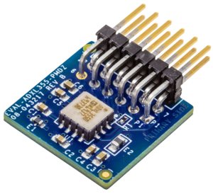
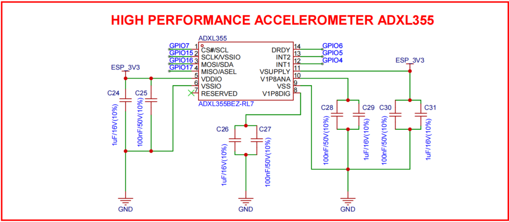

# ADXL354 / ADXL355 加速度计简介

## 简介

ADXL354/ADXL355 系列为低噪声、低漂移且低功耗的三轴 MEMS 加速度计。该系列提供模拟输出（ADXL354）与数字输出（ADXL355）两种选项，适合对偏置稳定性、噪声性能与长期可靠性有较高要求的嵌入式感测场景，例如惯性测量、振动分析与结构健康监测。

该器件具有出色的温度稳定性和超低噪声，配合可选量程与低功耗特性，适用于电池供电或对噪声敏感的物联网与工业应用。

## 主要特性（摘要）

- 低噪声：典型噪声谱密度约 22.5 µg/√Hz（各轴）
- 温漂小：0 g 偏移对温度的变化 ≤ 0.15 mg/°C（各轴）
- 低功耗：ADXL354 测量模式约 150 µA；ADXL355 测量模式约 200 µA；待机约 21 µA
- 可选测量范围：±2 g、±4 g、±8 g（型号/配置相关）
- 接口：ADXL355 支持 SPI 与 I2C（数字输出）；ADXL354 提供可调带宽的模拟输出
- 高分辨率（ADXL355）：内置 20-bit ADC，支持同步采样与数据插值
- 可编程数字滤波：支持高/低通数字滤波（ADXL355）
- 集成温度传感器与机电自检功能
- 供电范围：2.25 V 至 3.6 V（内部稳压器启用）；绕过内部 LDO 时典型为 1.8 V ±10%
- 工作温度：-40°C 至 +125°C
- 封装：14 引脚 LCC，尺寸约 6.0 × 5.6 × 2.2 mm

## 典型应用

- 惯性测量单元（IMU）、姿态与航向参考系统（AHRS）
- 平台稳定与运动补偿
- 结构健康监测与振动分析
- 地震/冲击检测与成像
- 倾角检测、机器人、物联网传感节点与状态监测

## 技术规格（简表）

| 参数       | 规格 / 说明 |
|------------|-------------:|
| 测量范围   | ±2 g、±4 g、±8 g（可选）|
| 分辨率     | 20 bit（ADXL355）|
| 噪声谱密度 | 约 22.5 µg/√Hz（典型）|
| 接口       | SPI、I2C（ADXL355）；模拟输出（ADXL354）|
| 工作电压   | 2.25 V 至 3.6 V（内部稳压器）|
| 工作温度   | -40°C 至 +125°C |

## DMA 支持说明

!!! tip "DMA 配置"
    在本实现中，ADXL355 驱动使用 **SPI3** 总线进行通信，该总线已启用 DMA（`SPI_DMA_CH_AUTO`）。DMA 的启用带来以下优势：
    
    - **降低 CPU 占用率**：SPI 数据传输由 DMA 控制器自动处理，CPU 无需参与数据传输过程
    - **提高传输性能**：特别适用于 ADXL355 的高频采样场景（最高支持 4000 Hz 输出数据率）
    - **自动使用**：当 SPI 总线初始化时启用 DMA 后，所有 SPI 事务（包括 `spi_device_polling_transmit()`）都会自动使用 DMA，无需额外配置
    
    初始化过程中会输出日志信息确认 DMA 已启用，所有 SPI 读写操作都会自动利用 DMA 进行数据传输。

## 评估板

## 接线

{width=100%}

{width=100%}

如图所示，本项目中ADXL355 采用 SPI 接线方式，连接到 ESP32-S3 的 SPI3 总线。

| ADXL355 评估板引脚 |    缩写    |    功能    |   对应 MCU 引脚  | 说明 |
|-------------------|------------|------------|-----------------|------|
| PIN 1             | CS         | 片选       | GPIO 7          | SPI 片选信号 |
| PIN 2             | MOSI       | 主输出从输入 | GPIO 16        | SPI 主输出/从输入 |
| PIN 3             | MISO       | 主输入从输出 | GPIO 17        | SPI 主输入/从输出 |
| PIN 4             | SCK        | 时钟       | GPIO 15         | SPI 时钟信号 |
| PIN 5             | DGND        | 数字地       | GND             | 数字地连接 |
| PIN 6             | VDD         | 电源正极     | 3.3 V           | 电源正极连接 |
| PIN 7             | INT1        | 中断输出     | GPIO 4        | 可选中断输出连接 |
| PIN 8             | NC          | 不连接       | 悬空            | 不连接 |
| PIN 9             | INT2        | 中断输出     | GPIO 5        | 可选中断输出连接 |
| PIN 10            | DRDY         | 数据就绪输出   | GPIO 6        | 可选数据就绪信号连接 |
| PIN 11            | DGND         | 数字地       | GND             | 数字地连接 |
| PIN 12            | VDD         | 电源正极     | 3.3 V           | 电源正极连接 |

## 官方驱动参考

-   :material-file:{ .lg .middle } ADXL355驱动

    ---

    ADXL355

    [:octicons-arrow-right-24: <a href="https://github.com/analogdevicesinc/no-OS/tree/main/drivers/accel/adxl355" target="_blank"> Portal </a>](#)

