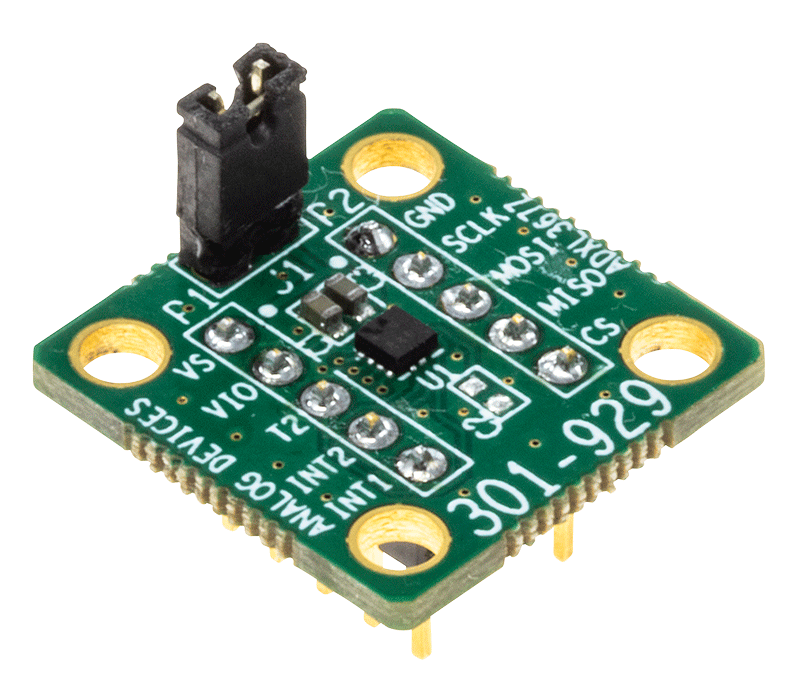
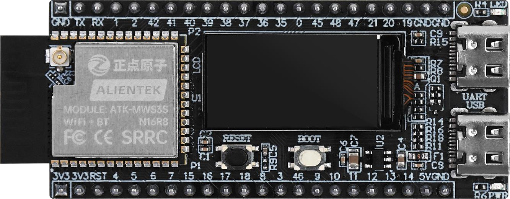
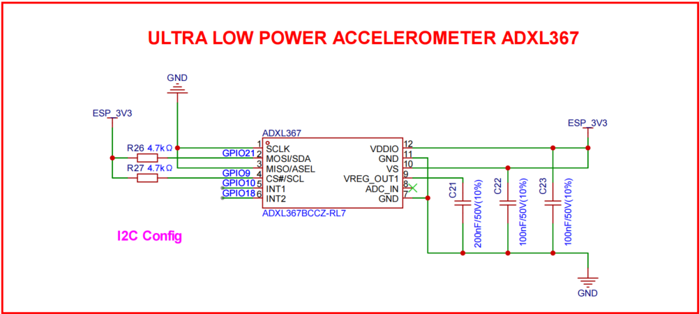
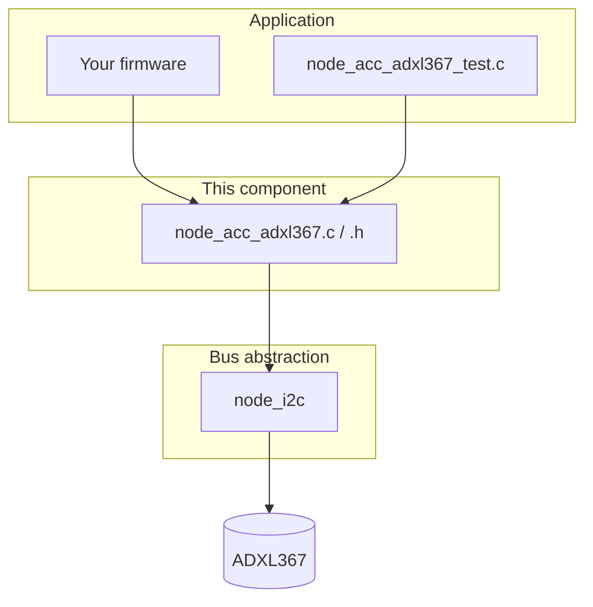
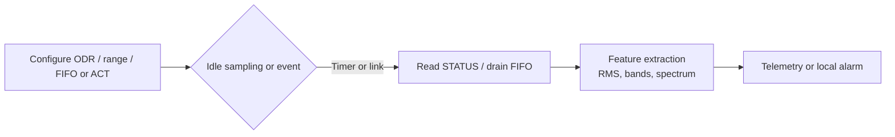

# ADXL367 Accelerometer Overview

## Introduction

The ADXL367 is an ultra-low-power, 3-axis digital MEMS accelerometer from Analog Devices, designed for battery-powered, always-on monitoring, and event wake-up scenarios. While maintaining very low system power consumption, it provides stable 3-axis acceleration sensing for motion detection, posture recognition, activity monitoring, and edge-triggered IoT applications.

Compared with higher-precision but higher-power accelerometers, the ADXL367 emphasizes ultra-low-power, long-duration online operation. It is commonly used in a system architecture of low-power front-end screening plus event-triggered deep acquisition.

## Key Features (Summary)

- Ultra-low power: typical 0.89 uA at 100 Hz; about 180 nA in motion wake-up mode; about 40 nA in standby
- Selectable measurement ranges: +-2 g, +-4 g, +-8 g
- Digital interfaces: SPI (4-wire) and I2C
- Resolution: 14-bit (with compatible 12-bit / 8-bit output formats)
- Low noise: typical noise density down to about 170 ug/sqrt(Hz)
- Configurable ODR: commonly up to 400 Hz
- Built-in FIFO: 512 samples
- Integrated temperature sensor and activity/inactivity detection capability
- Wide supply range: 1.1 V to 3.6 V
- Suitable for always-on monitoring, event triggering, and battery-powered devices

## Typical Applications

- Always-on motion monitoring and interrupt wake-up
- Wearables and portable terminals
- Battery-powered IoT nodes
- Posture detection, drop/vibration event detection
- Low-power edge sensing and intelligent triggering

## Technical Specifications (Quick Table)

| Parameter | Specification / Description |
|-----------|-----------------------------:|
| Measurement range | +-2 g, +-4 g, +-8 g |
| Resolution | 14-bit (compatible with 12-bit / 8-bit outputs) |
| Noise density | About 170 ug/sqrt(Hz) (typical) |
| Interface | SPI (4-wire), I2C |
| FIFO depth | 512 samples |
| Operating voltage | 1.1 V to 3.6 V |
| Power consumption (typ.) | 0.89 uA at 100 Hz; 180 nA (motion wake-up); 40 nA (standby) |

## Evaluation Board

{width=50%}

## Wiring

{width=100%}

{width=100%}

As shown above, ADXL367 uses I2C wiring in this project, avoiding SPI bus sharing with ADXL355.

The interface mapping is as follows:

| ADXL367 Eval Board Pin | MCU Pin | Description |
|------------------------|---------|-------------|
| VS                     | 3.3 V   | Power positive |
| VIO                    | 3.3 V   | Power positive |
| T2                     | NC      | Not connected |
| INT2                   | GPIO 18 | Interrupt output |
| INT1                   | GPIO 10 | Interrupt output |
| CS                     | GPIO 9  | SCL in I2C mode |
| MISO                   | GND     | Tie to GND in I2C mode |
| MOSI                   | GPIO 21 | SDA in I2C mode |
| SCLK                   | GND     | Tie to GND in I2C mode |
| GND                    | GND     | Power ground |

## Official Driver Reference

-   :material-file:{ .lg .middle } ADXL367 Driver

	---

	ADXL367

	[:octicons-arrow-right-24: <a href="https://github.com/analogdevicesinc/no-OS/tree/main/drivers/accel/adxl367" target="_blank"> Portal </a>](#)

## Driver in this project (`node_acc_adxl367`)

### What this block is for

The repository ships a dedicated ESP-IDF component that turns the ADXL367 into a node-local accelerometer service: one I2C address, one `node_acc_adxl367_dev_t` state object, and a consistent API for bring-up, configuration, raw reads, FIFO, interrupts, and on-chip motion detection. It is intended to sit between your application (or the bundled test harness) and the physical sensor.

### Where it sits in software

All transfers use I2C only. The driver never calls the ESP-IDF I2C API directly; it goes through `driver/node_i2c`. Register writes, 14-bit packing, and timing-sensitive flows follow Analog’s reference implementation under `driver/ref-adxl367` (same ideas as `adxl367.c`).

`node_acc_adxl367_dev_t` caches the open I2C handle plus the last known range, ODR, power mode, measurement mode (accel/temp mix), and FIFO mode so callers and the implementation stay consistent.

### Repository layout

| Path | Role |
|------|------|
| `CODE/AIoTNode/driver/node_acc_adxl367/include/node_acc_adxl367.h` | Public API: enums, device struct, function declarations. |
| `CODE/AIoTNode/driver/node_acc_adxl367/node_acc_adxl367.c` | Register access, init/probe, XYZ/temp, FIFO drain, INT map, activity/inactivity. |
| `CODE/AIoTNode/driver/node_acc_adxl367/node_acc_adxl367_test.c` | Phased tests and default demo entry; ties GPIO ISR to FIFO watermark where applicable. |
| `CODE/AIoTNode/driver/node_i2c` | Shared I2C master wrapper used by this driver. |
| `CODE/AIoTNode/driver/ref-adxl367` | Reference behaviour and coefficients (e.g. temperature conversion). |

### Functional map (what you can configure and read)

| Area | What the API covers |
|------|---------------------|
| Lifecycle | Soft reset; probe `DEVID` / `PARTID` / `REVID`; init defaults to ±2 g, 100 Hz, measure mode, accel-only. |
| Dynamic range and rate | `FILTER_CTL`: ±2 g / ±4 g / ±8 g; ODR from 12.5 Hz to 400 Hz. |
| Power | Standby vs measure (`POWER_CTL`). |
| Measurement path | Accel-only, temp-only, or accel+temp via `TEMP_CTL` / `ADC_CTL`; raw XYZ after `DATA_RDY`; raw temp and Celsius. |
| Status | Read `STATUS` for data ready, FIFO flags, ACT/INACT/AWAKE bits. |
| FIFO | Mode (oldest saved, stream, triggered), format (XYZ with channel ID, etc.), watermark sample sets, entry count, drain parsed XYZ. |
| Interrupts | Route events to INT1 or INT2: data ready, FIFO watermark/ready/overrun, activity/inactivity, awake, and others per `INTMAP` layout. |
| Motion detection | Activity and inactivity thresholds and dwell (ABS or REL reference), axis mask, LINKLOOP, disable. |

### Test phases (what is proven before you integrate)

The test source groups behaviour into phases so you can align application design with verified capability.

| Phase | Focus |
|-------|--------|
| 1 | Polling raw XYZ at the configured ODR. |
| 2 | Measurement modes; temp-only path rejects XYZ read (expected error path). |
| 3 | FIFO stream, watermark, draining XYZ by polling. |
| 4 | INT1 plus GPIO ISR: FIFO watermark driven from hardware line. |
| 5 | Linked activity/inactivity on INT2 (chip-side detection). |
| 6 | Default demo: simple still/motion discrimination in software from consecutive samples (distinct from hardware ACT). |

Pin macros and board-specific GPIO wiring for interrupts live in the test file; align them with the wiring tables earlier in this page.

### Structural health monitoring (SHM): how this maps to monitoring tasks

SHM pipelines usually separate (a) long idle or low-rate observation from (b) higher-rate capture when the structure is excited or when an anomaly is suspected. The driver exposes hardware that matches that split.

| Mechanism in this stack | Typical SHM role |
|-------------------------|------------------|
| Low sensor and MCU duty via standby / low ODR | Continuous or scheduled health checks with minimal energy. |
| Hardware activity/inactivity | Event tagging or wake when vibration crosses a threshold (loosening, impact, traffic-induced motion). |
| FIFO + watermark + ISR | Capture a contiguous window of samples after a trigger without spinning on `DATA_RDY` (modal snapshot, post-event record). |
| ODR up to 400 Hz, three axes | Band-limited response for many civil structures; feed RMS, spectra, or band energy for modal bands. |
| On-chip temperature | Correlate apparent drift in features with ambient or self-heating. |

Suggested data-flow for a node (conceptual, not a single API call):

In short: the driver does not implement damage models; it gives you deterministic access to the ADXL367 features that SHM workflows typically need—threshold-based attention, buffered windows for dynamics, and environmental context via temperature—so higher-level SHM logic can stay in application code or on a gateway.