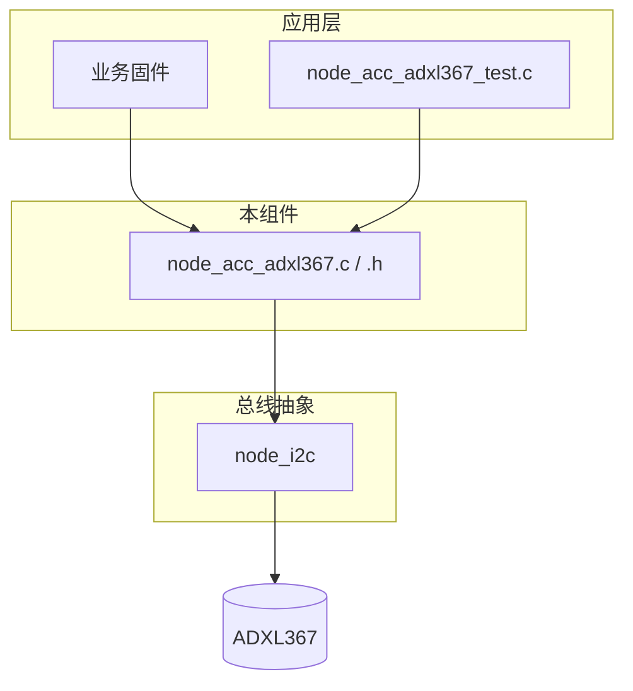
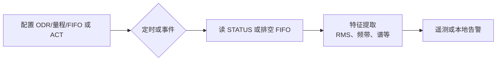

# ADXL367 加速度计简介

## 简介

ADXL367 是 Analog Devices 推出的超低功耗三轴数字 MEMS 加速度计，面向电池供电、常开监听与事件唤醒场景。器件在维持较低系统功耗的同时，提供稳定的三轴加速度测量能力，适合运动检测、姿态识别、活动监测以及边缘触发类物联网应用。

相较于高精度高功耗加速度计，ADXL367 更强调超低功耗与长期在线能力，常用于“低功耗前端筛查 + 事件触发后深度采集”的系统架构。

## 主要特性（摘要）

- 超低功耗：典型 0.89 µA@100 Hz；运动唤醒模式约 180 nA；待机约 40 nA
- 可选量程：±2 g、±4 g、±8 g
- 数字接口：SPI（4 线）与 I2C
- 分辨率：14-bit（兼容 12-bit / 8-bit 输出格式）
- 低噪声：典型噪声密度低至约 170 µg/√Hz
- ODR 可配置：常用到 400 Hz
- 内置 FIFO：512 samples
- 集成温度传感器与活动/静止检测能力
- 宽电压供电：1.1 V 至 3.6 V
- 适合常开监测、事件触发与电池供电设备

## 典型应用

- 常开运动监听与中断唤醒
- 可穿戴设备与便携式终端
- 电池供电物联网节点
- 姿态检测、跌落/震动事件检测
- 低功耗边缘感知与智能触发

## 技术规格（简表）

| 参数       | 规格 / 说明 |
|------------|-------------:|
| 测量范围   | ±2 g、±4 g、±8 g |
| 分辨率     | 14-bit（兼容 12-bit / 8-bit 输出） |
| 噪声密度   | 约 170 µg/√Hz（典型） |
| 接口       | SPI（4 线）、I2C |
| FIFO 深度  | 512 samples |
| 工作电压   | 1.1 V 至 3.6 V |
| 功耗（典型） | 0.89 µA@100 Hz；180 nA（运动唤醒）；40 nA（待机） |

## 评估板

{width=50%}

## 接线

{width=100%}

{width=100%}

如图所示，本项目中 ADXL367 采用 I2C 接线，从而避免与 ADXL355 共用 SPI 接口。

接口表如下：

| ADXL367 评估板引脚 | 对应 MCU 引脚 | 说明 |
|--------------------|---------------|------|
| VS                 | 3.3 V         | 电源正极 |
| VIO                | 3.3 V         | 电源正极 |
| T2                 | 悬空          | 不连接 |
| INT2               | GPIO 18       | 中断输出 |
| INT1               | GPIO 10       | 中断输出 |
| CS                 | GPIO 9        | I2C 模式下即 SCL |
| MISO               | GND           | I2C 模式下该引脚接地 |
| MOSI               | GPIO 21       | I2C 模式下即 SDA |
| SCLK               | GND           | I2C 模式下该引脚接地 |
| GND                | GND           | 电源地 |

## 官方驱动参考

-   :material-file:{ .lg .middle } ADXL367驱动

    ---

    ADXL367

    [:octicons-arrow-right-24: <a href="https://github.com/analogdevicesinc/no-OS/tree/main/drivers/accel/adxl367" target="_blank"> Portal </a>](#)

## 本工程中的驱动（`node_acc_adxl367`）

### 本节定位

仓库中的 ESP-IDF 组件把 ADXL367 抽象成节点侧「加速度服务」：单一 I2C 从机、一个 `node_acc_adxl367_dev_t` 状态对象，以及覆盖上电、配置、原始读取、FIFO、中断与片内运动检测的一套稳定 API，供应用层或随附测试程序调用。

### 在软件中的位置

仅使用 I2C；驱动不直接调用 ESP-IDF 的 I2C 底层接口，统一经 `driver/node_i2c`。寄存器读写顺序、14 位数据打包与时序相关行为与 `driver/ref-adxl367` 下 Analog 参考实现（与 `adxl367.c` 同源思路）对齐。

`node_acc_adxl367_dev_t` 除保存已打开的 I2C 句柄外，还缓存量程、ODR、功耗模式、测量模式（加速度/温度组合）与 FIFO 模式，避免调用方与内部状态不一致。

### 仓库内文件分工

| 路径 | 作用 |
|------|------|
| `CODE/AIoTNode/driver/node_acc_adxl367/include/node_acc_adxl367.h` | 对外 API：枚举、设备结构体、函数声明。 |
| `CODE/AIoTNode/driver/node_acc_adxl367/node_acc_adxl367.c` | 寄存器访问、初始化/探测、XYZ 与温度、FIFO 排空、INT 映射、活动/静止配置。 |
| `CODE/AIoTNode/driver/node_acc_adxl367/node_acc_adxl367_test.c` | 分阶段测试与默认演示入口；在相关阶段把 FIFO 水印接到 GPIO 中断。 |
| `CODE/AIoTNode/driver/node_i2c` | 本驱动共用的 I2C 封装。 |
| `CODE/AIoTNode/driver/ref-adxl367` | 参考行为与系数（如温度换算）。 |

### 功能一览（按能力域）

| 能力域 | API 覆盖内容 |
|--------|----------------|
| 生命周期 | 软复位；读取 `DEVID` / `PARTID` / `REVID` 做探测；初始化默认 ±2 g、100 Hz、测量模式、仅加速度测量。 |
| 量程与速率 | `FILTER_CTL`：±2 g / ±4 g / ±8 g；ODR 12.5 Hz～400 Hz。 |
| 功耗 | 待机与测量（`POWER_CTL`）。 |
| 测量数据路径 | 通过 `TEMP_CTL` / `ADC_CTL` 选择仅加速度、仅温度或二者；`DATA_RDY` 后读原始 XYZ；温度原始值与摄氏度。 |
| 状态寄存器 | `STATUS`：数据就绪、FIFO 相关标志、ACT/INACT/AWAKE 等。 |
| FIFO | 模式（最旧保留、流、触发）、格式（含带通道 ID 的 XYZ 等）、水印样本集数、条目计数、解析后的 XYZ 排空。 |
| 中断 | 将事件路由到 INT1 或 INT2：数据就绪、FIFO 水印/就绪/溢出、活动/静止、唤醒等（按 `INTMAP` 位定义）。 |
| 片内运动检测 | 活动/静止阈值与持续时间（绝对或相对基准）、轴屏蔽、LINKLOOP、关闭。 |

### 测试阶段（集成前已覆盖的行为）

测试源码按阶段划分，便于你对照应用设计选择已验证能力。

| 阶段 | 内容 |
|------|------|
| 1 | 轮询读取原始 XYZ。 |
| 2 | 测量模式切换；仅温度模式下拒绝读 XYZ（预期错误路径）。 |
| 3 | FIFO 流模式、水印、轮询排空 XYZ。 |
| 4 | INT1 与 GPIO 中断：由 FIFO 水印驱动。 |
| 5 | INT2：联动活动与静止（片内检测）。 |
| 6 | 默认演示：用相邻采样在软件侧区分动静（与硬件 ACT 不是同一路径）。 |

中断所用 GPIO 宏与板级接线以测试文件为准，需与上文「接线」表一致。

### 与结构健康监测（SHM）的对应关系

结构监测常把「长期低占空比观测」与「激励或异常怀疑时短时提高有效采样率」分开。本驱动暴露的硬件能力与此分层一致。

| 本栈中的机制 | 典型 SHM 用途 |
|--------------|----------------|
| 待机 / 较低 ODR | 长期或定时巡检，降低能耗。 |
| 硬件活动/静止 | 超过振动门限时唤醒或打标签（冲击、松动、车流等激励）。 |
| FIFO + 水印 + 中断 | 触发后连续抓取一段样本，减少空转等待 `DATA_RDY`（模态快照、事件后记录）。 |
| 三轴、ODR 至 400 Hz | 面向多数土木结构感兴趣的频段，供 RMS、频带能量或谱分析。 |
| 片内温度 | 解释长期基线漂移与环境变化。 |

节点侧建议的数据流（概念示意，非单一函数调用链）：

说明：驱动不包含损伤模型或识别算法；它提供对 ADXL367 的可预期访问（门限关注、缓冲窗、温度上下文），更高层 SHM 逻辑留在应用或网关上实现。