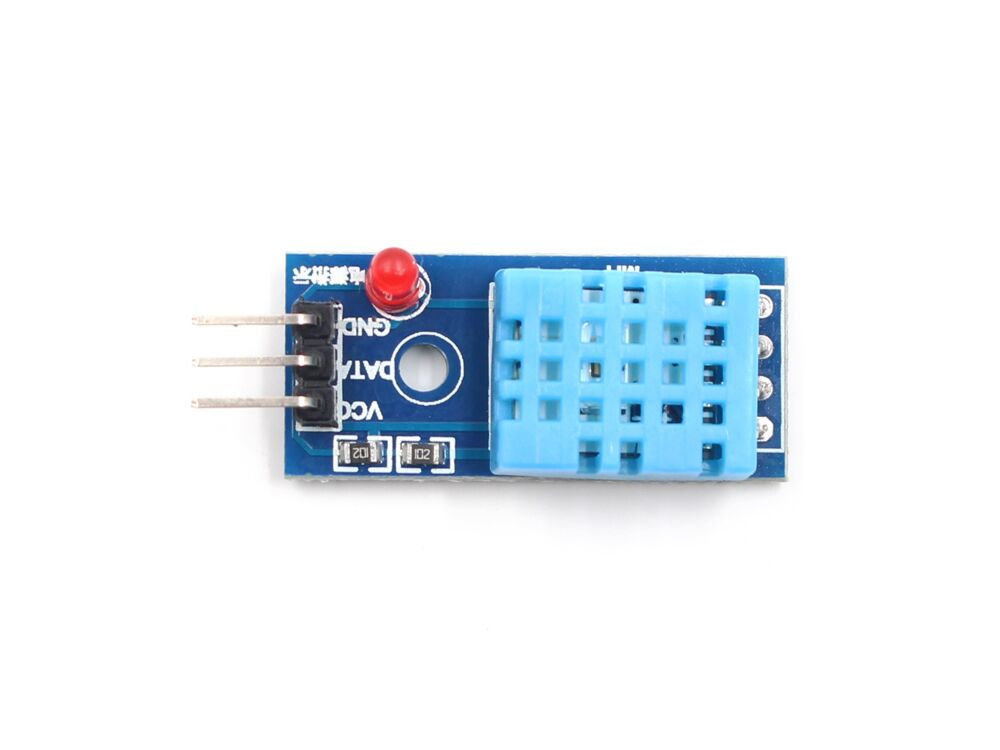

# DIGITAL HUMIDITY AND TEMPERATURE SENSOR - DHT11

!!! info
    The DHT11 is a commonly used digital humidity and temperature sensor known for its low cost and ease of use, making it suitable for basic humidity and temperature measurement applications. It communicates with microcontrollers using a single-wire protocol.

## Technical Specifications

| Feature        | Description                             |
| -------------- | --------------------------------------- |
| Measurement Range | Temperature: 0°C to 50°C, Humidity: 20% to 90% RH |
| Accuracy       | Temperature: ±2°C, Humidity: ±5% RH         |
| Resolution     | Temperature: 1°C, Humidity: 1% RH         |
| Power Supply   | 3.3V to 5V                        |
| Communication Interface | Single-wire digital signal                     |