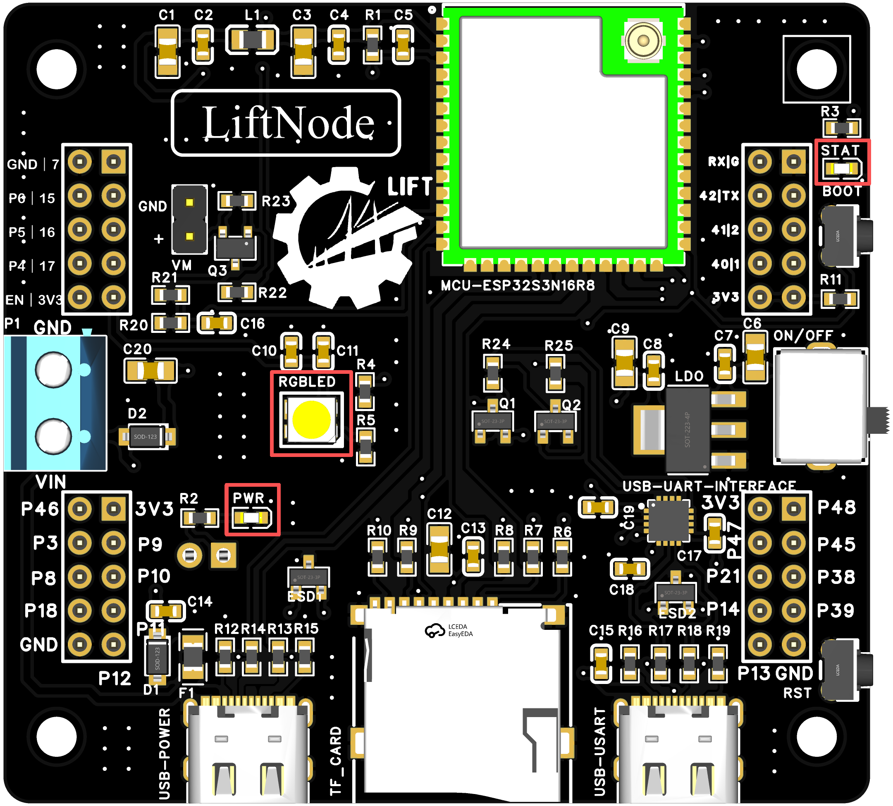
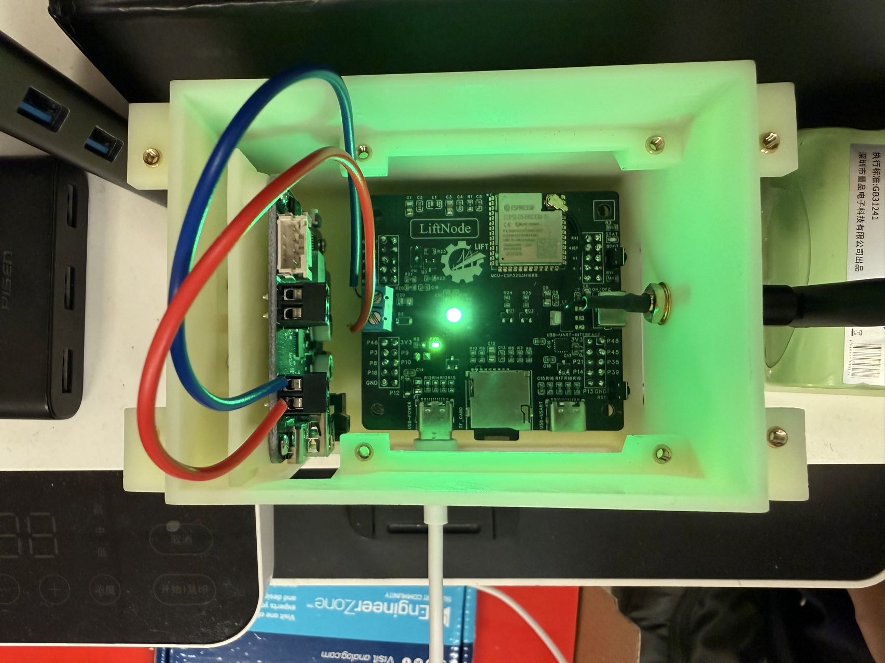

# RGBLED NOTES

## Introduction

!!! note
    This section explains RGB control based on the node_rgb component. The current implementation targets SK6812MINI-C (SK6812-class) one-wire RGB LEDs, with IO3 as the default control pin. By changing the configuration, the same code can be used on other boards.

## The RGBLED

{ width=800px }

## The Circuit Onboard

{ width=800px }

As can be seen, the GPIO to control the LED is IO3.

{ width=800px }

## Dependencies

RGB functionality depends on ESP-IDF components (RMT + LED Strip driver path). In the component CMakeLists.txt, you should at least declare:

- driver
- esp_driver_gpio

No additional third-party package is required, but make sure the ESP-IDF built-in led_strip capability is available in your project.

## Key Functions

| Function Prototype | Explanation | Example |
| --- | --- | --- |
| `esp_err_t node_rgb_init(const node_rgb_config_t *cfg)` | Initialize RGB with GPIO, LED count, and brightness settings | `node_rgb_config_t cfg = NODE_RGB_CONFIG_DEFAULT(); node_rgb_init(&cfg);` |
| `void node_rgb_deinit(void)` | Release the RGB device and clear display | `node_rgb_deinit();` |
| `void node_rgb_set_brightness(uint8_t v)` | Set brightness (0-255) | `node_rgb_set_brightness(128);` |
| `void node_rgb_rgb(uint8_t r, uint8_t g, uint8_t b)` | Set RGB color directly and refresh | `node_rgb_rgb(255, 64, 0);` |
| `esp_err_t node_rgb_str(const char *s)` | Set color by name (English case-insensitive, Chinese aliases supported) | `node_rgb_str("cyan");` |
| `void node_rgb_clear(void)` | Turn off all LEDs | `node_rgb_clear();` |
| `void node_rgb_chase_step(uint8_t r, uint8_t g, uint8_t b)` | One chase step: moving spot on multi-LED, R->G->B cycling on single LED | `node_rgb_chase_step(255, 0, 0);` |
| `void node_rgb_chase_reset(void)` | Reset chase state | `node_rgb_chase_reset();` |

## Default Configuration

- Default GPIO: IO3 (NODE_RGB_GPIO_DEFAULT)
- Default LED count: 1
- Default brightness: 96
- LED count limits: 1 to 256 (out-of-range values are clamped)

## Color String Notes

node_rgb_str() supports common color names, for example:

- English: red, green, blue, yellow, cyan, magenta, purple, orange, pink, white, black, off
- Chinese: 红, 绿, 蓝, 黄, 青, 品红, 紫, 橙, 粉, 白, 黑, 关

Input is trimmed for leading and trailing spaces. English names are case-insensitive.

## Return Value Notes

- ESP_OK: success
- ESP_ERR_INVALID_ARG: invalid argument (for example, empty string or invalid config)
- ESP_ERR_INVALID_STATE: device not initialized
- ESP_ERR_NOT_FOUND: color string not recognized

## Usage Tips

- The node_rgb component itself does not include FreeRTOS task/delay logic. Control animation timing in the application layer (for example, with vTaskDelay).
- For single-LED demos, use a named-color array cycle (for example, red -> orange -> yellow -> ...), consistent with the main.cpp example.