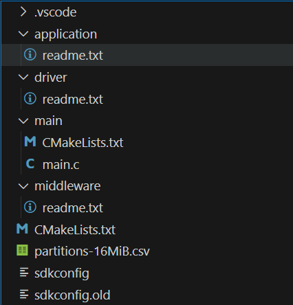

# 核心功能开发

!!! info "简介"
    在初始化一章中，我们已经介绍了如何搭建开发环境以及基本的项目结构。本章将在此基础上，将项目代码进行扩展，打造具备核心功能的物联网节点代码框架。

!!! info "核心功能"
    核心功能指的是只需要核心板就能实现的功能，不需要扩展的外围电路或者模块。

## 项目框架改造

之前的版本只是最基础的“Hello World”示例代码，无法满足实际应用需求。对代码进行层次化和模块化管理是大型项目开发的基础。在项目层级，我们增设与`main`文件夹同级的`driver`,`middleware`,`application`文件夹，分别用于存放硬件驱动代码、中间件代码和应用层代码。新增加的这三个文件夹里面我们各自放入一个readme.txt文件，以避免空文件夹无法被Git管理的问题。效果如图所示：

{width="250"}

在执行完以上操作后，我们还需要对`CMakeLists.txt`文件进行修改，以确保新增加的文件夹能够被正确编译。修改后的项目层面的`CMakeLists.txt`文件内容如下所示：

```cmake
# The following five lines of boilerplate have to be in your project's
# CMakeLists in this exact order for cmake to work correctly
cmake_minimum_required(VERSION 3.16)

include($ENV{IDF_PATH}/tools/cmake/project.cmake)

set(EXTRA_COMPONENT_DIRS "./driver" "./middleware" "./application")

project(AIoTNode)
```

!!! warning "注意"
    请确保`EXTRA_COMPONENT_DIRS`变量中包含了新增加的文件夹路径，否则编译器将无法找到这些组件，导致编译失败。

除了项目层面的`CMakeLists.txt`文件需要进行修改外，`main`文件夹下的`CMakeLists.txt`文件也需要进行相应的修改。修改后的`main/CMakeLists.txt`文件内容如下所示：

```cmake
# Define source directories
set(src_dirs
    .
)

# Define include directories
set(include_dirs
    .
)

# Define required components
set(requires
)

# Register the component
idf_component_register(
    SRC_DIRS ${src_dirs}
    INCLUDE_DIRS ${include_dirs}
    REQUIRES ${requires}
)

# Add compilation options
# component_compile_options(-ffast-math -O3 -Wno-error=format -Wno-format)
```

!!! note "说明"
    本项目的核心目标是打造传感器节点，即硬件设计和基础的驱动实现，其实并不会过多涉及中间件和应用层的开发内容。但是为了让项目结构更加完整和规范，并为后续项目提供基础，这里我们依然创建了这中间件和应用层的文件夹。

## 分支说明

通过同时对AIOT-C-ZERO和AIOT-CPP-ZERO版本进行以上改造，我们可以得到版本AIOT-C-CORE和AIOT-CPP-CORE的项目框架，后续会基于这两个版本进行核心功能的开发。

- AIOT-C-ZERO -> AIOT-C-CORE
- AIOT-CPP-ZERO -> AIOT-CPP-CORE

## 组件与模块

本项目中每个具体功能的实现都是以组件（Component）的形式存在的，能够以模块化的形式体现在项目代码结构中。组件是ESP-IDF项目中的基本代码单元，这样的设计提高了代码的复用性和可维护性。每个组件都包含自己的源代码文件、头文件以及CMake构建文件，能够独立编译和链接到主项目中。

!!! warning "注意"
    在应用中请格外注意组件之间的依赖关系。如果一个组件依赖于另一个组件，必须在CMakeLists.txt文件中正确声明这种依赖关系，以确保编译器能够正确处理这些依赖，避免编译错误。