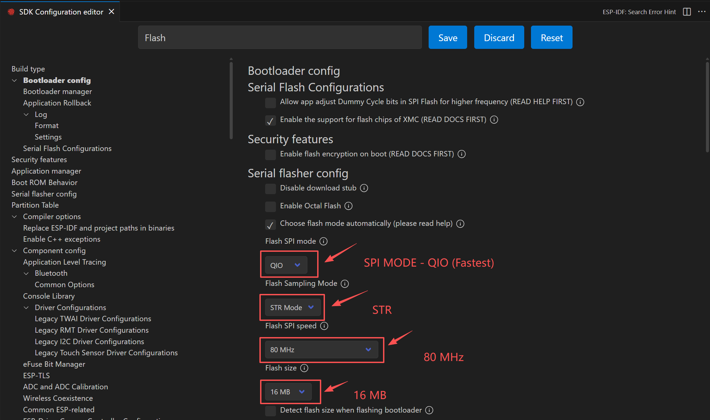
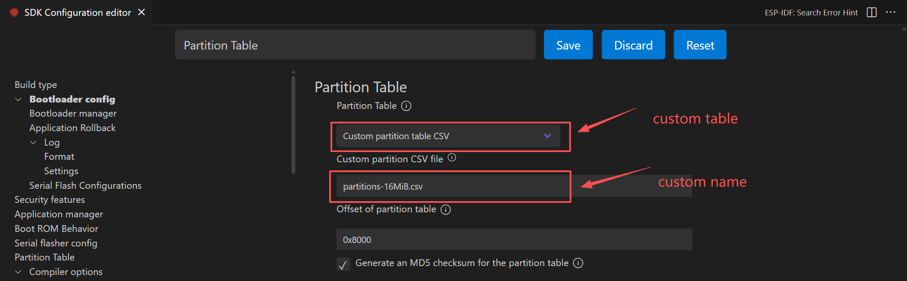
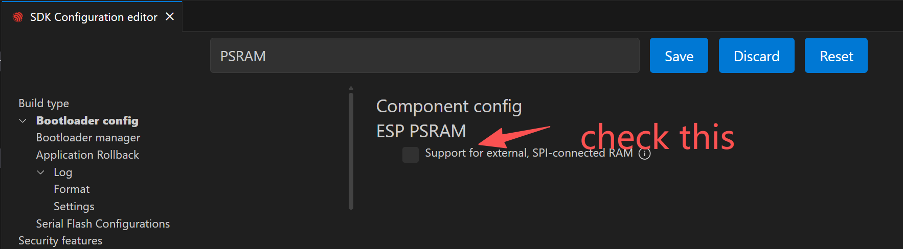
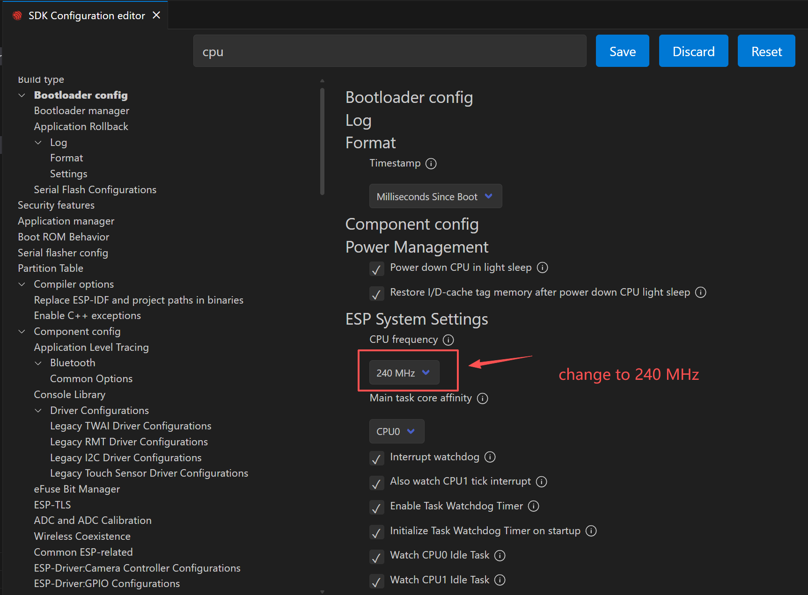

# PROJECT INITIALIZATION

## CREATING THE PROJECT

To create a new ESP32 project, you can use the UI interface or the command line tool `idf.py`. Since projects created via the UI tend to have a lot of auto-generated content that can make it harder to understand the project structure, it is recommended to use the command line tool. To use the `idf.py` command line tool, you first need to set up the ESP-IDF development environment. For detailed installation steps, please refer to the [official ESP-IDF documentation](https://docs.espressif.com/projects/esp-idf/en/latest/esp32/get-started/). The steps to create a new project are as follows:

1. Create a folder where you want to store your project, for example, a folder named `CODE`.
2. Open a terminal and navigate to the folder you just created, e.g., the `CODE` folder.
3. Activate the ESP-IDF development environment. You can refer to the official instructions for this. Here, we assume you can use the `get_idf` command to activate the ESP-IDF development environment. After opening the terminal in the target folder, enter the following command to activate the ESP-IDF development environment:

   ```bash
   get_idf
   ```
4. Use the command `idf.py create-project <project_name>` to create a new project. For example, we will use `AIoTNode` as the project name:

   ```bash
   idf.py create-project AIoTNode
   ```
5. Open the newly created project folder, and you will see the basic structure of the project as follows:

   ```
   AIoTNode/
   ├── CMakeLists.txt
   ├── main/
   │   ├── CMakeLists.txt
   │   └── main.c
   └── sdkconfig
   ```

!!! warning "Note"
    Starting from IDF v6.0, the default main program file name matches the project name. If you wish to change it, you can directly rename the source file in the `main` folder and update the file name in `main/CMakeLists.txt` accordingly.

## CONFIGURING THE PROJECT

!!! tip "Configuring the Project"
    Configuring the project ensures that it operates in an optimal state, maximizing hardware performance by using target-specific configurations rather than default settings.

!!! note "Methods to Configure the Project"
    There are two main methods to configure the project:

    - Using `idf.py menuconfig` to configure via the command line interface.

    - Using the graphical interface in the ESP-IDF extension for VS Code. It is recommended to use the graphical interface in the ESP-IDF extension for VS Code, as it is more intuitive and user-friendly.

### Accessing the Project Configuration Interface

You can access the project configuration UI by pressing `Ctrl+Shift+P` (Windows/Linux) or `Cmd+Shift+P` (macOS) and typing `ESP-IDF: Configure Project`. Alternatively, you can click the gear icon in the bottom menu of the VSCode window.


### FLASH Configuration

`FLASH` configuration. Type `flash` in the search bar and press Enter.

{width="800"}

### Partition Table Configuration

`Partition Table` configuration. Type `partition` in the search bar and press Enter.

{width="800"}

More details will be provided later.

### PSRAM Configuration

`PSRAM` configuration. Type `psram` in the search bar and press Enter.

{width="800"}

{width="800"}

### CPU Frequency Configuration

`CPU Frequency` configuration. Type `cpu frequency` in the search bar and press Enter. Change the CPU frequency to 240 MHz.

{width="800"}

### FREERTOS Configuration

`FREERTOS` configuration. Type `freertos` in the search bar and press Enter. Change the `Tick Rate (Hz)` to `1000`.

{width="800"}

### PARTITION TABLE Configuration

Partition table can be configured in two ways:

1. Using the UI interface to select a predefined partition table scheme.

2. Manually editing the `partitions.csv` file in the `main` directory to define a custom partition table.

For the first method, refer to the following images:

Modifying the partition table. In the command panel, type `ESP-IDF: Open Partition Table Editor UI`.

{width="800"}

{width="800"}

For the second method, you can directly open and edit the `partitions.csv` file. The `partitions.csv` file is located in the `partitions` folder under the project directory, usually named `partitions.csv`. After opening this file, you can modify the size and type of each partition as needed. For example:

```
# ESP-IDF Partition Table
# Name, Type, SubType, Offset, Size, Flags
nvs,data,nvs,0x9000,0x6000,,
phy_init,data,phy,0xf000,0x1000,,
factory,app,factory,0x10000,0x1F0000,,
vfs,data,fat,0x200000,0xA00000,,
storage,data,spiffs,0xc00000,0x400000,,
```

## TEMPLATE PROGRAM - C
Now, let's create a simple program to test the board. 

Go to the main.c file and the default content is:

```c
#include <stdio.h>

void app_main(void)
{

}
```
replace the content with the following code:

```c
#include "freertos/FreeRTOS.h"
#include "freertos/task.h"
#include "nvs_flash.h"
#include "esp_system.h"
#include "esp_chip_info.h"
#include "esp_psram.h"
#include "esp_flash.h"

/**
 * @brief Entry point of the program
 * @param None
 * @retval None
 */
void app_main(void)
{
    esp_err_t ret;
    uint32_t flash_size;
    esp_chip_info_t chip_info;

    // Initialize NVS
    ret = nvs_flash_init();
    if (ret == ESP_ERR_NVS_NO_FREE_PAGES || ret == ESP_ERR_NVS_NEW_VERSION_FOUND)
    {
        ESP_ERROR_CHECK(nvs_flash_erase()); // Erase if needed
        ret = nvs_flash_init();
    }

    // Get FLASH size
    esp_flash_get_size(NULL, &flash_size);
    esp_chip_info(&chip_info);

    // Display CPU core count
    printf("CPU Cores: %d\n", chip_info.cores);

    // Display FLASH size
    printf("Flash size: %ld MB flash\n", flash_size / (1024 * 1024));

    // Display PSRAM size
    printf("PSRAM size: %d bytes\n", esp_psram_get_size());

    while (1)
    {
        printf("Hello-ESP32\r\n");
        vTaskDelay(1000);
    }
}
```

Then, ensure the serial port number is corrrect, the target board is selected, then click the "fire flame" icon to build, flash and monitor the program. Then, you should be able to see the printouts on the serial monitor. 

!!! note "AIoTNode-C-ZERO"
    This version is named AIoTNode-C-ZERO because it is a very basic template program suitable for beginners to get started and understand the basic functions of the ESP32.

## TEMPLATE PROGRAM - C++

If you are using C++, you can follow the same steps as above, but create a `main.cpp` file instead of `main.c`. The content of `main.cpp` should be as follows:

```c++
// Use C++ headers where appropriate and keep ESP-IDF C APIs
#include <cstdio>
#include <cinttypes>

#include "freertos/FreeRTOS.h"
#include "freertos/task.h"
#include "nvs_flash.h"
#include "esp_system.h"
#include "esp_chip_info.h"
#include "esp_psram.h"
#include "esp_flash.h"
#include "esp_log.h"

static const char *TAG = "main";

/**
 * Entry point for ESP-IDF applications when using C++.
 * app_main must use C linkage so the runtime can find it.
 */
extern "C" void app_main(void)
{
    esp_err_t ret = nvs_flash_init();
    if (ret == ESP_ERR_NVS_NO_FREE_PAGES || ret == ESP_ERR_NVS_NEW_VERSION_FOUND)
    {
        ESP_ERROR_CHECK(nvs_flash_erase());
        ret = nvs_flash_init();
    }
    ESP_ERROR_CHECK(ret);

    uint32_t flash_size = 0;
    esp_chip_info_t chip_info{}; // value-initialize

    // Get FLASH size and chip info
    ESP_ERROR_CHECK(esp_flash_get_size(nullptr, &flash_size));
    esp_chip_info(&chip_info);

    // Log system info
    ESP_LOGI(TAG, "CPU Cores: %d", chip_info.cores);
    ESP_LOGI(TAG, "Flash size: %u MB", flash_size / (1024 * 1024));
    ESP_LOGI(TAG, "PSRAM size: %zu bytes", esp_psram_get_size());

    while (true)
    {
        ESP_LOGI(TAG, "Hello-ESP32");
        vTaskDelay(pdMS_TO_TICKS(1000));
    }
}
```

Then, ensure the serial port number is correct, the target board is selected, then click the "fire flame" icon to build, flash and monitor the program. Then, you should be able to see the printouts on the serial monitor.

!!! note "AIoTNode-CPP-ZERO"
    This version is named AIoTNode-CPP-ZERO because it is a very basic template program suitable for beginners to get started and understand the basic functions of the ESP32 using C++.