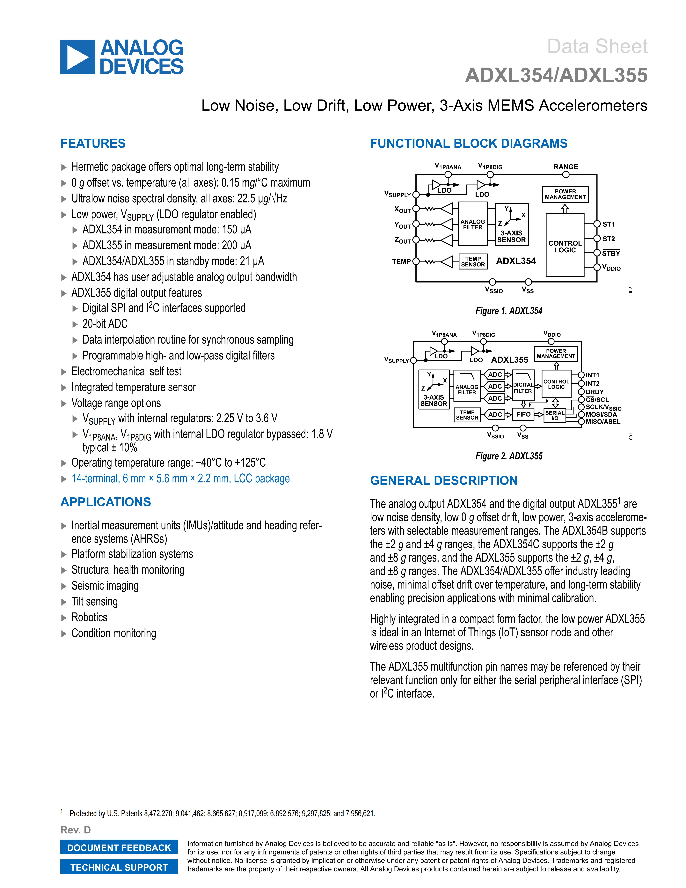

# ADXL355 DIGITAL ACCELEROMETER

## Introduction

Acceleration measurement is a common requirement in many embedded systems. The ADXL355 is a high-precision, low-power, three-axis digital accelerometer suitable for various applications such as motion detection, tilt measurement, and vibration monitoring.

The ADXL355 features low noise density, high resolution, and a wide measurement range, making it ideal for applications requiring accurate and reliable acceleration data.

## Key Features (Summary)

- Low Noise: Typical noise density of approximately 22.5 µg/√Hz (all axes)
- Low Temperature Drift: 0 g offset variation with temperature ≤ 0.15 mg/°C (all axes)
- Low Power Consumption: Measurement mode approximately 200 µA; standby approximately 21 µA
- Selectable Measurement Ranges: ±2 g, ±4 g, ±8 g (model/configuration dependent)
- Interface: SPI and I2C (digital output)
- High Resolution: Built-in 20-bit ADC, supports synchronous sampling and data interpolation
- Programmable Digital Filtering: Supports high/low-pass digital filtering
- Integrated Temperature Sensor and Self-Test Functionality
- Supply Voltage: 2.25 V to 3.6 V (with internal regulator enabled); typically 1.8 V ±10% when bypassing internal LDO
- Operating Temperature: -40°C to +125°C
- Package: 14-lead LCC, approximately 6.0 × 5.6 × 2.2 mm

## Typical Applications

- Inertial Measurement Units (IMU), Attitude and Heading Reference Systems (AHRS)
- Platform Stabilization and Motion Compensation
- Structural Health Monitoring and Vibration Analysis
- Seismic/Shock Detection and Imaging
- Tilt Sensing, Robotics, IoT Sensor Nodes, and Condition Monitoring

## Technical Specifications (Summary Table)

| Parameter          | Specification / Description                     |
|--------------------|-----------------------------------------------:|
| Measurement Range  | ±2 g, ±4 g, ±8 g (selectable)                  |
| Resolution         | 20 bit (ADXL355)                              |
| Noise Density      | Approximately 22.5 µg/√Hz (typical)                     |
| Interface          | SPI, I2C (ADXL355)                            |
| Operating Voltage  | 2.25 V to 3.6 V (with internal regulator)        |
| Operating Temperature | -40°C to +125°C                            |  

