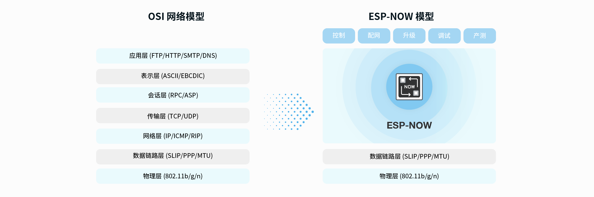

# ESP-NOW 通讯

## 简介

ESP-NOW 是 Espressif 提供的一种低功耗、低延迟的无线通讯协议，适用于 ESP8266 和 ESP32 系列芯片。它允许设备之间直接进行点对点通信，而无需通过 Wi-Fi 路由器，从而实现更高效的通讯方式。其实现基于 IEEE 802.11 协议，但省略了传统 Wi-Fi 通信中的握手和连接过程。

ESP-NOW 特点：

-   **低功耗**：ESP-NOW 设计用于低功耗应用，适合电池供电的设备，延长设备的使用寿命。

-   **低延迟**：ESP-NOW 提供快速的数据传输，适用于对延迟敏感的应用场景。

-   **点对点通信**：设备之间可以直接通信，无需通过 Wi-Fi 路由器，简化了网络架构。

-   **多设备支持**：ESP-NOW 支持多个设备同时通信，最多可支持 20 个对等设备。




<div class="grid cards" markdown>

-   :material-file:{ .lg .middle } __ESP-NOW__

    ---

    [:octicons-arrow-right-24: <a href="https://www.espressif.com/zh-hans/solutions/low-power-solutions/esp-now" target="_blank"> ESP-NOW 官方网站 </a>](#)

-   :material-file:{ .lg .middle } __ESP-NOW API__

    ---

    [:octicons-arrow-right-24: <a href="https://docs.espressif.com/projects/esp-idf/zh_CN/latest/esp32s3/api-reference/network/esp_now.html" target="_blank"> ESP-NOW API 官方文档 </a>](#)

</div>

## ESP-NOW 通讯步骤

ESP-NOW 通讯的基本步骤如下：

1. 初始化 ESP-NOW 协议栈。

2. 配置对等设备信息，包括 MAC 地址和加密密钥（如果需要）。

3. 注册发送和接收回调函数，以处理数据传输。

4. 发送数据到指定的对等设备。

5. 在接收回调函数中处理接收到的数据。

## 初步尝试 - 点对点通讯

基于 AIoTNode-CPP-MORE版本开发，分为发送端和接收端两个部分。修改仅限于main.cpp文件。

### TX - 发送端

```cpp
/**
 * @file main.cpp
 * @author SHUAIWEN CUI (SHUAIWEN001@e.ntu.edu.sg)
 * @brief ESP-NOW发送端示例 - 简单易懂的教学版本
 * @version 1.0
 * @date 2025-10-22
 * 
 * @copyright Copyright (c) 2024
 * 
 */

/* DEPENDENCIES */
// ESP基础库
#include "esp_system.h"
#include "nvs_flash.h"
#include "esp_chip_info.h"
#include "esp_psram.h"
#include "esp_flash.h"
#include "esp_log.h"
#include <string.h>

// FreeRTOS
#include "freertos/FreeRTOS.h"
#include "freertos/task.h"

// ESP-NOW相关（ESP-NOW基于WiFi，所以需要这些头文件）
#include "esp_wifi.h"
#include "esp_netif.h"
#include "esp_event.h"
#include "esp_now.h"

// BSP驱动
#include "node_led.h"
#include "node_exit.h"
#include "node_spi.h"
#include "node_lcd.h"
#include "node_timer.h"
#include "node_rtc.h"
#include "node_sdcard.h"

#ifdef __cplusplus
extern "C" {
#endif

/* ========== 全局变量定义 ========== */
const char *TAG = "ESP_NOW_TX";

// 接收端的MAC地址（6字节）
// 0xFF表示广播地址，所有ESP-NOW设备都能收到
// 如果要指定特定设备，请替换为目标设备的MAC地址
static uint8_t receiver_mac[6] = {0xFF, 0xFF, 0xFF, 0xFF, 0xFF, 0xFF};

// 发送计数器（用于标识每次发送的数据）
static int send_count = 0;

// 接收计数器（记录接收到的消息数量）
static int recv_count = 0;

/* ========== 数据结构定义 ========== */
// 定义我们要发送的数据结构
// 这个结构体包含了要传输的所有数据
typedef struct {
    int counter;           // 发送序号
    char text[30];        // 文本消息（最多30个字符）
    int value1;           // 数值1（示例）
    int value2;           // 数值2（示例）
} message_data_t;

/* ========== 回调函数：发送完成后的通知 ========== */
// 当数据发送完成（成功或失败）时，ESP-NOW会自动调用这个函数
// 注意：ESP-IDF v6.0版本改变了回调函数签名，现在使用wifi_tx_info_t结构体
void send_callback(const wifi_tx_info_t *info, esp_now_send_status_t status)
{
    // status == ESP_NOW_SEND_SUCCESS 表示发送成功
    if (status == ESP_NOW_SEND_SUCCESS)
    {
        ESP_LOGI(TAG, "✓ 发送成功");
    }
    else
    {
        ESP_LOGE(TAG, "✗ 发送失败");
    }
}

/* ========== 回调函数：接收到数据 ========== */
// 当接收到ESP-NOW数据时，ESP-NOW会自动调用这个函数
// 注意：ESP-IDF v6.0版本改变了回调函数签名，现在使用esp_now_recv_info结构体
void recv_callback(const esp_now_recv_info *recv_info, const uint8_t *data, int len)
{
    recv_count++;  // 接收计数加1
    
    // 从recv_info结构体中获取发送方的MAC地址
    const uint8_t *mac_addr = recv_info->src_addr;
    
    // 打印发送方的MAC地址
    ESP_LOGI(TAG, "收到数据！来自: %02X:%02X:%02X:%02X:%02X:%02X, 长度: %d",
             mac_addr[0], mac_addr[1], mac_addr[2], 
             mac_addr[3], mac_addr[4], mac_addr[5], len);
    
    // 如果数据长度匹配我们的消息结构，就解析它
    if (len == sizeof(message_data_t))
    {
        message_data_t *msg = (message_data_t *)data;
        ESP_LOGI(TAG, "消息内容: counter=%d, text=%s, value1=%d, value2=%d",
                 msg->counter, msg->text, msg->value1, msg->value2);
        
        // 接收信息已在上面的发送任务中显示，这里不需要单独显示
        // 如果需要更新接收计数，可以在发送任务下次执行时更新
    }
}

/* ========== ESP-NOW初始化函数 ========== */
// 这个函数负责初始化WiFi和ESP-NOW协议
esp_err_t espnow_init(void)
{
    esp_err_t ret = ESP_OK;
    
    // 步骤1：初始化网络接口（ESP-NOW需要这个）
    ESP_LOGI(TAG, "步骤1: 初始化网络接口...");
    ret = esp_netif_init();
    if (ret != ESP_OK) {
        ESP_LOGE(TAG, "网络接口初始化失败");
        return ret;
    }
    
    // 步骤2：创建事件循环（ESP-NOW需要这个来处理事件）
    ESP_LOGI(TAG, "步骤2: 创建事件循环...");
    ret = esp_event_loop_create_default();
    if (ret != ESP_OK && ret != ESP_ERR_INVALID_STATE) {
        ESP_LOGE(TAG, "事件循环创建失败");
        return ret;
    }
    
    // 步骤3：初始化WiFi（ESP-NOW基于WiFi协议）
    ESP_LOGI(TAG, "步骤3: 初始化WiFi...");
    wifi_init_config_t cfg = WIFI_INIT_CONFIG_DEFAULT();
    ret = esp_wifi_init(&cfg);
    if (ret != ESP_OK) {
        ESP_LOGE(TAG, "WiFi初始化失败");
        return ret;
    }
    
    // 步骤4：设置WiFi为Station模式（客户端模式）
    // 注意：ESP-NOW不需要连接到路由器，只要WiFi启动即可
    ret = esp_wifi_set_storage(WIFI_STORAGE_RAM);
    ret = esp_wifi_set_mode(WIFI_MODE_STA);  // Station模式
    ret = esp_wifi_start();
    if (ret != ESP_OK) {
        ESP_LOGE(TAG, "WiFi启动失败");
        return ret;
    }
    
    // 步骤5：设置WiFi信道（发送端和接收端必须在同一信道）
    ret = esp_wifi_set_channel(1, WIFI_SECOND_CHAN_NONE);
    if (ret != ESP_OK) {
        ESP_LOGE(TAG, "设置信道失败");
        return ret;
    }
    
    // 步骤6：初始化ESP-NOW协议
    ESP_LOGI(TAG, "步骤4: 初始化ESP-NOW...");
    ret = esp_now_init();
    if (ret != ESP_OK) {
        ESP_LOGE(TAG, "ESP-NOW初始化失败");
        return ret;
    }
    
    // 步骤7：注册发送回调函数（发送完成后会调用send_callback）
    ESP_LOGI(TAG, "步骤5: 注册发送回调...");
    ret = esp_now_register_send_cb(send_callback);
    if (ret != ESP_OK) {
        ESP_LOGE(TAG, "注册发送回调失败");
        return ret;
    }
    
    // 步骤8：注册接收回调函数（接收到数据时会调用recv_callback）
    ESP_LOGI(TAG, "步骤6: 注册接收回调...");
    ret = esp_now_register_recv_cb(recv_callback);
    if (ret != ESP_OK) {
        ESP_LOGE(TAG, "注册接收回调失败");
        return ret;
    }
    
    // 步骤9：添加接收端（告诉ESP-NOW要把数据发送给谁）
    ESP_LOGI(TAG, "步骤7: 添加接收端...");
    esp_now_peer_info_t peer_info;
    memset(&peer_info, 0, sizeof(peer_info));  // 清空结构体
    memcpy(peer_info.peer_addr, receiver_mac, 6);  // 复制MAC地址
    peer_info.channel = 1;        // 信道（必须和WiFi信道一致）
    peer_info.ifidx = WIFI_IF_STA; // 使用Station接口
    peer_info.encrypt = false;    // 不使用加密（简化版本）
    
    ret = esp_now_add_peer(&peer_info);
    if (ret != ESP_OK) {
        ESP_LOGE(TAG, "添加接收端失败");
        return ret;
    }
    
    // 获取并打印本机MAC地址
    uint8_t my_mac[6];
    esp_wifi_get_mac(WIFI_IF_STA, my_mac);
    ESP_LOGI(TAG, "✓ ESP-NOW初始化成功！");
    ESP_LOGI(TAG, "本机MAC地址: %02X:%02X:%02X:%02X:%02X:%02X",
             my_mac[0], my_mac[1], my_mac[2], my_mac[3], my_mac[4], my_mac[5]);
    ESP_LOGI(TAG, "目标MAC地址: %02X:%02X:%02X:%02X:%02X:%02X",
             receiver_mac[0], receiver_mac[1], receiver_mac[2], 
             receiver_mac[3], receiver_mac[4], receiver_mac[5]);
    
    return ESP_OK;
}

/* ========== 发送任务函数 ========== */
// 这个函数在一个独立的FreeRTOS任务中运行，定期发送数据
void send_task(void *pvParameters)
{
    message_data_t message;  // 准备发送的数据
    char display_buf[80];     // LCD显示缓冲区
    
    ESP_LOGI(TAG, "发送任务开始运行...");
    
    while (1)  // 无限循环
    {
        // 1. 准备要发送的数据
        send_count++;  // 计数器加1
        message.counter = send_count;
        snprintf(message.text, sizeof(message.text), "Hello #%d", send_count);
        message.value1 = send_count * 10;
        message.value2 = send_count * 20;
        
        // 2. 发送数据（异步发送，函数立即返回）
        // esp_now_send() 发送后不会等待，发送结果通过回调函数通知
        esp_err_t ret = esp_now_send(receiver_mac, (uint8_t *)&message, sizeof(message));
        
        if (ret == ESP_OK)
        {
            // 简化显示：只显示3行，留足间距，统一用16像素字体
            lcd_clear(WHITE);
            
            // 第1行: 标题（Y=0，占用0-16）
            lcd_show_string(0, 0, 160, 16, 16, (char*)"ESP-NOW TX", GREEN);
            
            // 第2行: 发送信息（Y=24，留8像素间距，占用24-40）
            snprintf(display_buf, sizeof(display_buf), "Send #%d", send_count);
            lcd_show_string(0, 24, 160, 16, 16, display_buf, BLACK);
            
            // 第3行: 接收信息（Y=48，留8像素间距，占用48-64）
            snprintf(display_buf, sizeof(display_buf), "Recv #%d", recv_count);
            lcd_show_string(0, 48, 160, 16, 16, display_buf, BLACK);
            
            ESP_LOGI(TAG, "发送数据 #%d: %s", send_count, message.text);
        }
        else
        {
            // 发送失败
            ESP_LOGE(TAG, "发送失败: %s", esp_err_to_name(ret));
            lcd_clear(WHITE);
            lcd_show_string(0, 16, 160, 16, 12, (char*)"Send Failed!", RED);
        }
        
        // 4. 切换LED状态（视觉反馈）
        led_toggle();
        
        // 5. 等待2秒后再次发送
        vTaskDelay(pdMS_TO_TICKS(2000));
    }
}

/* ========== 主函数 ========== */
void app_main(void)
{
    esp_err_t ret;
    uint32_t flash_size;
    esp_chip_info_t chip_info;

    // ========== 第一部分：系统初始化 ==========
    ESP_LOGI(TAG, "========== 系统初始化 ==========");
    
    // 初始化NVS（非易失性存储）
    ret = nvs_flash_init();
    if (ret == ESP_ERR_NVS_NO_FREE_PAGES || ret == ESP_ERR_NVS_NEW_VERSION_FOUND)
    {
        ESP_ERROR_CHECK(nvs_flash_erase());
        ret = nvs_flash_init();
    }

    // 获取芯片信息（用于调试）
    esp_flash_get_size(NULL, &flash_size);
    esp_chip_info(&chip_info);
    ESP_LOGI(TAG, "CPU核心数: %d", chip_info.cores);
    ESP_LOGI(TAG, "Flash大小: %ld MB", flash_size / (1024 * 1024));
    ESP_LOGI(TAG, "PSRAM大小: %d bytes", esp_psram_get_size());

    // ========== 第二部分：硬件初始化 ==========
    ESP_LOGI(TAG, "========== 硬件初始化 ==========");
    
    led_init();    // 初始化LED
    exit_init();   // 初始化外部中断
    spi2_init();   // 初始化SPI接口
    lcd_init();    // 初始化LCD显示屏
    
    // 清屏并显示初始化信息
    lcd_clear(WHITE);
    lcd_show_string(0, 0, 160, 16, 16, (char*)"Initializing...", BLUE);
    
    // 注意：这里跳过了SD卡初始化，因为ESP-NOW不需要SD卡
    // 如果需要SD卡，可以取消下面注释
    /*
    while (sd_card_init())
    {
        lcd_show_string(0, 0, 200, 16, 16, (char*)"SD Card Error!", RED);
        vTaskDelay(500);
    }
    */

    // ========== 第三部分：ESP-NOW初始化 ==========
    ESP_LOGI(TAG, "========== ESP-NOW初始化 ==========");
    
    lcd_fill(0, 0, 160, 16, WHITE);
    lcd_show_string(0, 0, 160, 16, 12, (char*)"Init ESP-NOW...", BLUE);
    
    ret = espnow_init();
    if (ret != ESP_OK)
    {
        // 初始化失败，在LCD上显示错误并停止
        lcd_clear(WHITE);
        lcd_show_string(0, 0, 160, 16, 12, (char*)"ESP-NOW Init", RED);
        lcd_show_string(0, 16, 160, 16, 12, (char*)"Failed!", RED);
        ESP_LOGE(TAG, "ESP-NOW初始化失败，程序停止");
        while (1) {
            vTaskDelay(1000);  // 无限等待
        }
    }
    
    // 初始化成功
    lcd_clear(WHITE);
    lcd_show_string(0, 0, 160, 16, 12, (char*)"ESP-NOW Ready!", GREEN);
    vTaskDelay(pdMS_TO_TICKS(1000));  // 等待1秒让用户看到提示
    
    // ========== 第四部分：创建发送任务 ==========
    ESP_LOGI(TAG, "========== 创建发送任务 ==========");
    
    // 创建一个FreeRTOS任务来定期发送数据
    // 参数说明：
    // - send_task: 任务函数
    // - "send_task": 任务名称
    // - 4096: 任务栈大小（字节）
    // - NULL: 传递给任务的参数
    // - 5: 任务优先级（数字越大优先级越高）
    // - NULL: 任务句柄（不需要返回）
    xTaskCreate(send_task, "send_task", 4096, NULL, 5, NULL);
    
    ESP_LOGI(TAG, "✓ 程序启动完成！开始发送数据...");
    
    // 主任务可以继续做其他事情，或者进入休眠
    while (1)
    {
        // 主任务现在什么都不做，只是等待
        // 实际的发送工作由send_task任务完成
        vTaskDelay(pdMS_TO_TICKS(5000));  // 每5秒打印一次
        ESP_LOGI(TAG, "主任务运行中... (发送:%d, 接收:%d)", send_count, recv_count);
    }
}

#ifdef __cplusplus
}
#endif


```

### RX - 接收端

```cpp
/**
 * @file main.cpp
 * @author SHUAIWEN CUI (SHUAIWEN001@e.ntu.edu.sg)
 * @brief ESP-NOW接收端示例 - 简单易懂的教学版本（ESP-IDF v6.0）
 * @version 1.0
 * @date 2025-10-22
 * 
 * @copyright Copyright (c) 2024
 * 
 */

/* DEPENDENCIES */
// ESP基础库
#include "esp_system.h"
#include "nvs_flash.h"
#include "esp_chip_info.h"
#include "esp_psram.h"
#include "esp_flash.h"
#include "esp_log.h"
#include <string.h>

// FreeRTOS
#include "freertos/FreeRTOS.h"
#include "freertos/task.h"

// ESP-NOW相关（ESP-NOW基于WiFi，所以需要这些头文件）
#include "esp_wifi.h"
#include "esp_netif.h"
#include "esp_event.h"
#include "esp_now.h"

// BSP驱动
#include "node_led.h"
#include "node_exit.h"
#include "node_spi.h"
#include "node_lcd.h"
#include "node_timer.h"
#include "node_rtc.h"
#include "node_sdcard.h"

#ifdef __cplusplus
extern "C" {
#endif

/* ========== 数据结构定义 ========== */
// 定义我们要接收的数据结构
// 这个结构体包含了要传输的所有数据
typedef struct {
    int counter;           // 发送序号
    char text[30];        // 文本消息（最多30个字符）
    int value1;           // 数值1（示例）
    int value2;           // 数值2（示例）
} message_data_t;

/* ========== 全局变量定义 ========== */
const char *TAG = "ESP_NOW_RX";

// 接收计数器（记录接收到的消息数量）
static int recv_count = 0;

// 最后接收到的消息（用于在LCD上显示）
static message_data_t last_message;
static bool message_received = false;

/* ========== 回调函数：发送完成后的通知 ========== */
// 接收端通常不需要发送回调，但保留此函数以防需要回复消息
// 注意：ESP-IDF v6.0版本改变了回调函数签名，现在使用wifi_tx_info_t结构体
void send_callback(const wifi_tx_info_t *info, esp_now_send_status_t status)
{
    // 接收端模式下，这个回调通常不会被使用
    // 如果需要向发送端回复消息，可以使用这个回调
    if (status == ESP_NOW_SEND_SUCCESS)
    {
        ESP_LOGI(TAG, "✓ 回复发送成功");
    }
    else
    {
        ESP_LOGE(TAG, "✗ 回复发送失败");
    }
}

/* ========== 回调函数：接收到数据 ========== */
// 当接收到ESP-NOW数据时，ESP-NOW会自动调用这个函数
// 注意：ESP-IDF v6.0版本改变了回调函数签名，现在使用esp_now_recv_info结构体
void recv_callback(const esp_now_recv_info *recv_info, const uint8_t *data, int len)
{
    recv_count++;  // 接收计数加1
    
    // 从recv_info结构体中获取发送方的MAC地址
    const uint8_t *mac_addr = recv_info->src_addr;
    
    // 打印发送方的MAC地址
    ESP_LOGI(TAG, "✓ 收到数据！来自: %02X:%02X:%02X:%02X:%02X:%02X, 长度: %d",
             mac_addr[0], mac_addr[1], mac_addr[2], 
             mac_addr[3], mac_addr[4], mac_addr[5], len);
    
    // 如果数据长度匹配我们的消息结构，就解析它
    if (len == sizeof(message_data_t))
    {
        message_data_t *msg = (message_data_t *)data;
        ESP_LOGI(TAG, "消息内容: counter=%d, text=%s, value1=%d, value2=%d",
                 msg->counter, msg->text, msg->value1, msg->value2);
        
        // 保存最后接收到的消息
        memcpy(&last_message, msg, sizeof(message_data_t));
        message_received = true;
        
        // LED闪烁提示收到数据
        led_toggle();
    }
    else
    {
        ESP_LOGW(TAG, "收到数据长度不匹配！期望: %d, 实际: %d", sizeof(message_data_t), len);
    }
}

/* ========== ESP-NOW初始化函数 ========== */
// 这个函数负责初始化WiFi和ESP-NOW协议
esp_err_t espnow_init(void)
{
    esp_err_t ret = ESP_OK;
    
    // 步骤1：初始化网络接口（ESP-NOW需要这个）
    ESP_LOGI(TAG, "步骤1: 初始化网络接口...");
    ret = esp_netif_init();
    if (ret != ESP_OK) {
        ESP_LOGE(TAG, "网络接口初始化失败");
        return ret;
    }
    
    // 步骤2：创建事件循环（ESP-NOW需要这个来处理事件）
    ESP_LOGI(TAG, "步骤2: 创建事件循环...");
    ret = esp_event_loop_create_default();
    if (ret != ESP_OK && ret != ESP_ERR_INVALID_STATE) {
        ESP_LOGE(TAG, "事件循环创建失败");
        return ret;
    }
    
    // 步骤3：初始化WiFi（ESP-NOW基于WiFi协议）
    ESP_LOGI(TAG, "步骤3: 初始化WiFi...");
    wifi_init_config_t cfg = WIFI_INIT_CONFIG_DEFAULT();
    ret = esp_wifi_init(&cfg);
    if (ret != ESP_OK) {
        ESP_LOGE(TAG, "WiFi初始化失败");
        return ret;
    }
    
    // 步骤4：设置WiFi为Station模式（客户端模式）
    // 注意：ESP-NOW不需要连接到路由器，只要WiFi启动即可
    ret = esp_wifi_set_storage(WIFI_STORAGE_RAM);
    ret = esp_wifi_set_mode(WIFI_MODE_STA);  // Station模式
    ret = esp_wifi_start();
    if (ret != ESP_OK) {
        ESP_LOGE(TAG, "WiFi启动失败");
        return ret;
    }
    
    // 步骤5：设置WiFi信道（发送端和接收端必须在同一信道）
    ret = esp_wifi_set_channel(1, WIFI_SECOND_CHAN_NONE);
    if (ret != ESP_OK) {
        ESP_LOGE(TAG, "设置信道失败");
        return ret;
    }
    
    // 步骤6：初始化ESP-NOW协议
    ESP_LOGI(TAG, "步骤4: 初始化ESP-NOW...");
    ret = esp_now_init();
    if (ret != ESP_OK) {
        ESP_LOGE(TAG, "ESP-NOW初始化失败");
        return ret;
    }
    
    // 步骤7：注册接收回调函数（接收到数据时会调用recv_callback）
    ESP_LOGI(TAG, "步骤5: 注册接收回调...");
    ret = esp_now_register_recv_cb(recv_callback);
    if (ret != ESP_OK) {
        ESP_LOGE(TAG, "注册接收回调失败");
        return ret;
    }
    
    // 步骤8：可选 - 注册发送回调（如果需要回复消息给发送端）
    ESP_LOGI(TAG, "步骤6: 注册发送回调...");
    ret = esp_now_register_send_cb(send_callback);
    if (ret != ESP_OK) {
        ESP_LOGE(TAG, "注册发送回调失败");
        return ret;
    }
    
    // 注意：接收端不需要添加peer，因为接收端会自动接收所有发送给它的数据
    // 如果需要在接收后回复消息，可以在收到数据时动态添加发送端的peer
    
    // 获取并打印本机MAC地址
    uint8_t my_mac[6];
    esp_wifi_get_mac(WIFI_IF_STA, my_mac);
    ESP_LOGI(TAG, "✓ ESP-NOW接收端初始化成功！");
    ESP_LOGI(TAG, "本机MAC地址: %02X:%02X:%02X:%02X:%02X:%02X",
             my_mac[0], my_mac[1], my_mac[2], my_mac[3], my_mac[4], my_mac[5]);
    ESP_LOGI(TAG, "等待接收数据...");
    
    return ESP_OK;
}

/* ========== 显示更新任务函数 ========== */
// 这个函数在一个独立的FreeRTOS任务中运行，定期更新LCD显示
void display_task(void *pvParameters)
{
    char display_buf[80];     // LCD显示缓冲区
    
    ESP_LOGI(TAG, "显示任务开始运行...");
    
    while (1)  // 无限循环
    {
        // 更新LCD显示
        lcd_clear(WHITE);
        
        // 第1行: 标题（Y=0，占用0-16）
        lcd_show_string(0, 0, 160, 16, 16, (char*)"ESP-NOW RX", GREEN);
        
        // 第2行: 接收计数（Y=24，留8像素间距，占用24-40）
        snprintf(display_buf, sizeof(display_buf), "Recv #%d", recv_count);
        lcd_show_string(0, 24, 160, 16, 16, display_buf, BLACK);
        
        // 如果收到了消息，显示消息内容
        if (message_received)
        {
            // 第3行: 消息文本（Y=48，留8像素间距，占用48-64）
            snprintf(display_buf, sizeof(display_buf), "Text: %s", last_message.text);
            lcd_show_string(0, 48, 160, 16, 16, display_buf, BLUE);
            
            // 第4行: Counter值（Y=72，留8像素间距，占用72-88）
            snprintf(display_buf, sizeof(display_buf), "Cnt: %d", last_message.counter);
            lcd_show_string(0, 72, 160, 16, 16, display_buf, BLACK);
        }
        else
        {
            // 第3行: 等待消息（Y=48，留8像素间距，占用48-64）
            lcd_show_string(0, 48, 160, 16, 16, (char*)"Waiting...", BLACK);
        }
        
        // 等待500ms后更新显示
        vTaskDelay(pdMS_TO_TICKS(500));
    }
}

/* ========== 主函数 ========== */
void app_main(void)
{
    esp_err_t ret;
    uint32_t flash_size;
    esp_chip_info_t chip_info;

    // ========== 第一部分：系统初始化 ==========
    ESP_LOGI(TAG, "========== 系统初始化 ==========");
    
    // 初始化NVS（非易失性存储）
    ret = nvs_flash_init();
    if (ret == ESP_ERR_NVS_NO_FREE_PAGES || ret == ESP_ERR_NVS_NEW_VERSION_FOUND)
    {
        ESP_ERROR_CHECK(nvs_flash_erase());
        ret = nvs_flash_init();
    }

    // 获取芯片信息（用于调试）
    esp_flash_get_size(NULL, &flash_size);
    esp_chip_info(&chip_info);
    ESP_LOGI(TAG, "CPU核心数: %d", chip_info.cores);
    ESP_LOGI(TAG, "Flash大小: %ld MB", flash_size / (1024 * 1024));
    ESP_LOGI(TAG, "PSRAM大小: %d bytes", esp_psram_get_size());

    // ========== 第二部分：硬件初始化 ==========
    ESP_LOGI(TAG, "========== 硬件初始化 ==========");
    
    led_init();    // 初始化LED
    exit_init();   // 初始化外部中断
    spi2_init();   // 初始化SPI接口
    lcd_init();    // 初始化LCD显示屏
    
    // 清屏并显示初始化信息
    lcd_clear(WHITE);
    lcd_show_string(0, 0, 160, 16, 16, (char*)"Initializing...", BLUE);
    
    // 注意：这里跳过了SD卡初始化，因为ESP-NOW不需要SD卡
    // 如果需要SD卡，可以取消下面注释
    /*
    while (sd_card_init())
    {
        lcd_show_string(0, 0, 200, 16, 16, (char*)"SD Card Error!", RED);
        vTaskDelay(500);
    }
    */

    // ========== 第三部分：ESP-NOW初始化 ==========
    ESP_LOGI(TAG, "========== ESP-NOW初始化 ==========");
    
    lcd_fill(0, 0, 160, 16, WHITE);
    lcd_show_string(0, 0, 160, 16, 12, (char*)"Init ESP-NOW...", BLUE);
    
    ret = espnow_init();
    if (ret != ESP_OK)
    {
        // 初始化失败，在LCD上显示错误并停止
        lcd_clear(WHITE);
        lcd_show_string(0, 0, 160, 16, 12, (char*)"ESP-NOW Init", RED);
        lcd_show_string(0, 16, 160, 16, 12, (char*)"Failed!", RED);
        ESP_LOGE(TAG, "ESP-NOW初始化失败，程序停止");
        while (1) {
            vTaskDelay(1000);  // 无限等待
        }
    }
    
    // 初始化成功
    lcd_clear(WHITE);
    lcd_show_string(0, 0, 160, 16, 12, (char*)"ESP-NOW Ready!", GREEN);
    vTaskDelay(pdMS_TO_TICKS(1000));  // 等待1秒让用户看到提示
    
    // ========== 第四部分：创建显示更新任务 ==========
    ESP_LOGI(TAG, "========== 创建显示更新任务 ==========");
    
    // 创建一个FreeRTOS任务来定期更新LCD显示
    // 参数说明：
    // - display_task: 任务函数
    // - "display_task": 任务名称
    // - 4096: 任务栈大小（字节）
    // - NULL: 传递给任务的参数
    // - 5: 任务优先级（数字越大优先级越高）
    // - NULL: 任务句柄（不需要返回）
    xTaskCreate(display_task, "display_task", 4096, NULL, 5, NULL);
    
    ESP_LOGI(TAG, "✓ 程序启动完成！等待接收数据...");
    
    // 主任务可以继续做其他事情，或者进入休眠
    while (1)
    {
        // 主任务现在什么都不做，只是等待
        // 实际的接收工作由ESP-NOW接收回调完成
        // 显示更新由display_task任务完成
        vTaskDelay(pdMS_TO_TICKS(5000));  // 每5秒打印一次
        ESP_LOGI(TAG, "主任务运行中... (接收计数: %d)", recv_count);
    }
}

#ifdef __cplusplus
}
#endif

```

### 结果展示

<iframe width="800" height="450" src="https://www.youtube-nocookie.com/embed/zjPG3-lPeHM" frameborder="0" allowfullscreen></iframe>
