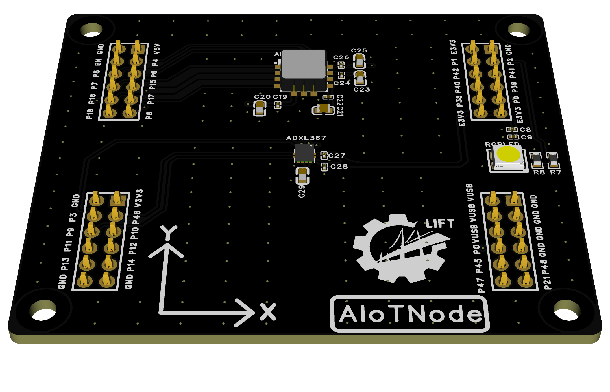
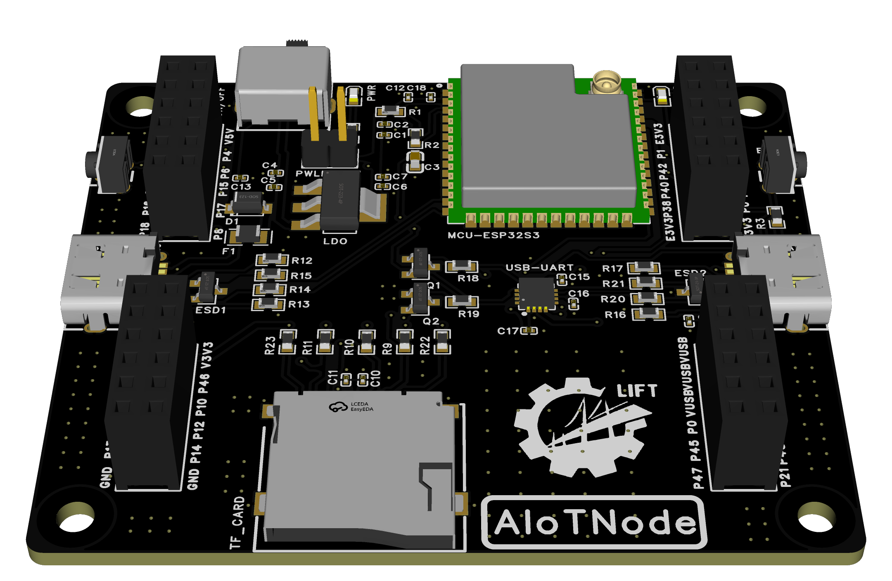

# NEXNODE

## INTRODUCTION

This project dedicates to the development of an EdgeAI-powered MCU level IoT node for future-oriented applications.

"Nex" is stemmed from both "Next" and "Nexus", which implies the next generation of IoT devices and the connection between the physical and digital worlds.

## ROADMAP

### Hardware Architecture

From an architectural perspective, an AIoT node can be divided into the following main subsystems:

- Main Control Module: Responsible for control and coordination
- Perception Module: Responsible for environmental perception and data collection
- Communication Module: Responsible for data transmission and network connection
- Execution Module: Responsible for executing specific tasks and operations
- Power Module: Responsible for providing stable power supply to each module

### Software Architecture

From a software architecture perspective, an AIoT node can be divided into the following main layers:

- Hardware Layer: Various physical hardware components
- Driver Layer: Hardware drivers
- Middleware: Provides common functions and services
- Application Layer: Specific applications and services