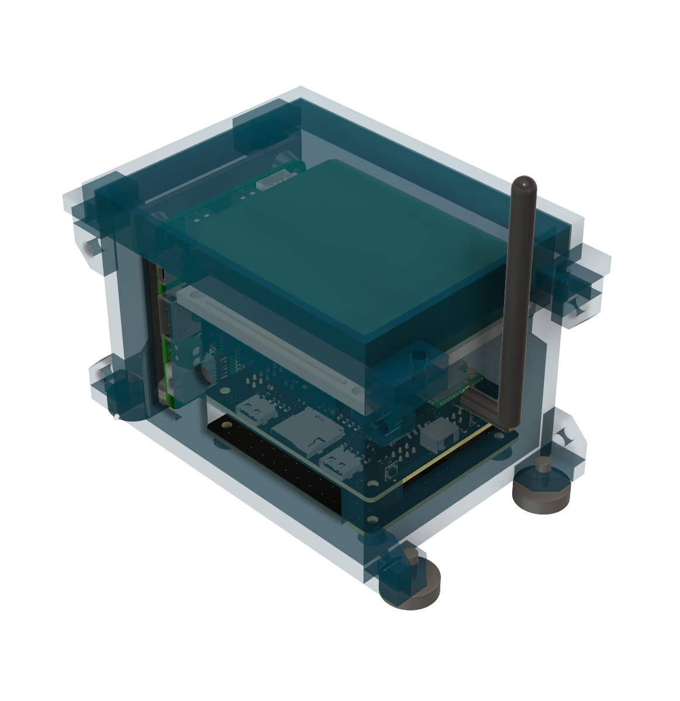
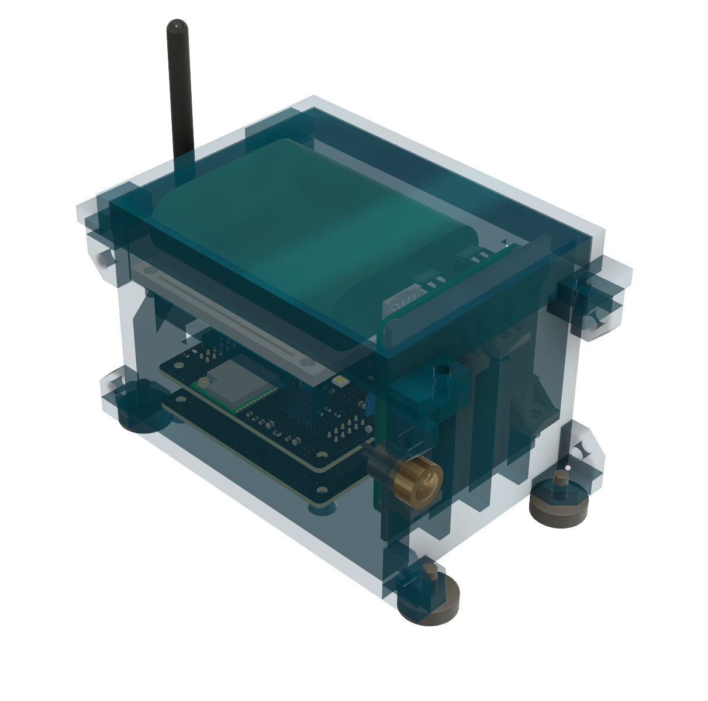
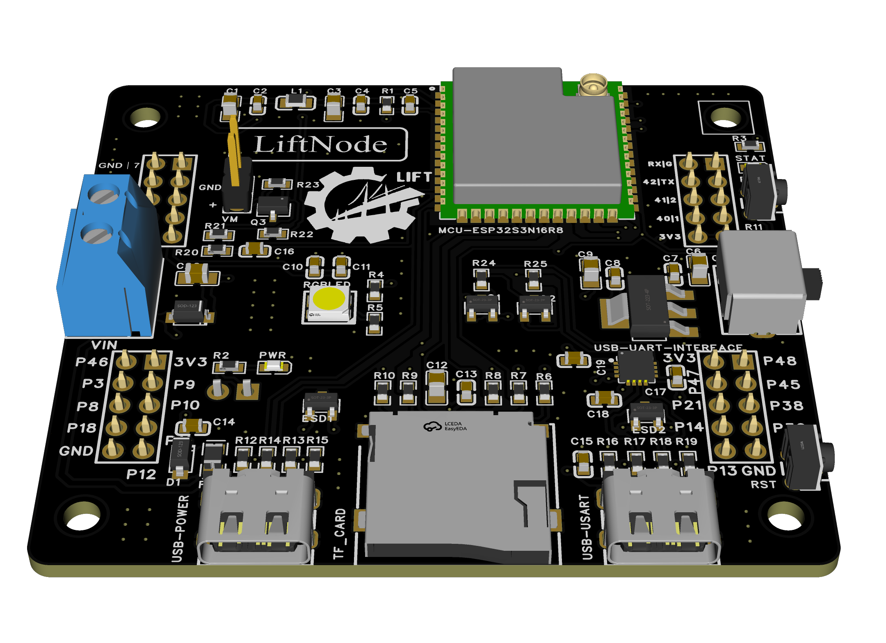
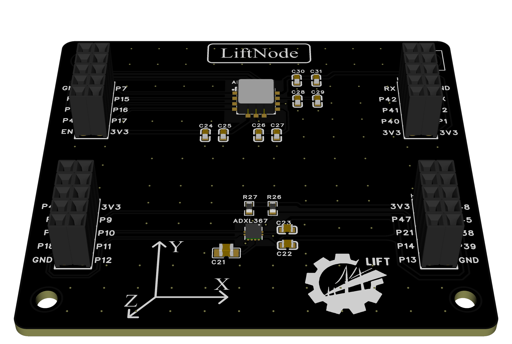
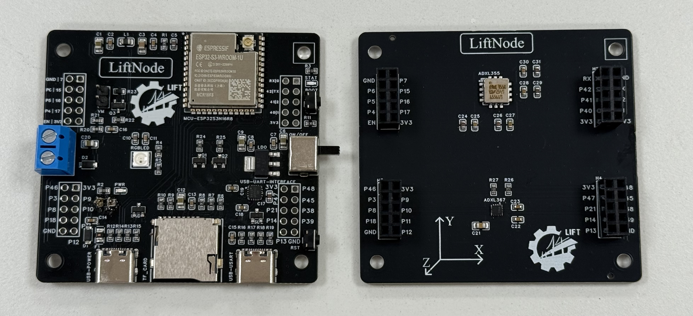
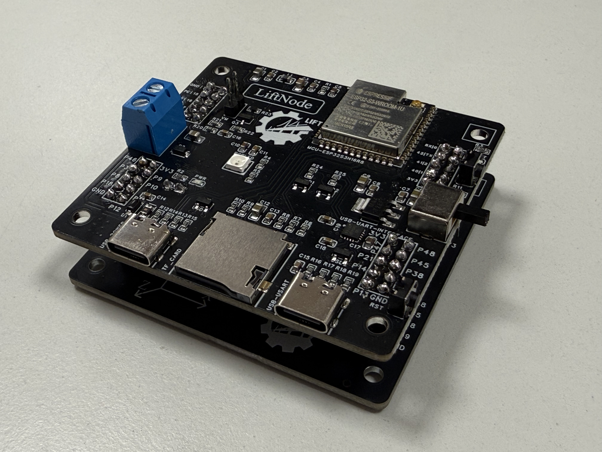
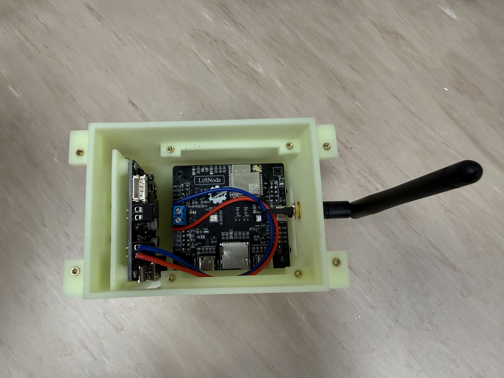
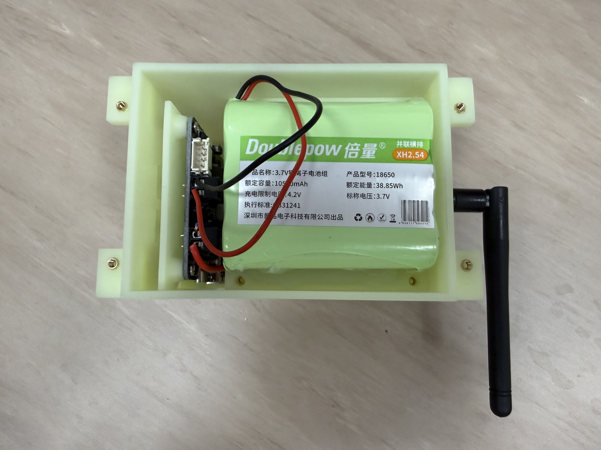
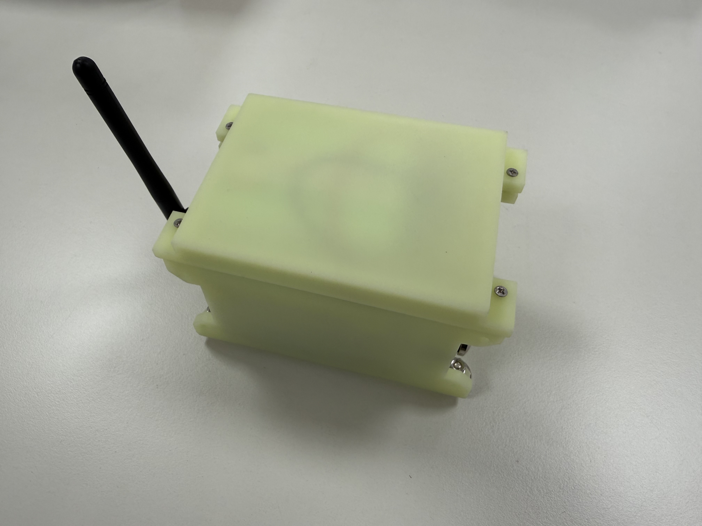

# NexNode

## 介绍

这个项目致力于为面向未来的应用开发一款基于EdgeAI的MCU级IoT节点。

"Nex" 源自 "Next" 和 "Nexus"，意味着下一代IoT设备和物理世界与数字世界之间的连接。

### 设计图

{width=100%}
*节点设计图-视角1*

{width=100%}
*节点设计图-视角2*

{width=100%}
*主控板设计图*

{width=100%}
*扩展板设计图*

### 实物图

{width=100%}
*PCB实物图*

{width=100%}
*PCB堆叠图*

{width=100%}
*节点内部实物图*

{width=100%}
*节点电池实物图*

{width=100%}
*节点外观实物图*

## 路线图

### 硬件架构

从架构角度来看，AIoT节点可以分为以下几个主要子系统：

- 主控模块：负责控制与协调
- 感知模块：负责环境感知与数据采集
- 通信模块：负责数据传输与网络连接
- 执行模块：负责执行具体任务与操作
- 电源模块：负责为各个模块提供稳定的电力供应

### 软件架构

从软件架构角度来看，AIoT节点可以分为以下几个主要层次：

- 硬件层：各种实际硬件组件
- 驱动层：硬件驱动程序
- 中间件：提供通用功能和服务
- 应用层：具体应用程序和服务

## 项目内容

### 硬件设计

硬件部分包括：

- 系统设计
- 元器件选型
- 原理图设计
- PCB设计
- 机械设计（外壳、结构件等）

### 软件设计

软件部分包括：

- ESP32简单教程
- 初始化
- 核心功能
- 外围功能等

### 无线传感器网络功能

无线传感器网络功能开发
